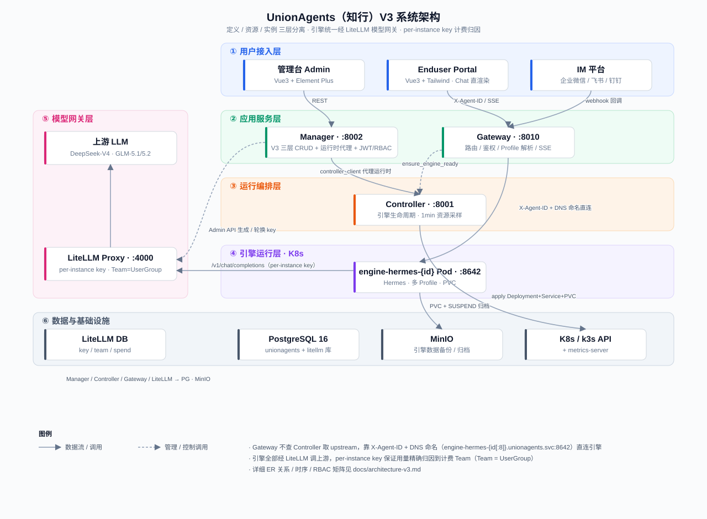
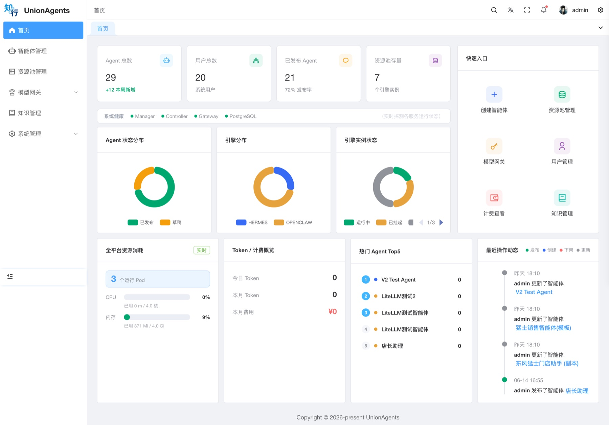

# UnionAgents (知行)

> 企业级多智能体平台 — 定义智能体、管理运行资源、为终端用户提供对话门户。

**版本**: 0.8.76（V3 三层重构）

> **V3 架构**: 智能体开发（定义/版本）、运行资源管理（资源池）、智能体实例 三层分离。引擎统一经 LiteLLM 模型网关调用上游，per-instance key 精确计费归因。详见 [V3 架构文档](docs/architecture-v3.md)（含 Mermaid 交互图与 ER 关系）。

---

## 特性

| 特性 | 说明 |
|------|------|
| **V3 三层模型** | 定义层（AgentDefinition/Version）× 资源池（ResourcePool）× 实例层（AgentInstance），定义发布版本 ≠ 实例上线，实例绑定版本可回滚 |
| **LiteLLM 模型网关** | 全系统唯一模型网关，4 上游模型（DeepSeek-V4 flash/pro、GLM-5.1/5.2），per-instance 虚拟 key，计费 Team = UserGroup，用量/成本精确归因 |
| **多引擎支持** | Hermes（现有，多 Profile + PVC），OpenClaw 等（规划中）；引擎类型作枚举不建表，镜像/端口走 `ENGINE_RUNTIMES` 常量 |
| **引擎全生命周期** | deploy → running ↔ suspended → archived；运行时操作（部署/暂停/恢复/重启/销毁）全归实例层，原 Controller 职责已并入 Manager |
| **实例版本热升级** | 定义发新版后实例版本号旁出图标，点击增量热推人设/技能/模型到运行 Pod 不重建；仅 model_group 变更时轻量 restart |
| **SSE 流式** | 部署进度 SSE；对话 SSE 纯透传（Gateway 去 Origin/Referer 头，nginx `proxy_buffering off`） |
| **企业 IM 渠道** | 飞书（卡片流式）/ 企业微信（字节分段 chunk-flush + 卡片 JSON 容错提取）/ 钉钉；动态 Pod 唤醒、消息去重、失败重试、权限闸门 |
| **语音 ASR** | gateway Pod sidecar（faster-whisper 本地）+ 火山引擎 OpenSpeech 云端；企微语音消息自动转文字，Provider 抽象可扩展 |
| **空闲自动回收** | 30min 无活动 SUSPEND（scale=0 + 存档对象存储），24h 未恢复 DESTROY（清 K8s 资源，数据已归档） |
| **归档安全加固** | daily 两层对象 + finalizer 销毁感知 + 拒删校验 + 并发锁；SUSPEND 存档 → DESTROY 仅清 K8s 资源（数据已落对象存储） |
| **技能管理** | 技能挂定义层，install/sync/uninstall fan-out 到定义各实例；按 agent 隔离 + 软链接共享；5 套预制技能 + 模版预填 |
| **技能凭证加密** | skill-credentials 经 Fernet 加密落库（`UA_CREDENTIAL_ENCRYPTION_KEY`，prod 必填、设后不可改、须冷备） |
| **人设配置** | persona_config 写文件即生效（SOUL.md/system_prompt） |
| **用户信息注入上下文** | 可选写 memories/USER.md 按用户隔离注入引擎上下文，提升个性化 |
| **指标采样** | Manager metric_sampler 每 1min 采样引擎 Pod CPU/内存落库（保留 7d），趋势时序图 |
| **对象存储多云兼容** | S3 兼容 endpoint 自动识别（OSS/COS/MinIO 等），云上托管对象存储或本地 MinIO 均可 |
| **全链路可观测** | Langfuse tracing（manager/gateway 自动上报，未配置则 no-op）+ Prometheus/Grafana 资源监控 |
| **RBAC + access_scope** | 管理台走 RBAC（平台管理员/组管理员两类角色 × 三类资源权限矩阵）；终端用户走 access_scope（ALL/USER/USER_GROUP），与 RBAC 分离 |
| **配置热同步** | 修改模型/人设/技能配置后同步到运行中引擎并滚动重启 |
| **管理后台仪表盘** | ECharts 真实数据：智能体/用户/发布率概览、实例状态分布、资源用量、Token 计费、热门 Agent Top5、最近动态 |
| **深色主题** | 8 套主题（从 hermes-webui 迁移），暗色/亮色模式 |

---

## 系统架构

V3 三层 + 模型网关层拓扑详见 [docs/architecture-v3.md](docs/architecture-v3.md)（系统整体图、逻辑三层图、ER 关系图、运行时序图、k3s 部署拓扑、RBAC 权限矩阵）。

核心解耦：**Gateway 反向依赖解耦**——不查 Manager 取 upstream，靠 `X-Agent-ID` + DNS 命名规范（`engine-hermes-{id[:8]}.{ns}.svc.cluster.local:8642`）直连引擎 Pod；Manager 只管 Pod 生命周期与采样。引擎全部经 LiteLLM 调上游，per-instance key 保证用量精确归因到计费 Team。

<p align="center">
  
</p>

---

## 界面预览

### 管理后台首页（系统管理员视图）

<p align="center">
  
</p>

管理员首页一屏呈现平台全局运营态势：智能体 / 用户 / 发布率 / 资源池概览，各服务实时健康探活，实例状态分布，全平台资源实时用量，Token 与计费概览，热门 Agent Top5，最近操作动态及快捷入口。

---

## V3 三层模型

```
① 智能体开发层          ② 运行资源管理层         ③ 智能体实例层
AgentDefinition         ResourcePool            AgentInstance
 (name/engine_type/      (cpu/mem/replicas/      (definition×version×pool
  persona/model/          max_sessions/           ×access_scope/
  skill/memory config)    idle 回收策略)          status/litellm_config)
       │ 发布                     │ 供给规格              │
       ▼                          ▼                       ├── AgentInstanceChannel (http/wecom/feishu)
 AgentVersion                                          ├── AgentDeployment (引擎部署状态·scope)
 (不可变快照·version_no)                              └── AgentProfile (单用户/组 Profile 映射)
```

- **引擎类型不建表**——`engine_type` 作枚举放定义，镜像/端口走 `ENGINE_RUNTIMES`（`HERMES`→`unionagents/engine-hermes`/8642）。加引擎必须改代码，是强契约。
- **发布语义拆分**：定义「发布版本」（生成不可变快照）≠ 实例「上线」（DRAFT→PUBLISHED，对终端可见）。实例绑定 `version_id` 支持升级/回滚，热升级增量推送不重建 Pod。
- **技能挂定义层**，install/sync/uninstall fan-out 到定义各实例；`access_scope` 在实例层决定谁能用，渠道层不再重复控制权限。
- **运行时操作全归实例详情页**：deploy / suspend / resume / restart / destroy；定义层只管开发（发布/下线/编辑）。

---

## 核心流程

### 用户访问流程

```
管理员创建 AgentDefinition（人设/模型/技能/记忆配置，草稿）
  → 发布版本（生成 AgentVersion 不可变快照）
  → 创建 ResourcePool（多租户 K8s 资源规格 + 回收策略）
  → 创建 AgentInstance（绑定 definition × version × resource_pool）
  → 设置 access_scope (ALL/USER/USER_GROUP) → 上线（PUBLISHED，对终端可见）
  → （可选）部署引擎 / 绑定 IM 渠道

终端用户登录 chat.域名 → 查看可访问实例列表（access_scope 过滤）
  → 选择实例 → Manager 检测引擎状态
  → 未部署 → K8s 创建 Pod + SSE 进度条 → 就绪
  → 已休眠 → 从对象存储恢复 + scale=1 → 就绪
  → 已部署 → 直接进入 Chat 页面

Chat 交互（Web 入口）:
  Portal → Gateway（X-Agent-ID）→ ProfileResolver → ensure_profile → Engine Pod
  Messages ← Gateway（SSE 透传，去 Origin/Referer）← Engine ← LiteLLM（per-instance key）← 上游 LLM
  会话/记忆由引擎自身管理（不入 Manager DB）

Chat 交互（IM 入口）:
  IM Webhook → Gateway dispatcher → 消息去重 → 权限闸门 → ensure_engine_ready
  → 转发到 Engine → 响应按渠道限制分段回发
```

### 引擎生命周期

```
PENDING → DEPLOYING → RUNNING ←→ SUSPENDED → ARCHIVED
                         │                          ↑
                         └────→ FAILED              │
                                                    │
                              (ARCHIVED → deploy 重新创建)
```

| 状态 | Pod | PVC | 对象存储 |
|------|-----|-----|---------|
| **PENDING** | — | — | — |
| **DEPLOYING** | 创建中 | 创建中 | — |
| **RUNNING** | 1 副本 | 有 | — |
| **SUSPENDED** | scale=0 | 保留 | 有备份 |
| **ARCHIVED** | 已删除 | 已删除 | 有永久归档 |
| **FAILED** | — | — | — |

### 空闲回收策略

```
30 分钟无活动 → SUSPEND: 引擎数据打包 → 上传对象存储 → scale=0
24 小时后     → DESTROY: 设为永久归档 → 删除 K8s Deployment/Service/PVC
用户再次访问   → DEPLOY: 从对象存储恢复数据 → 创建新 Pod
```

---

## 服务一览

| 服务 | 端口 | 职责 |
|------|------|------|
| **Manager** | 8002 | V3 三层 CRUD + 运行时代理 + LiteLLM 管理 API + 仪表盘，JWT/RBAC 认证；原 Controller 职责（引擎生命周期/Profile/技能 fan-out/指标采样/对象存储存档/空闲回收）已并入 |
| **Hub** | 8003 | 独立 Agent Hub 子系统（扫描器/策略/适配器，能力中心：featured/tags/install-from-hub） |
| **Gateway** | 8010 | Profile-aware 反向代理 + IM 渠道 Webhook + 语音 ASR；`X-Agent-ID` + JWT → ProfileResolver → DNS 命名直连引擎 Pod |
| **Admin Console** | 80 (K8s) | 管理后台前端（Vue 3 + Element Plus, vue-pure-admin） |
| **Enduser Portal** | 80 (K8s) | 终端用户门户前端（Vue 3 + Tailwind），登录/列表/部署/Chat |
| **LiteLLM** | 4000 | 模型网关（litellm-database 镜像），per-instance key + 计费 Team，调上游 LLM |
| **PostgreSQL** | 5432 | 主库（`unionagents` + `litellm` 两个库） |
| **对象存储** | 9000/9001 | S3 兼容（本地 MinIO / 云上托管对象存储），引擎数据备份/归档 |
| **Hermes Engine** | 8642 | V2 多 Profile + PVC，Pod 内支持多 Profile gateway 进程，全部经 LiteLLM 调上游 |
| **OpenClaw Engine** (规划) | 8642 | 通用计算机操控引擎 |

> Controller 已并入 Manager，不再独立部署。`/api/controller/*` 兼容路径仍由 Manager:8002 提供（enduser-portal 沿用）。

---

## 技术栈

| 层 | 技术 |
|----|------|
| **后端语言** | Python 3.11+ |
| **Web 框架** | FastAPI + SQLAlchemy async (asyncpg) |
| **认证** | JWT (python-jose + passlib/bcrypt) |
| **容器编排** | K8s / k3s（本地 colima + k3s） |
| **数据库** | PostgreSQL 16 |
| **对象存储** | S3 兼容（本地 MinIO / 云上托管对象存储） |
| **模型网关** | LiteLLM Proxy（litellm-database） |
| **CI/CD** | Gitee Go Pipelines → 容器镜像仓库 |
| **管理台前端** | Vue 3 + Element Plus + TypeScript + ECharts (vue-pure-admin) |
| **用户前端** | Vue 3 + Tailwind CSS + Vite + Pinia |
| **AI 引擎** | Hermes (现有) / OpenClaw（规划中） |
| **可观测** | Langfuse（LLM tracing）+ Prometheus / Grafana（资源监控） |
| **包管理** | pnpm (前端) / uv (Python) |

---

## API 端点

### Manager (:8002，前缀 `/api/manager`)

#### 认证与权限

| 方法 | 路径 | 说明 |
|------|------|------|
| POST | `/auth/login` | 密码登录，返回 JWT token 对（`access_token`/`refresh_token`） |
| POST | `/auth/refresh` | 刷新 Token |
| GET | `/auth/me` | 当前用户信息 |
| GET/POST | `/users` · `/roles` · `/user-groups` | 用户/角色/用户组管理 |
| GET | `/roles/permissions/all` | 所有权限列表 |
| GET/POST | `/im-bindings` | IM 账号绑定 |

#### V3 三层（定义/版本/资源池/实例）

| 方法 | 路径 | 说明 |
|------|------|------|
| GET/POST | `/agent-definitions` | 定义列表/创建 |
| GET/PUT/DELETE | `/agent-definitions/{id}` | 定义详情/更新/删除 |
| GET | `/agent-definitions/{id}/versions` | 版本列表 |
| POST | `/agent-definitions/{id}/publish` | 发布版本（生成不可变快照） |
| GET/POST | `/resource-pools` | 资源池列表/创建 |
| GET/PUT/DELETE | `/resource-pools/{id}` | 资源池详情/更新/删除 |
| POST | `/resource-pools/{id}/clone` | 克隆资源池 |
| GET/POST | `/agent-instances` | 实例列表/创建（创建时自动 provision per-instance key） |
| GET | `/agent-instances/accessible` | 终端用户可访问实例（access_scope 过滤） |
| GET/PUT/DELETE | `/agent-instances/{id}` | 实例详情/更新/删除 |
| POST | `/agent-instances/{id}/publish` | 上线（DRAFT/OFFLINE→PUBLISHED） |
| POST | `/agent-instances/{id}/offline` | 停用 |
| POST | `/agent-instances/{id}/switch-version` | 切换绑定版本（升级/回滚，重生成 key） |
| POST | `/agent-instances/{id}/upgrade` | 实例版本热升级（增量推人设/技能/模型不重建 Pod） |
| POST | `/agent-instances/{id}/clone` | 克隆实例 |
| POST | `/agent-instances/{id}/litellm-key/reprovision` | 重新生成 per-instance key（key 丢失/老 key 统一） |
| POST | `/agent-instances/{id}/{deploy,suspend,resume,restart,destroy}` | 运行时生命周期（Manager 代理） |
| GET | `/agent-instances/{id}/deployment-status` | 部署状态 |

#### 技能管理

| 方法 | 路径 | 说明 |
|------|------|------|
| GET | `/agent-definitions/{id}/skills` | 列技能（合并引擎扫描） |
| POST | `/agent-definitions/{id}/skills/preview` | 预览技能包 |
| POST | `/agent-definitions/{id}/skills/install` | 安装技能 |
| PUT | `/agent-definitions/{id}/skills/order` | 技能排序 |
| PUT | `/agent-definitions/{id}/skills/{skill_id}` | 开关技能 |
| DELETE | `/agent-definitions/{id}/skills/{skill_id}` | 卸载技能 |

#### LiteLLM 模型网关

| 方法 | 路径 | 说明 |
|------|------|------|
| GET | `/litellm/model-groups` | 模型组列表（去重 model_name） |
| GET/POST | `/litellm/models` | 模型列表/创建（DB 存储，可编辑） |
| PUT/DELETE | `/litellm/models/{id}` | 更新/删除模型 |
| GET | `/litellm/teams` · POST `/litellm/teams/sync` | UserGroup↔Team 映射/全量同步 |
| GET/POST | `/litellm/keys` | 虚拟 key 列表/创建 |
| PUT/DELETE | `/litellm/keys/{id}` | 更新/删除 key |
| POST | `/litellm/keys/{id}/block` · `/unblock` | 封禁/解封 |
| GET | `/litellm/spend` · `/summary` · `/by-model` · `/trend` | 用量查询（按 key/组/模型/趋势） |

#### 仪表盘

| 方法 | 路径 | 说明 |
|------|------|------|
| GET | `/dashboard/health` · `/resources` · `/instance-status` | 健康/资源/实例状态分布 |
| GET | `/dashboard/billing` · `/top-agents` · `/activities` | 计费/热门 Agent/最近动态 |
| GET | `/dashboard/group` | 组管理员概览 |

### Hub (:8003，前缀 `/api/hub`)

能力中心：featured 技能/智能体列表、tags、install-from-hub（订阅到模版）。manager 提供 hub-proxy 转发。

### Controller 兼容路径（由 Manager :8002 提供，前缀 `/api/controller`）

> Controller 已并入 Manager。`/api/controller/*` 兼容路径仍由 Manager:8002 提供，enduser-portal 沿用。路径中 `{agent_id}` 实为 instance_id（V3 复用路径名，语义为实例）。

| 方法 | 路径 | 说明 |
|------|------|------|
| GET | `/agents/{id}/status` | 查询引擎部署状态 |
| POST | `/agents/{id}/deploy` · `/deploy/events` | 部署/恢复引擎 · SSE 进度 |
| POST | `/agents/{id}/{suspend,resume,restart,destroy}` | 暂停/恢复/重启/销毁 |
| POST | `/agents/{id}/config/sync` · `/config/apply` | 同步配置到对象存储 · 应用配置 + 滚动重启 |
| POST | `/agents/{id}/persona/sync` | 同步人设 |
| POST/GET/DELETE | `/agents/{id}/skills/{install,config/sync,list,{name}}` | 技能安装/同步/列表/卸载 |
| POST | `/profiles` · `/register` · `/ensure` · `DELETE /profiles/{id}` | Profile 创建/注册/确保/删除 |
| GET | `/engine-instances/{id}/pods` · `/pods/{name}/logs` · `/pods/metrics` | Pod 列表/日志/指标 |
| POST | `/engine-instances/{id}/pods/{name}/restart` | 重启 Pod |
| GET | `/chat/dashboard/{config,status}` · `/chat/models` | Portal 前端引导配置/状态/模型 |

### Gateway (:8010)

| 方法 | 路径 | 说明 |
|------|------|------|
| ANY | `/{path}` | 透传代理到引擎 Pod，需 `X-Agent-ID` 头 + JWT，去 Origin/Referer |
| POST | `/api/gateway/channel/{type}/{agent_id}/callback` | IM 平台 Webhook 回调（免 JWT，签名验证） |
| GET | `/api/gateway/channel/{type}/{agent_id}/callback` | IM 平台 URL 验证 |
| GET | `/health` | 健康检查 |

---

## DB 模型（V3）

| 模型 | 表名 | 说明 |
|------|------|------|
| User / Role / Permission | `users` / `roles` / `permissions` | RBAC 账号/角色/权限 |
| UserGroup | `user_groups` | 用户组（↔ LiteLLM Team 1:1） |
| — | `user_roles` / `role_permissions` / `user_group_members` | RBAC 关联表 |
| **AgentDefinition** | `agent_definitions` | 智能体定义（engine_type, persona/model/skill/memory config, current_version_id） |
| **AgentVersion** | `agent_versions` | 不可变版本快照（version_no, 配置快照, change_log） |
| **ResourcePool** | `resource_pools` | K8s 资源规格 + 回收策略（cpu/mem/replicas/idle_*） |
| **AgentInstance** | `agent_instances` | 定义×版本×资源池×access_scope，litellm_config（per-instance key） |
| — | `agent_instance_user_access` / `agent_instance_group_access` | 实例 N:N 用户/用户组 |
| **AgentInstanceChannel** | `agent_instance_channels` | IM 渠道绑定（http/wecom/feishu） |
| **AgentDeployment** | `agent_deployments` | 引擎部署状态（status, pod_name, engine_url, scope） |
| **AgentProfile** | `agent_profiles` | 单用户/组 Profile 映射（user_id→hermes_home） |
| **ResourceMetricSample** | `resource_metric_samples` | Pod 资源用量时序采样（保留 7d） |
| — | — | 聊天会话/记忆由引擎自身管理，不入本库；LiteLLM 表由 litellm 自管（`litellm` 库） |

> V2 老表（`agents` / `agent_sessions` / `agent_channels` / `engine_instances`）已 DROP。

---

## 后端项目结构

```
services/
├── manager/                    # 管理后台 API（V3 三层 + LiteLLM 管理 + 仪表盘 + 引擎生命周期）
│   ├── Dockerfile
│   └── app/
│       ├── main.py             # FastAPI 入口 + 路由挂载
│       ├── models/             # SQLAlchemy 模型（V3 三层）
│       ├── schemas/            # Pydantic 请求/响应模型
│       ├── core/auth.py        # JWT 签发/验证 + RBAC 依赖
│       ├── services/
│       │   ├── definition_service.py   # 定义层（发布版本）
│       │   ├── instance_service.py     # 实例层（生命周期 + per-instance key provision + 热升级）
│       │   ├── resource_pool_service.py
│       │   ├── channel_service.py      # IM 渠道
│       │   ├── litellm_client.py       # LiteLLM Admin REST 客户端
│       │   ├── metrics_service.py      # 指标聚合
│       │   └── auth_service.py
│       ├── worker/             # minio_archiver（存档/归档/对象存储兼容）/ metric_sampler
│       └── api/                # 路由（agent_definitions/agent_instances/resource_pools/litellm/agent_skills/dashboard/...）
├── gateway/                    # 反向代理 + IM 渠道 + 语音 ASR
│   ├── Dockerfile
│   └── app/
│       ├── main.py
│       ├── settings.py
│       ├── proxy.py            # 引擎反向代理（去 Origin/Referer）
│       ├── profile_resolver.py # X-Agent-ID + JWT → Profile 解析 + access 校验
│       ├── asr/                # 语音 ASR（volcengine / local_whisper / Aliyun·Tencent·Huawei 待落地）
│       └── channel/            # IM 渠道适配器
│           ├── base.py / models.py / registry.py
│           ├── dispatcher.py   # per-agent 队列调度（去重/唤醒/转发/回复）
│           ├── router.py       # Webhook 路由
│           ├── wecom.py        # 企业微信（字节分段 chunk-flush + 卡片 JSON 容错提取）
│           ├── feishu.py       # 飞书（卡片流式）
│           └── dingtalk.py     # 钉钉
├── hub/                        # 能力中心子系统（扫描器/策略/适配器）
└── skill-secret-sidecar/       # 技能凭证加解密 sidecar
pkg/
└── common/
    ├── config.py               # 全局配置 + ENGINE_RUNTIMES 常量
    ├── database.py             # SQLAlchemy async 引擎
    └── models.py               # 共享数据模型
```

---

## Portal 前端结构

```
apps/enduser/src/
├── main.ts / App.vue           # Vue 3 入口（导航栏 + router-view）
├── router/                     # Hash 路由 + JWT 守卫
├── api/                        # HTTP 客户端（自动 JWT, 401→登录）
├── stores/                     # auth / agent 状态
├── composables/useChat.ts      # 聊天核心（SSE 流式、会话管理、Gateway 通信）
├── views/                      # Login / AgentList / AgentChat
└── components/chat/            # ChatPage / SessionList / Messages / Composer / FileBrowser
```

```
apps/admin/                     # vue-pure-admin（管理台）
└── src/views/
    ├── agent-definitions/      # 智能体定义（版本/技能/配置详情 Tab）
    ├── agent-instances/        # 实例（列表卡片 + 详情：概览/实例/监控/记忆/技能）
    ├── resource-pools/         # 资源池
    ├── hub/                    # 能力中心（浏览/详情/订阅）
    ├── litellm/                # 模型网关（模型/密钥/用量三页）
    ├── monitoring/             # 监控中心（资源监控 + Langfuse trace 查看）
    └── dashboard/              # 仪表盘（真实数据）
```

```
apps/android/                   # 原生 Android 客户端（Kotlin + Jetpack Compose）
└── app/src/main/java/com/unionagents/enduser/
    ├── MainActivity.kt         # 单 Activity 入口 + Hilt AndroidEntryPoint
    ├── UnionAgentsApp.kt       # @HiltAndroidApp Application
    ├── di/                     # NetworkModule / DataStoreModule（Hilt DI）
    ├── net/                    # Retrofit + OkHttp + DTO + Interceptor（鉴权 + agent 头）
    ├── sse/                    # SSE 流式层（StreamEvent / SseClient / ChatStreamRunner / PendingRunStore）
    ├── repo/                   # Auth / Agent / Chat / Model / Workspace Repository
    └── ui/                     # login / agentlist / chat / workspace / mine / theme / nav
```

---

## 本地开发

### 前置条件

- Python 3.11+ + uv
- Node.js >= 22（Admin）/ >= 20（Enduser）+ pnpm
- colima + k3s（本地 K8s 环境）

### 快速开始

```bash
# === 1. 启动基础设施 (k3s) ===
make k8s-infra              # PostgreSQL + MinIO (StatefulSet)

# === 2. 后端开发 (热重载) ===
make dev-manager            # Manager @ :8002
make dev-gateway            # Gateway @ :8010

# === 3. 前端开发 ===
cd apps/enduser && pnpm dev # Enduser Portal @ :3000
cd apps/admin && pnpm dev   # Admin 管理后台 @ :8848

# === 4. 端口转发 (k3s 服务) ===
make pf-all                 # 一键转发所有 k3s 服务到本地

# === 5. 本地镜像构建 ===
make docker-all             # 构建全部镜像 (latest 标签)
make docker-manager         # unionagents/manager:latest

# === 6. 代码质量 ===
make fmt                    # ruff format
make lint                   # ruff check
make test                   # pytest（manager + gateway + hub + hermes）
```

### Android 客户端

```bash
# === 一次性 bootstrap（首次构建会下载 Gradle 8.11.1 + 依赖） ===
make android-bootstrap          # 需要 JDK 17 + Android SDK (platform-35 + build-tools-35)

# === 开发构建 ===
make android-debug             # debug APK → apps/android/app/build/outputs/apk/debug/app-debug.apk

# === Release 构建（需先生成 keystore） ===
cp apps/android/keystore.properties.example apps/android/keystore.properties
# 编辑 keystore.properties 填入 keytool 生成的 keystore 路径与密码
make android-release           # 签名 APK

# === 测试 + 静态检查 ===
make android-test               # JUnit 单测（SSE event parser 等）
make android-lint               # Android Lint
```

### K8s 部署到本地 k3s

```bash
make k8s-all                # deploy/k8s/* 全部部署到 k3s
make k8s-logs SVC=manager   # 查看服务日志
make k8s-delete             # 清理所有资源
```

> 本地测试用真 DB + mock 外部 HTTP（LiteLLM 等）。`cd services/manager && PYTHONPATH=<root>:<manager> uv run pytest`。改 `_provision_litellm` 等含 DB 写入的逻辑须断言落库字段，不能只 mock commit。

---

## 生产部署

### 前置条件

| 资源 | 说明 |
|------|------|
| K8s 集群 (k3s) | 单节点及以上 |
| PostgreSQL 16 | 与集群同 VPC（含 `unionagents` + `litellm` 库） |
| 对象存储 | S3 兼容（云上托管对象存储或自建 MinIO），引擎数据归档 |
| 容器镜像仓库 | 命名空间 `unionagents`（云上托管或自建） |
| Traefik / nginx Ingress + TLS | Let's Encrypt |
| 域名 | `chat.域名` / `admin.域名`（示例：`your-domain.com`，需 ICP 备案） |

### 部署步骤

```bash
# 1. 创建命名空间
kubectl create namespace unionagents

# 2. 创建镜像拉取凭据 + TLS Secret + 凭据 Secret（pg/litellm/对象存储/jwt）
kubectl create secret docker-registry registry-secret ...
kubectl create secret tls unionagents-tls ...
kubectl apply -f deploy/k8s/infra/secret.yaml   # 占位符值，生产前替换为真实凭据

# 3. 部署基础设施
kubectl apply -f deploy/k8s/infra/ -n unionagents

# 4. 部署后端服务（含 LiteLLM）
kubectl apply -f deploy/k8s/services/ -n unionagents

# 5. 部署前端应用
kubectl apply -f deploy/k8s/apps/ -n unionagents

# 6. 配置 DNS：chat.域名 / admin.域名 → 负载均衡公网 IP
```

> 一键全量部署：`bash deploy/ci/deploy.sh <版本号>`（含 secret/ingress/litellm）。脚本从 `deploy/ci/.env.local`（已 gitignore）读取 `DOMAIN` / `REGISTRY` / `REGISTRY_USERNAME` / `REGISTRY_PASSWORD` / `UA_MINIO_ENDPOINT` / DB 凭据等，sed 替换 `deployment.yaml` 中的 `${VERSION}` / `${REGISTRY}` / `${UA_MINIO_ENDPOINT}` 等占位符后 `kubectl apply`。云上镜像须 `--platform linux/amd64` 构建；大镜像（engine-hermes-v2 ~5.3GB）建议走镜像仓库内网端点。

---

## CI/CD

使用 **Gitee Go** 构建 Docker 镜像并推送至容器镜像仓库。每个微服务有独立的流水线定义文件：

| 流水线文件 | 镜像 | 触发方式 |
|-----------|------|---------|
| `.workflow/build-admin.yml` | `unionagents/console-admin` | 手动 |
| `.workflow/build-enduser.yml` | `unionagents/enduser-portal` | 手动 |
| `.workflow/build-manager.yml` | `unionagents/manager` | 手动 |
| `.workflow/build-gateway.yml` | `unionagents/gateway` | 手动 |
| `.workflow/build-engine.yml` | `unionagents/engine-hermes` | 手动 |
| `.workflow/build-litellm.yml` | `unionagents/litellm`（转推官方 litellm-database） | 手动 |
| `.workflow/build-hub.yml` | `unionagents/hub` | 手动 |

每个微服务有独立的 Gitee Go 部署流水线（`.workflow/deploy-*.yml` → `deploy/ci/deploy-*.yaml`），部署时通过 `params` 替换 `${VERSION}` / `${REGISTRY}` 占位符。镜像仓库地址与凭据在 Gitee Go 配置为变量（`REGISTRY` / `REGISTRY_USERNAME` / `REGISTRY_PASSWORD`），不入仓库。版本号遵循 **SemVer 2.0**（详见 `VERSION` 文件及 `scripts/bump-version.sh`）。

---

## 端口规划

| 分组 | 服务 | K8s 端口 | 本地开发 |
|------|------|---------|---------|
| 基础设施 | PostgreSQL | 5432 | 5432 (PF) |
| | 对象存储 API / Console | 9000 / 9001 | (PF) |
| 模型网关 | LiteLLM | 4000 | 4000 (PF) |
| 引擎 | Hermes Engine | 8642 | — |
| 后端 | Manager | 8002 | 8002 |
| | Gateway | 8010 | 8010 |
| | Hub | 8003 | 8003 |
| 前端 | Admin Console | 80 | 8848 (Vite) |
| | Enduser Portal | 80 | 3000 (Vite) |

---

## 架构约束

### Gateway 反向依赖
- Gateway **不允许**查询 Manager 或其他服务获取 upstream 地址
- 路由信息通过请求头 `X-Agent-ID` + DNS 命名规范传递
- Manager 按约定创建 Pod，Gateway 按规范直接构造 URL：`engine-hermes-{instance_id[:8]}.{namespace}.svc.cluster.local:8642`
- 两者通过命名约定解耦，无运行时依赖

### SSE 流式
- nginx-ingress 代理 SSE 必须设置 `proxy_buffering off;`
- `proxy_set_header Connection "upgrade"` 会干扰 SSE 流式响应
- 前端使用 `ReadableStream` + `TextDecoder` 逐块解析 SSE
- Gateway 转发前**必须去掉 `Origin` 和 `Referer` 头**（引擎 API 收到带 Origin 的请求返回 403）

### 数据存档
- 存档时机提前到 **SUSPEND**（30min 空闲时），不设定期轮询备份
- PVC 实时写（引擎自身行为，零开销）
- SUSPEND 存档 → DESTROY 仅清理 K8s 资源（数据已落对象存储）
- 归档安全：daily 两层对象备份 + finalizer 销毁感知 + 拒删校验 + 并发锁

### LiteLLM 计费归因
- 引擎只走 LiteLLM，每实例一 per-instance key
- UserGroup ↔ LiteLLM Team 1:1；access_scope=USER_GROUP → 计费 Team=首个组，其余 → 平台默认 Team（`default`）
- access 变更 / 切版本 / reprovision 触发 key 重生成

---

## IM 渠道架构

### 适配器架构

Gateway 的 IM 渠道子系统采用适配器模式，统一消息模型，支持多渠道扩展：

```
Webhook POST → Router → 签名验证 → Challenge → parse_incoming → Dispatcher → Engine
                          │                                  │               │
                          ↓                                  ↓               ↓
                       Adapter (wecom/feishu/dingtalk)    MessageEvent   SSE stream
```

| 文件 | 职责 |
|------|------|
| `base.py` | 抽象基类：verify_signature / parse_incoming / send_message / 流式支持 |
| `models.py` | 统一 `MessageEvent` 消息模型 |
| `registry.py` | 装饰器注册，`get_adapter(channel_type, config)` 创建适配器实例 |
| `router.py` | `POST/{type}/{agent_id}/callback` 路由 + 通用 GET URL 验证 |
| `dispatcher.py` | per-agent 队列调度器：去重 → 权限闸门 → 引擎唤醒 → session 管理 → 消息转发 → 回复 |

### 支持的渠道

| 渠道 | 适配器 | 签名 | Challenge | 流式 |
|------|--------|------|-----------|------|
| 飞书 | `feishu.py` | HMAC-SHA256 | POST `url_verification` | ✅ 卡片 PATCH 流式 |
| 企业微信 | `wecom.py` | SHA1 | GET `echostr` 解密 | ✅ chunk-flush（≤2048 字节分段，多条新消息）+ 卡片 JSON 容错提取 |
| 钉钉 | `dingtalk.py` | HMAC-SHA256 | POST `check_url` | ❌ 不支持编辑 |

> 企业微信消息限制：text/markdown 均 **2048 字节**（非字符），中文 3 字节/字 → ~682 字。超长必须分段，不能只截断。长回复满 2048 字节即 flush 一条，首条延迟≈生成 2048 字节的时间。

### 消息调度优化

| 优化项 | 实现 |
|--------|------|
| 消息去重 | `(agent_id, platform_message_id)` + 60s TTL |
| 引擎转发重试 | 503/连接错误时指数退避重试 (1s→2s→4s, 最多3次) |
| 会话缓存 TTL | 30 分钟过期自动重建 |
| 引擎重启检测 | `ensure_engine_ready` 返回 `(ready, was_already_running)`，重启时自动清理缓存 session |
| DB 配置缓存 | 60s TTL 内存缓存，减少 DB 查询 |
| 权限闸门 | dispatcher 转发前校验 IM 用户绑定 → instance access_scope，AccessDenied 不吞当 fallback |

---

## 可观测性

- **LLM 全链路追踪**：Manager / Gateway 自动上报 trace 至 Langfuse（`LANGFUSE_HOST` / `UA_LANGFUSE_*` 未配置时 no-op，不影响请求）；管理台监控中心可查看 trace 并跳转 Langfuse。
- **资源监控**：Manager 注入 `UA_PROMETHEUS_URL`（资源监控页数据源）与 `UA_GRAFANA_EXTERNAL_URL`（"在 Grafana 中查看"链接），Pod CPU/内存时序采样保留 7d。

---

## 相关文档

- [V3 架构图](docs/architecture-v3.md) — 三层模型 / ER 关系 / 运行时序 / k3s 拓扑 / RBAC 矩阵
- [V3 架构图源码](docs/architecture-v3-src/) — Mermaid 源 + 生成脚本
- [IM 渠道架构](docs/architecture-im-channels.md) — 适配器模式 / 消息调度 / 多渠道扩展
- [Profile 多租户（V2，已 superseded）](docs/architecture-v2-profile-multitenancy.md)
- [变更日志](docs/changelog/)
- [部署文档](docs/deployment/)
- [贡献指南](docs/contributing.md)
