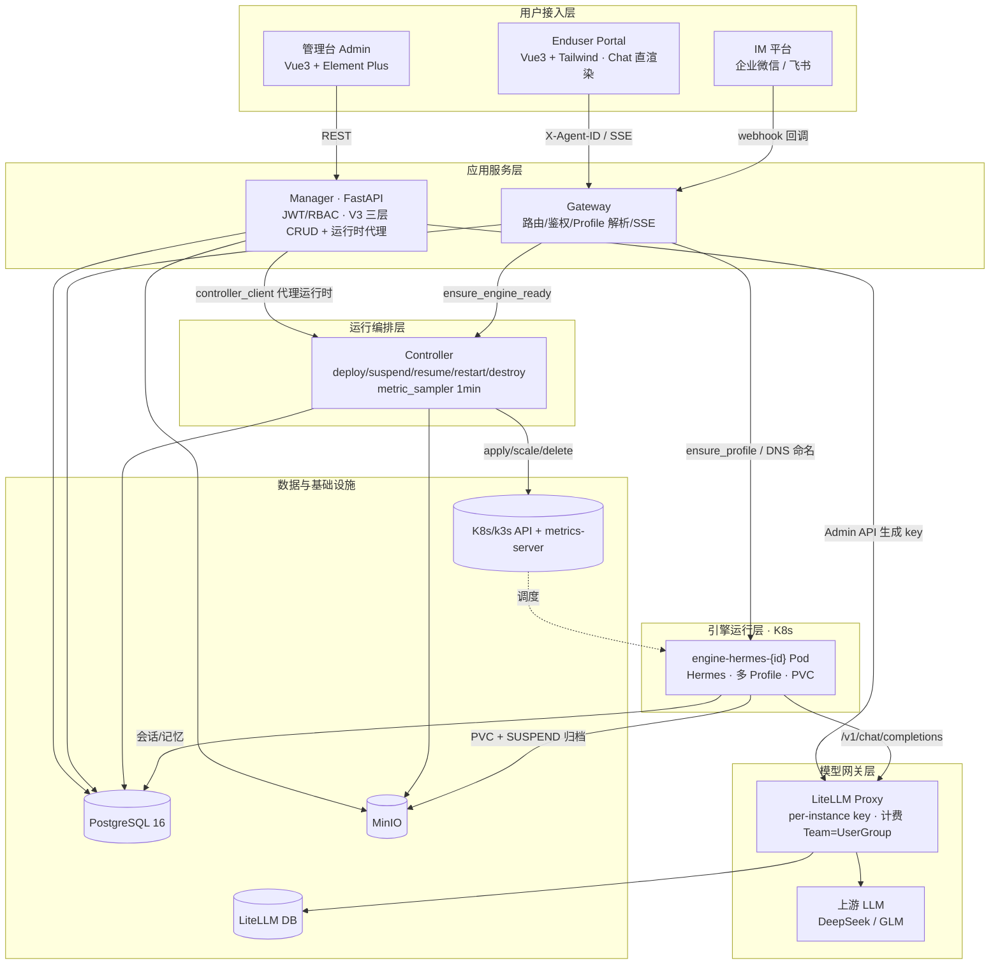
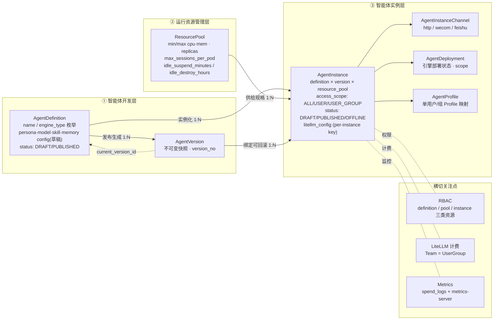
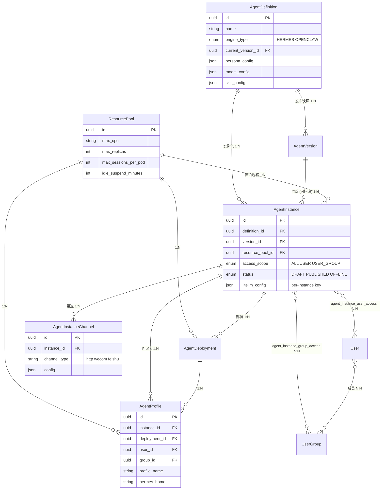
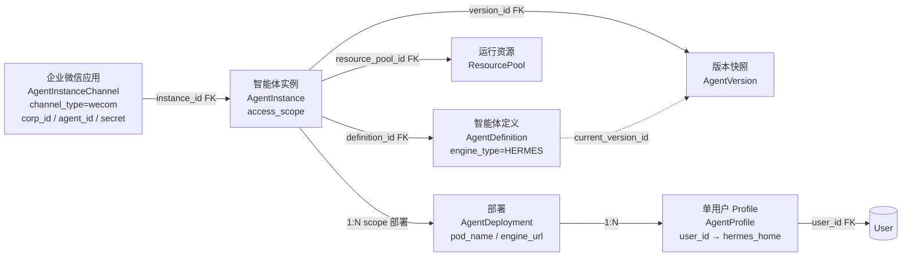
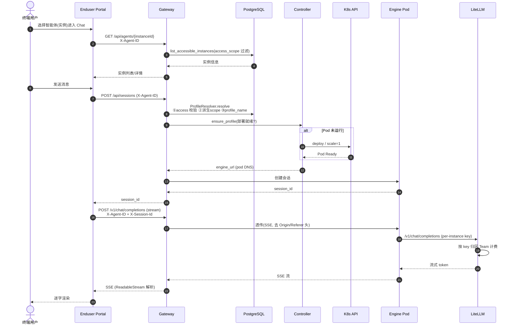
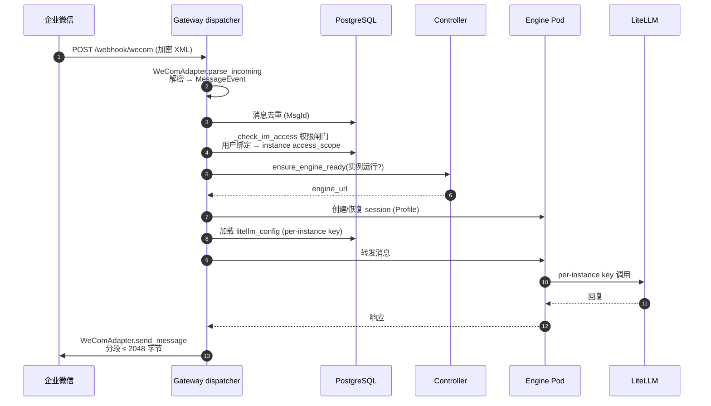
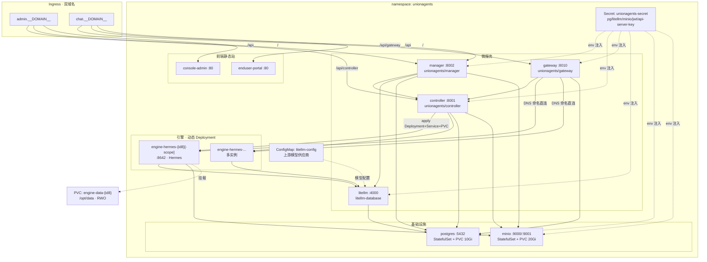
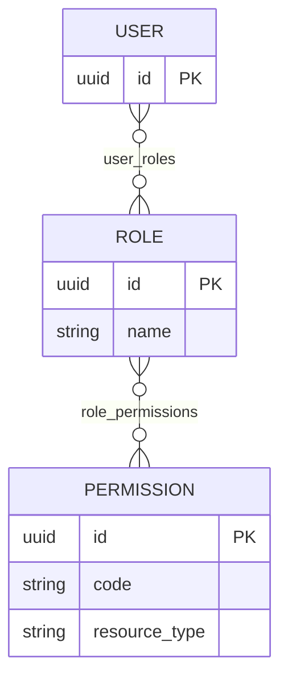
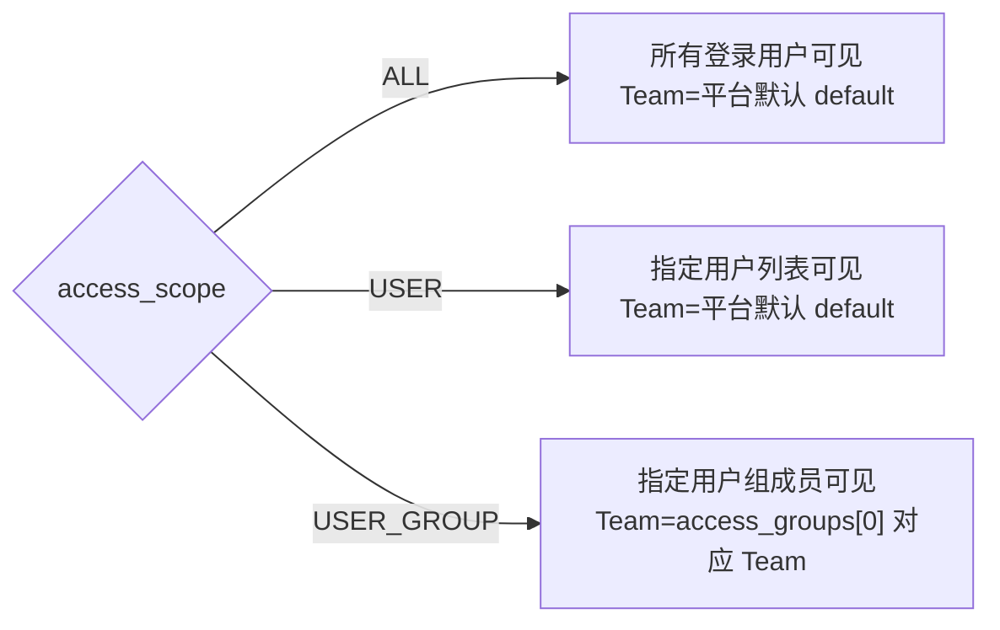

# UnionAgents（知行）V3 架构图

> 基于 2026-06-23 完成的 V3 三层重构（智能体开发 / 运行资源管理 / 智能体实例 三层分离）整理。

事实来源：
- 数据模型：`services/manager/app/models`（`agent_definitions` / `agent_versions` / `resource_pools` / `agent_instances` + `agent_instance_channels` / `agent_instance_user_access` / `agent_instance_group_access` / `agent_deployments` / `agent_profiles`）
- 引擎运行时映射：`pkg/common/config.py` 的 `ENGINE_RUNTIMES`
- 编排：`services/controller/app/main.py`（`_load_instance_config` / `_load_resource_spec` / `deploy` / `suspend` / `resume` / `restart` / `destroy`）
- 网关：`services/gateway` 的 `profile_resolver` + dispatcher + wecom 适配器
- 终端门户：`apps/enduser/src`（`useChat` composable）

---

## 1. 系统整体架构图

**要点**：Gateway 反向依赖解耦——不查 Controller 取 upstream，靠 `X-Agent-ID` + DNS 命名规范（`{pod_name}.{ns}.svc.cluster.local:port`）直连引擎；Controller 只管 Pod 生命周期与采样。引擎全部经 LiteLLM 调上游，per-instance key 保证用量精确归因到计费 Team（Team = UserGroup）。

---

## 2. 逻辑架构（V3 三层 + 横切）

**要点**：
- 引擎类型**不建表**——`engine_type` 作枚举放 definition，镜像/端口走 `ENGINE_RUNTIMES` 常量（`HERMES`→`unionagents/engine-hermes:latest`/8642，`OPENCLAW`→同端口）。理由：加引擎必须改代码，是强契约，建表会误导。
- 「发布」语义拆分：定义「发布版本」(生成快照) ≠ 实例「上线」(DRAFT→PUBLISHED)。实例绑定 `version_id` 支持回滚。
- 技能挂定义层，install/sync/uninstall fan-out 到定义各实例；access_scope 在实例层决定谁能用，渠道层不再重复控制权限。
- 运行时操作全归实例详情页：deploy / suspend / resume / restart / destroy；定义层只管 Manager 操作（发布/下线/编辑）。

---

## 3. 顶层模型关系图（ER + 企业微信引用链）

### 3a. ER 关系（1:N / N:N / 引用）

### 3b. 以企业微信为例的引用链

> 题目要求的链路：企业微信应用 → 智能体实例 → 智能体定义 → 运行资源 → 单用户 Profile

**引用链语义**：企业微信应用 → 实例（渠道 FK）→ 定义（实例化来源）+ 版本（运行配置快照，可回滚）→ 资源池（规格供给）→ 部署（引擎 Pod 实例）→ 单用户 Profile（Pod 内隔离会话空间）。`access_scope` 在实例层决定谁能用，渠道层只做存在性检查、不再重复控制权限。

---

## 4. 运行时序图（最终用户视角入口）

### 4a. Web Portal 聊天入口（主路径）

### 4b. IM 渠道入口（企业微信 inbound）

> 📌 **完整 IM/Channel 对接文档**已拆分到 [`docs/architecture-im-channels.md`](./architecture-im-channels.md)（HTML 版 [`architecture-im-channels.html`](./architecture-im-channels.html)，含模型字段表、入站/出站时序图、adapter 差异表、v0.8.19 端口单源真相）。下面保留简化时序图作总览，细节以那份为准。
>
> 关键更新（vs 下方旧图）：webhook 路径为 `/api/gateway/channel/{type}/{agent_id}/callback`；`ensure_engine_ready` 走 DNS 命名规范（不查 Controller）；profile 解析含 IM 用户绑定转换（`im_user_bindings`）；引擎路由经 Pod 内 nginx `X-Hermes-Profile` 头 → per-profile 端口（`port_map.json` 唯一真相，v0.8.19）。

**要点对比**：Web 入口由 Portal 主动建会话、Gateway 透传 SSE（nginx 必须 `proxy_buffering off`，且去掉 `Origin`/`Referer` 头避免引擎 403）；IM 入口由 dispatcher 被动收回调，做去重 + 权限闸门 + ensure 引擎就绪后转发，响应需按企业微信消息长度（≤2048 字节）分段回发。两条路径最终都落到「Gateway → 引擎 Pod → LiteLLM → 上游」同一模型调用链，per-instance key 保证计费归因。

---

## 5. k3s 部署拓扑图

单 namespace `unionagents`，所有组件同 ns。Ingress 双域名分流管理台与聊天门户；引擎 Pod 由 Controller 动态创建为 Deployment + 同名 Service + PVC。

**要点**：
- **单 namespace**：`unionagents`，无多 ns 隔离；引擎与平台服务同 ns，靠 DNS 命名（`engine-hermes-{id[:8]}[-{scope}].unionagents.svc:8642`）路由。
- **引擎动态创建**：Controller `k8s_manager.py` 按 instance 创建 Deployment + 同名 Service + PVC `engine-data-{id[:8]}`（挂 `/opt/data`，多 Profile 布局 `/opt/data/profiles/{name}`）。
- **Ingress 双域名**：`admin.__DOMAIN__`（管理台）、`chat.__DOMAIN__`（终端门户），前端静态站走 `/`。`/api` 拆分：管理台只路由到 manager + controller（运行时代理），**不接 gateway**；终端门户额外路由 `/api/gateway` 到 gateway（聊天 SSE）。
- **Secret/ConfigMap 集中**：`unionagents-secret` 统一管所有凭据；`litellm-config` ConfigMap 存上游模型供应商（敏感，不入库）。
- **持久化**：PG（10Gi，含 `unionagents` + `litellm` 两个库）、MinIO（20Gi）、引擎 PVC（RWO，每实例一块）。

---

## 6. RBAC 权限矩阵图

权限模型：`Role` ⟂ `Permission`（N:N，经 `role_permissions`），`User` ⟂ `Role`（N:N，经 `user_roles`）。权限粒度 = `resource_type` + `code`。管理台走 RBAC；终端用户走 `access_scope`（与 RBAC 分离）。

### 6a. 权限模型与角色

> 终端用户访问**不走 RBAC**，由 `AgentInstance.access_scope`（ALL / USER / USER_GROUP）决定可见性，与管理台 RBAC 分离（详见 6c）。

### 6b. 预置角色 × 权限矩阵

| resource_type | 动作 code | 平台管理员 | 组管理员 | 说明 |
|---|---|:---:|:---:|---|
| **litellm** | `model:manage` | ✅ | ❌ | 全局上游模型/供应商，不受组范围限制 |
| | `key:manage` | ✅ | ✅ | 所属 UserGroup 对应 Team 的虚拟 key |
| | `spend:view` | ✅ | ✅ | 所属 UserGroup 用量与成本 |
| **agent_definition** | `view` | ✅ | ✅ | |
| | `create` | ✅ | ✅ | |
| | `update` | ✅ | ✅ | 编辑草稿配置 |
| | `delete` | ✅ | ❌ | 组管理员不可删定义 |
| | `publish` | ✅ | ✅ | 发布版本快照 |
| | `manage_skills` | ✅ | ✅ | 安装/开关/排序/卸载技能 |
| **resource_pool** | `view` | ✅ | ✅ | |
| | `create` | ✅ | ❌ | 资源池仅平台管理员维护 |
| | `update` | ✅ | ❌ | |
| | `delete` | ✅ | ❌ | |
| | `clone` | ✅ | ❌ | |
| **agent_instance** | `view` | ✅ | ✅ | |
| | `create` | ✅ | ✅ | |
| | `update` | ✅ | ✅ | |
| | `delete` | ✅ | ✅ | |
| | `clone` | ✅ | ✅ | |
| | `publish` | ✅ | ✅ | 上线（对终端可见） |
| | `offline` | ✅ | ✅ | 停用 |
| | `switch_version` | ✅ | ✅ | 切换绑定版本（升级/回滚） |
| | `manage_channel` | ✅ | ✅ | 管理 IM 渠道 |
| | `deploy` | ✅ | ✅ | 运行时：部署引擎 |
| | `suspend` | ✅ | ✅ | 运行时：scale 0 + 存档 |
| | `resume` | ✅ | ✅ | 运行时：恢复 |
| | `restart` | ✅ | ✅ | 运行时：滚动重启 |
| | `destroy` | ✅ | ✅ | 运行时：销毁引擎 + 归档 |
| | `view_overview` | ✅ | ✅ | 概览 |
| | `view_metrics` | ✅ | ✅ | 监控 |
| | `view_memory` | ✅ | ✅ | 记忆 |
| | `view_logs` | ✅ | ✅ | Pod 日志 |

> 平台管理员 = 全部权限（含 `resource_pool` 写与 `litellm:model:manage`）；组管理员 = 实例全生命周期 + 定义开发 + 资源池只读 + LiteLLM key/spend，不可删定义、不可改资源池、不可管全局模型。

### 6c. 终端用户 access_scope 与计费 Team 派生

终端用户**不走 RBAC**，由 `AgentInstance.access_scope` 决定可见性；计费 Team 由 access_scope 派生（谁能用谁出钱）：

`_derive_team`：`USER_GROUP` → 首个组对应 Team；`ALL`/`USER` → 平台默认 Team（`team_id="default"`）。access 变更触发 per-instance key 重生成。
