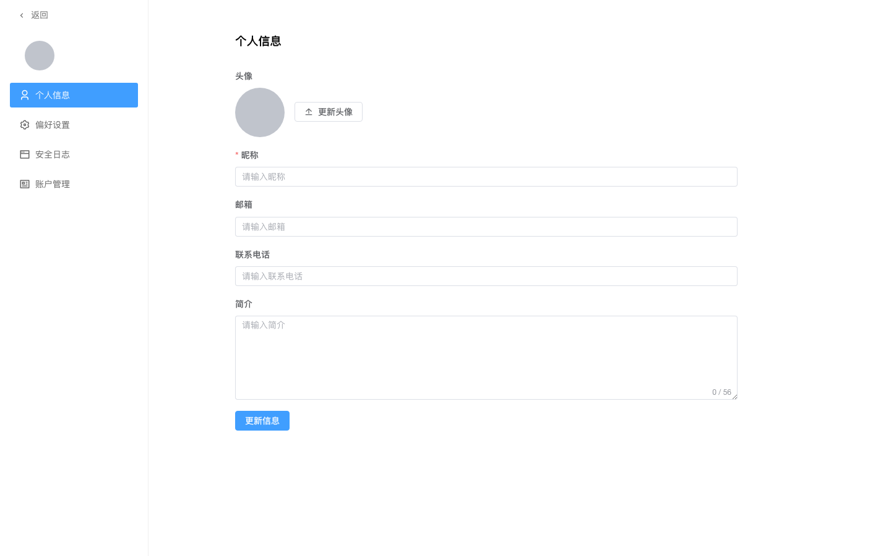

# 修改个人资料

账户设置是当前登录用户的自服务入口，左侧边栏 + 右侧 2 个 Tab：「个人信息」、「安全日志」。

## 改头像与昵称

### 操作步骤

1. 单击右上角头像，在下拉菜单中单击**账户设置**。

2. 默认在「个人信息」Tab。

3. 改头像：

   - **本地上传**：单击当前头像，弹出裁剪对话框 → 选择本地图片 → 拖动调整裁剪框 → 单击**确认裁剪**，上传到服务端
   - **选择预置头像**：单击头像旁的**选择预置头像**按钮，弹窗中以 12 宫格展示系统预置的卡通头像，单击任一卡片选中后单击**确认**即可

4. 改昵称、绑定邮箱、绑定手机：

   - **昵称**：必填，显示在 navbar 右上角
   - **绑定邮箱**：输入时自动联想 `@qq.com` / `@126.com` / `@163.com` 等后缀
   - **绑定手机**：手机号

5. 单击**更新信息**保存。

### 预期结果

- navbar 右上角显示新头像和昵称
- 其他用户在操作记录、文章作者等位置看到新昵称

## 修改密码

1. 在「个人信息」Tab，单击**修改密码**。
2. 弹窗中依次填写**原密码**、**新密码**（至少 8 位）、**确认新密码**。
3. 单击**确定**。
4. 原密码错误时提示「原密码错误」，新密码与确认不一致时提示「两次输入的新密码不一致」。
5. 修改成功后旧 Token 仍可用（不强制重新登录），如需立即失效请手动退出。

::: tip 头像存储
头像上传后存到 MinIO 公开 bucket，可直接通过 URL 访问；个人资料字段（昵称 / 邮箱 / 手机）保存到后端 users 表。新建用户时系统会按用户名哈希确定性分配一个预置头像作为初始头像，后续可随时通过本地上传或选择预置头像更换。
:::

## 认证邮箱与手机

绑定邮箱/手机后默认「未认证」状态，未认证的联系方式不能用于登录、找回密码、账号解锁。您可自行完成认证：

1. 在「个人信息」Tab，邮箱/手机字段右侧若显示**认证邮箱**（或**认证手机**）按钮，表示当前绑定但未认证。
2. 单击按钮，弹出认证对话框。
3. 输入图形验证码 → 单击**发送验证码**，系统通过当前激活的邮件/短信服务商向您的绑定邮箱/手机发送 6 位验证码（10 分钟内有效）。
4. 收到验证码后填入 → 单击**确认认证**。
5. 验证通过后，按钮消失，邮箱/手机状态变为「已认证」。

::: tip 改绑后需重新认证
通过「修改邮箱」改绑新邮箱后，状态自动回退为「未认证」，需重新走本流程认证才能用于找回密码等场景。
:::

::: warning 唯一性
已认证的邮箱/手机在系统中全局唯一。若改绑到一个已被其他用户认证的邮箱/手机，系统会返回 409 冲突，需先让对方用户改绑或解绑。
:::

## 看登录历史

1. 在账户设置页，单击左侧**安全日志**。
2. 表格只展示账户安全相关的操作：

   | 列 | 说明 |
   |---|---|
   | 操作 | 动作类型，简化展示为动词：登录 / 登出 / 修改密码 / 修改资料 |
   | IP 地址 | 操作发起的客户端 IP（nginx 透传 X-Forwarded-For） |
   | 用户代理 | 操作发起的客户端标识（浏览器/curl/SDK 等，鼠标悬停看完整 UA） |
   | 时间 | 操作发生时间 |

3. 支持分页查看历史。其他操作（如 token 刷新、单纯换头像）不在此列表展示，可在管理员后台的操作记录里查。仅保留近 3 个月内的操作记录，更早的日志按审计合规要求归档，不在此接口暴露。
