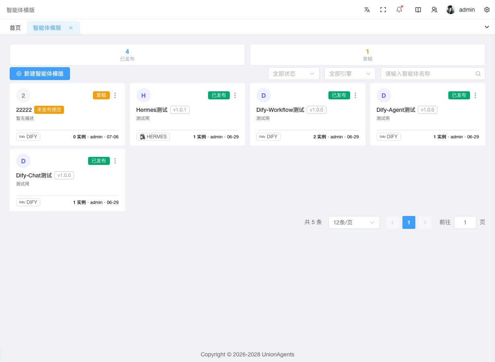

# 创建并发布智能体定义

当你需要让平台提供一个新的智能体能力（比如"客服助手"、"代码审查员"）时，先在「智能体开发」页面创建它的**定义**——定义是智能体的版本化蓝图，包含人设、技能、模型配置。发布定义后才能在[智能体实例](agent-instances.md)页面创建可运行的实例。

## 前提条件

- 已登录控制台，拥有「智能体定义」的创建权限（系统管理员或运维人员）
- 已规划好智能体的：名称、引擎类型（Hermes / OpenClaw / Dify）、人设描述、要装的技能

## 操作步骤

1. 登录 UnionAgents 控制台。

2. 在左侧导航栏，单击**智能体开发**。

   进入智能体定义列表页，顶部展示已发布 / 草稿 / 总数三个统计卡片。

3. 单击右上角**创建**按钮。

4. 在弹出的创建向导中，填写以下信息：

   - **名称**：智能体定义名（如"客服助手"）
   - **引擎类型**：选择 Hermes / OpenClaw / Dify 之一
   - **描述**：一句话说明这个智能体做什么

5. 单击**保存**，进入定义详情页。

6. 在详情页配置智能体的核心内容：

   1. 单击**人设** Tab，在 Markdown 编辑器中编写 `system_prompt`（即 SOUL.md），定义智能体的角色、能力边界、行为规范。保存时会同步写入 `persona_config` 和 `model_settings`。
   2. 单击**技能** Tab，在技能目录中找到需要的技能，单击**安装**。已安装的技能可通过开关启用/禁用；需要凭证的技能（如调外部 API）单击**配置**填写。
   3. 在向导的模型配置步骤中，选择模型组（从[模型组管理](litellm.md#模型组管理)中已注册的 `model_name` 中选）。

7. 配置完成后，单击右上角**发布版本**。

8. 在弹出的对话框中，填写**变更说明**（change log），单击**确认**。

   生成新版本（如 v1.0），状态变为「已发布」。

## 预期结果

- 定义列表页卡片显示版本号 `v1.0`、状态标签「已发布」
- 详情页「版本」Tab 出现一条 v1.0 的记录，包含你填写的变更说明
- 该定义可被[智能体实例](agent-instances.md)页面选择并实例化

## 后续步骤

- [创建智能体实例](agent-instances.md) — 选定这个定义的某个版本，绑定资源池部署运行
- [接入 IM 渠道](agent-instances.md#接入-im-渠道) — 让终端用户能从企微/飞书对话

## 修改已发布的智能体

已发布定义需要改人设或增减技能时：

1. 在定义详情页直接编辑**人设**或**技能** Tab。
2. 改完后卡片会显示橙色「未发布修改」标签。
3. 单击**发布版本**，填新的变更说明（如"v1.1：增加天气技能"），生成新版本。
4. 运行中的实例可[热升级](agent-instances.md#升级到新版本)到新版本，无需重建 Pod。

::: tip 版本回滚
在「版本」Tab 可查看所有历史版本。如需回滚，联系平台管理员在数据库层操作（当前 UI 未提供一键回滚）。
:::
