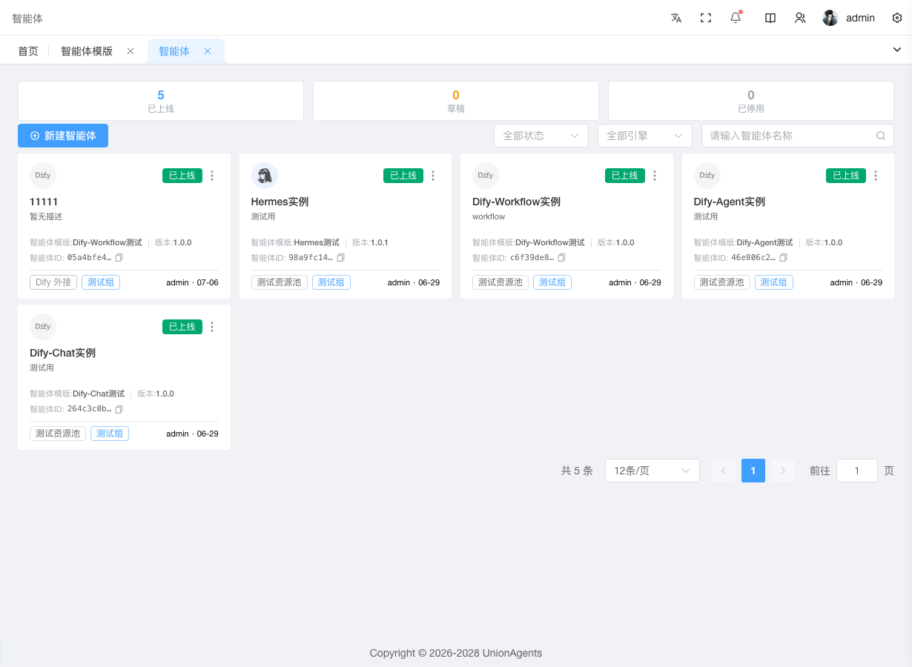

# 部署并管理智能体实例

智能体实例是平台对外提供服务的运行时单元——绑定一个[定义](agent-definitions.md)的某个版本 + 一个[资源池](resource-pools.md)，部署到 K8s 后通过 Gateway 暴露给终端用户。本页讲怎么创建实例、部署、升级、下线、排查异常。

## 前提条件

- 已有一个[已发布的智能体定义](agent-definitions.md)（如 v1.0）
- 已有一个[资源池](resource-pools.md)（Dify 外部模式实例不需要）
- 拥有「智能体实例」的创建权限

## 创建并部署实例

1. 在左侧导航栏，单击**智能体实例**。

2. 单击右上角**创建**按钮。

3. 在创建表单中填写：

   - **实例名称**：对外展示的名字（如"客服助手-生产"）
   - **绑定定义**：选择上一步发布的定义 + 版本（如"客服助手 v1.0"）
   - **资源池**：选择已建好的资源池（Dify 实例选"外部"跳过）
   - **所属用户组**：选实例归属的组（决定可见性与 LiteLLM Key 归属）

4. 单击**保存**。列表出现新实例，状态为「草稿」+「待启动」。

5. 单击实例卡片进入详情页。

6. 单击右上角**部署**按钮。

   底部出现 4 步部署进度面板：**启动中 → 创建 Pod → 等待运行 → 就绪**。页面每 2 秒轮询一次，最长 3 分钟。失败可单击**重试**。

7. 部署完成后，运行状态变为「运行中」（实心绿色标签）。

8. 单击**上线**按钮，发布状态从「草稿」变为「已发布」。

   此时终端用户可通过终端门户或 API 访问该实例。

## 预期结果

- 实例卡片显示状态标签「已发布」+「运行中」
- 卡片显示定义版本号、资源池名、用户组
- 头部 Agent ID 可复制，用于 API 调用

## 升级到新版本

当[定义](agent-definitions.md)发布了新版本（如 v1.1 增加了天气技能），运行中的实例可热升级：

1. 在实例列表页，有新版本可升级的实例卡片会显示**红色脉动铃铛**图标。

2. 单击该实例进入详情页。

3. 头部版本号旁显示「有新版本 v1.1」提示，单击**升级**按钮。

4. 确认后，新版本的人设/技能会热加载到运行中的 Pod，**无需重建 Pod**（Hermes/OpenClaw 支持；Dify 外部模式走 Dify 平台自身更新）。

## 临时下线 vs 完全回收

| 需求 | 操作 | 效果 |
|---|---|---|
| 临时下线（终端不可见，但 Pod 还在，可快速恢复） | 卡片菜单 → **下线** | 发布状态变「已下线」，运行状态保持「运行中」 |
| 完全回收（清 Pod 释放资源，数据归档 MinIO） | 详情页 → **销毁** | 运行状态变「已归档」，K8s 资源清理，数据已备份 |
| 重新上线已下线实例 | 卡片菜单 → **上线** | 发布状态恢复「已发布」 |
| 恢复已挂起实例 | 详情页 → **恢复** | 从 SUSPENDED 回到 RUNNING |

::: warning 销毁不可逆
**销毁**会清理 K8s 资源，但数据已归档到 MinIO（SUSPEND 时自动触发归档）。归档后实例记录仍在，可查看历史数据，但不能重新启动——需重新创建实例。
:::

## 排查实例异常

实例跑出问题时（响应慢、报错、不响应），按以下顺序排查：

### 1. 看运行状态标签

详情页头部有两个状态标签：

- **发布状态**（细边框）：草稿/已发布/已下线 — 业务可见性
- **运行状态**（实心）：运行中/已挂起/失败/部署中/已归档 — Pod 实际情况

如果运行状态是**失败**（红色），继续下一步。

### 2. 看 Pod 状态

单击**运行时** Tab，看 Pod 表格：

- Pod 状态为 **CrashLoopBackOff**（红色）：引擎启动失败，看日志
- Pod 状态为 **Pending**（黄色）：资源不够，Pod 调度不上去，检查[资源池](resource-pools.md)容量
- 重启次数 > 0（黄色高亮）：Pod 反复重启，看日志找原因

### 3. 看实时日志

1. 在「运行时」Tab，单击有问题的 Pod 行的**查看日志**。
2. 在弹出的日志抽屉中：
   - **来源**：默认看 engine stdout（引擎日志）；Gateway 相关问题切到 gateway per-profile
   - **Profile**：选要看的 Profile 配置
   - **尾行数**：200 / 500 / 1000 / 2000 行
   - **自动刷新**：开启后定时拉新日志

3. 根据日志报错定位问题（如模型 API Key 失效、技能凭证错误、资源不足等）。

### 4. 看监控曲线

单击**监控** Tab，看 CPU / 内存 / 请求数 / Token 数 1h / 6h / 24h / 7d 趋势：

- CPU 持续接近 limit：实例可能被打满，考虑[扩容资源池](resource-pools.md)
- 请求数突降：可能 Gateway 路由异常或终端侧故障
- Token 数异常高：可能有滥用，去[用量统计](monitoring.md#看谁用了多少-token)按用户下钻

### 5. 看 API Key

单击**API Keys** Tab，确认实例的有效 Key：

- 每实例最多 10 个 Key
- 创建 Key 后明文仅展示一次，需立即复制保存
- Key 失效会导致 API 调用 401，可在[API Key 管理](litellm.md#管理-api-key)页封禁/吊销/重建

## 接入 IM 渠道

让终端用户从企微/飞书/钉钉对话触发该实例：

1. 进入实例详情页，单击**渠道** Tab。
2. 选择 IM 类型（企业微信 / 飞书 / 钉钉）。
3. 填写对应凭证字段（企微：corpid / secret / token / aes_key；飞书：app_id / app_secret；钉钉：app_key / app_secret）。
4. 单击**保存**，开关自动启用。
5. HTTP 渠道（Webhook 触发）单独开关，与 IM 渠道独立。

详见 [IM 渠道架构](../architecture/architecture-im-channels)。

## 后续步骤

- [创建 API Key 调用实例](litellm.md#管理-api-key) — 用 sk- 风格 Key 通过 OpenAI SDK 调用
- [排查调用慢在哪](monitoring.md#排查某次调用慢在哪) — 链路追踪
- [查看实例的用量](monitoring.md#看谁用了多少-token) — 按 Agent 过滤
