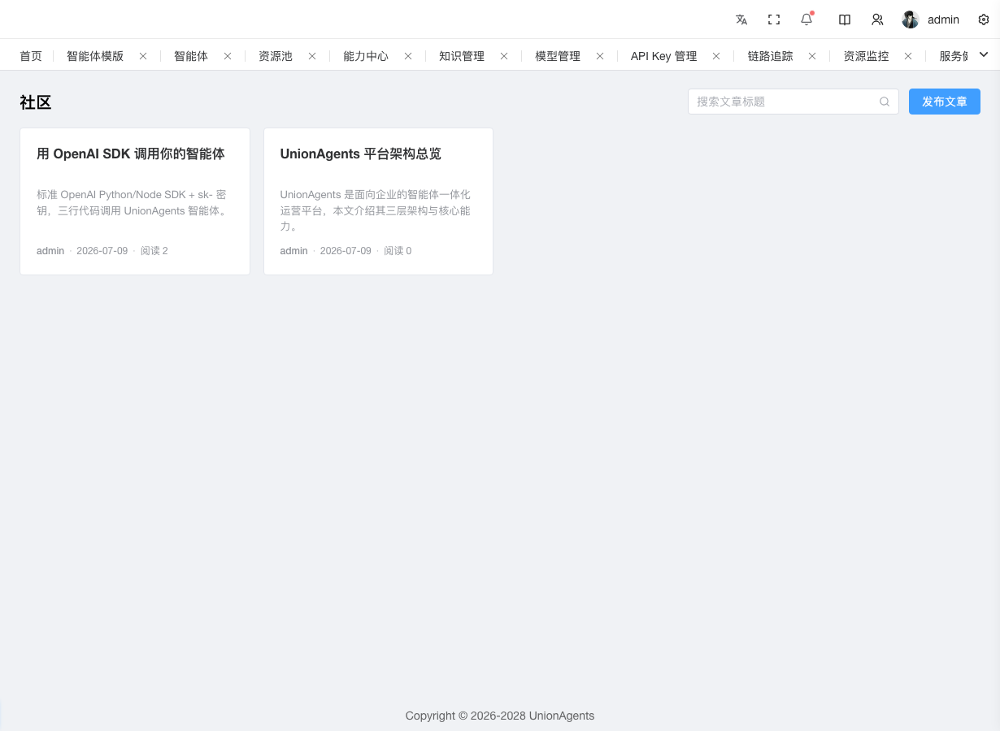
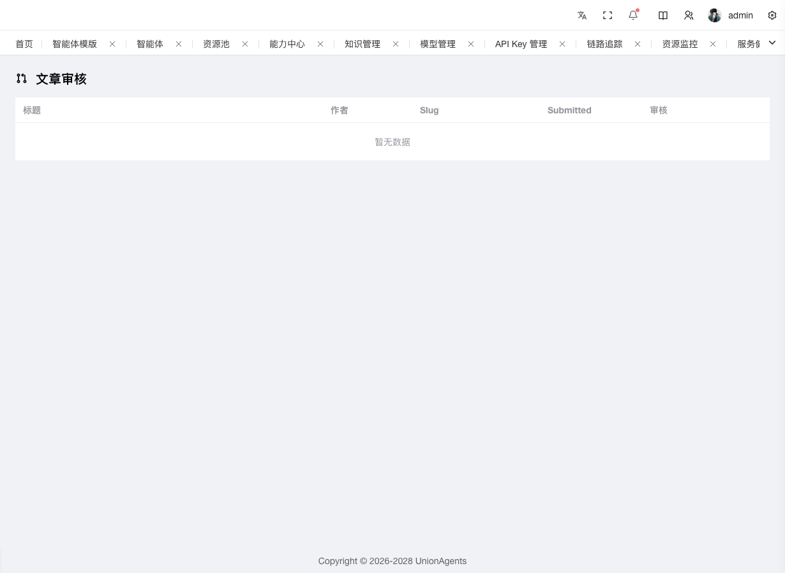

# 发文章与审核文章



社区是平台对外公开的技术文章区，所有登录用户可发文章，需管理员审核后才上线。公开阅读**无需登录**。

本页讲两个任务：**写一篇文章** 和 **审核待发布的文章**。

## 写一篇文章 {#write}

### 前提条件

- 已登录控制台（任何角色都可发）
- 文章内容已准备好（Markdown 格式）

### 操作步骤

1. 在左侧导航栏，单击**社区 → 文章列表**。

   ::: info 公开可访问
   `/community/list` 无需登录即可访问，但发帖需登录。
   :::

2. 单击右上角**写文章**按钮，进入编辑器。

3. 填写：

   - **标题**：文章标题（必填）
   - **Slug**：URL 友好标识。可手填，或留空让系统自动从标题转拼音 + kebab-case。冲突时自动加后缀（如 `my-post-2`）
   - **摘要**：一句话摘要，列表展示用
   - **正文**：md-editor-v3 编辑器，支持工具栏、预览、深色模式

4. 完成后两个选择：

   - 单击**保存草稿**：状态保持 DRAFT，仅作者可见，可继续编辑
   - 单击**提交审核**：弹窗确认"提交后将进入审核队列"，确认后状态变 PENDING

### 预期结果

- 「我的文章」页出现新文章
- 保存草稿：状态显示「草稿」
- 提交审核：状态显示「待审核」，进入管理员审核队列

### 修改草稿或驳回后的文章

仅 DRAFT / REJECTED 状态可改：

1. 在「我的文章」找到对应文章。
2. 单击**编辑**。
3. 修改后保存草稿或重新提交审核。

::: tip 看驳回理由
状态为「已驳回」的文章会展示 `reject_reason`，按理由修改后再提交。
:::

## 审核待发布的文章 {#audit}



### 前提条件

- 拥有 `community:audit` 权限（通常是平台/系统管理员）

### 操作步骤

1. 在左侧导航栏，单击**社区 → 社区审核**。

2. 待审核队列列出所有 PENDING 状态的文章：

   | 列 | 说明 |
   |---|---|
   | 标题 | 文章名 |
   | 作者 | 作者用户名 |
   | 提交时间 | 进入审核队列的时间 |
   | 操作 | 通过 / 驳回 |

3. 找到要审核的文章，单击行末操作：

   - **通过**：状态变为 PUBLISHED，设置 `published_at`，文章立即在公开列表可见
   - **驳回**：弹窗填写驳回理由（`reject_reason`），状态变为 REJECTED

4. 驳回理由会展示给作者，作者修改后可重新提交。

### 预期结果

- 通过的文章：公开列表 `/community/list` 立即可见
- 驳回的文章：作者「我的文章」页显示「已驳回」+ 理由

## 文章状态机

```
草稿 DRAFT → 提交审核 → 待审核 PENDING → 通过 → 已发布 PUBLISHED
                              ↓
                          驳回 → 已驳回 REJECTED → 修改后重新提交
```

## 权限矩阵

| 操作 | 作者本人 | 平台管理员 | 其他用户 | 未登录 |
|---|---|---|---|---|
| 查看公开列表/详情 | ✓ | ✓ | ✓ | ✓ |
| 查看自己草稿/待审/驳回 | ✓ | ✓ | ✗ | ✗ |
| 创建文章 | ✓ | ✓ | ✓ | ✗ |
| 编辑自己文章（DRAFT/REJECTED） | ✓ | ✓ | ✗ | ✗ |
| 提交审核 | ✓ | ✓ | ✗ | ✗ |
| 删除自己文章 | ✓ | ✓ | ✗ | ✗ |
| 删除他人文章 | ✗ | ✓ | ✗ | ✗ |
| 审核 | ✗ | ✓ | ✗ | ✗ |

## 平台预置文章

启动时自动 seed 2 篇平台文章（由系统管理员发布，直接 PUBLISHED 状态，无需审核）：

- 《UnionAgents 平台架构总览》—— V3 架构摘要
- 《用 OpenAI SDK 调用你的智能体》—— 与 [API 调用指导](../api-usage) 联动

如已存在同 slug 文章则跳过，幂等可重复执行。
