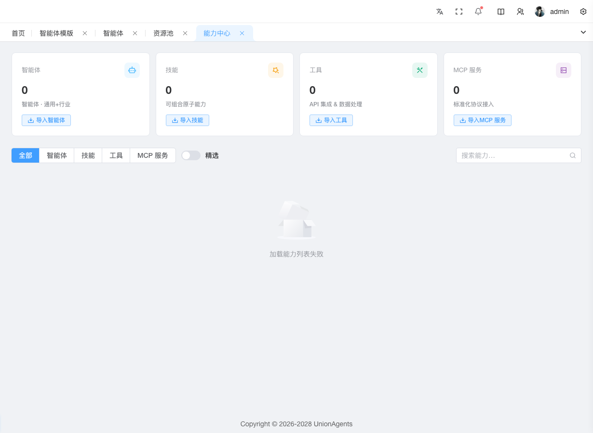

# 发布与订阅能力



能力中心（Hub）是平台的能力市场——Agent / Skill / Tool / MCP 的统一注册中心。开发者把可复用能力发布到 Hub，其他用户订阅后挂载到自己的智能体使用。

本页讲两个核心任务：**发布新能力** 和 **订阅 Skill 到智能体**。

## 发布新能力

当你开发了一个新的技能/工具/Agent 模板，想让它被其他智能体复用时，发布到 Hub。

### 前提条件

- 拥有 Hub 的导入权限
- 已准备好能力的 manifest（JSON 格式，描述能力结构与调用方式）

### 操作步骤

1. 在左侧导航栏，单击**能力中心**。

2. 顶部四个分类卡片（Agent / Skill / Tool / MCP），单击对应类型的**导入**按钮。

3. 在弹出对话框中，默认在「自定义」Tab：

   - **名称**：能力名（如"天气查询"）
   - **描述**：一句话说明功能
   - **Manifest**：粘贴 JSON 格式的能力描述文件
   - **行业**：所属行业（如金融/制造）
   - **场景**：适用场景
   - **标签**：多选 + 可手填新标签

4. 单击**确定**，进入能力详情页。

5. 在详情页**版本**卡片，单击**创建版本**。

6. 填写**版本号**（如 v1.0）和**版本描述**，单击**保存**。版本状态变为「草稿」。

7. 单击该版本行的**提交审核**按钮。状态变为「待审核」。

8. 管理员在审核工作台**批准**或**驳回**（驳回需填理由）。

9. 批准后，单击该版本行的**发布**按钮。状态变为「已发布」，其他用户可订阅。

### 预期结果

- Hub 列表页出现该能力卡片，状态标签「已发布」
- 其他用户在 Hub 列表能看到该能力，可订阅

### 版本状态流转

```
草稿 → 提交审核 → 待审核 → 批准/驳回 → 已批准 → 发布 → 已发布
                       ↓
                    已驳回 → 修改后重新提交
```

## 订阅 Skill 到智能体

当你看到 Hub 里现成的 Skill 想用在自己智能体上时。

### 前提条件

- 已有一个[已发布的智能体定义](agent-definitions.md)（如 v1.0）
- 目标 Skill 在 Hub 状态为「已发布」

### 操作步骤

1. 在左侧导航栏，单击**能力中心**。

2. 在列表页找到目标 Skill 卡片，单击**订阅**按钮（仅 Skill 类型有此按钮）。

3. 在弹出的订阅对话框中：

   - **目标能力摘要**：展示 Skill 名/类型/风险等级
   - **选择 Agent 模板**：从已发布的智能体定义中选一个（显示发布/草稿标签）
   - **当前已订阅列表**：标签形式展示已订阅该 Skill 的定义

4. 单击**确认订阅**。系统自动：
   - 把该 Skill 写入所选定义的 `skill_config`
   - 弹窗询问是否发布定义新版本

5. 单击**是，发布新版本**（如 v1.1），填变更说明（如"增加天气查询技能"）。

6. 系统引导跳转到[智能体实例](agent-instances.md)页，对运行中实例做**热升级**到 v1.1。

7. Pod 热加载新 Skill，无需重建。

### 预期结果

- 选定定义的「技能」Tab 出现新订阅的 Skill
- 定义版本号从 v1.0 升到 v1.1
- 运行中实例的 Pod 热加载了新 Skill，下次对话即可调用

## 查看能力详情

单击 Hub 列表的任意能力卡片，进入详情页，包含三张卡：

### 1. 基本信息

描述列表展示：名称 / 类型 / 状态 / 风险等级 / 描述 / 行业 / 场景 / 标签 / 可发现 / 精选 / 创建者 / 来源 / 创建时间。

### 2. 版本

版本表格展示所有版本，每行操作按钮随状态变化（草稿→提交审核，待审核→批准/驳回，已批准→发布）。

### 3. 安全扫描

显示该版本的安全扫描报告：严重级别 / 规则 ID / 消息 / 位置。头部显示整体风险标签 + 发现的问题数量。

::: tip 风险等级
- **低**：无外部调用，安全
- **中**：有外部 API 调用，需关注数据流出
- **高**：可执行任意代码或访问敏感资源，需严格审查
- **阻断**：扫描发现高危问题，禁止发布
:::

## 后续步骤

- [升级已订阅 Skill](agent-definitions.md#修改已发布的智能体) — Hub 发布新版本后在定义页升级
- [创建智能体定义](agent-definitions.md) — 订阅 Skill 前需要先有定义
