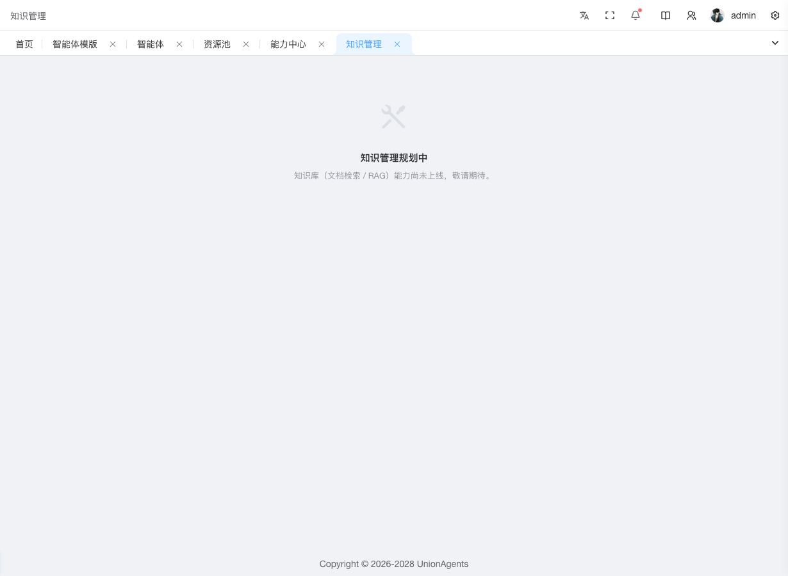

# 知识库（规划中）

::: warning 功能规划中
知识库（文档检索 / RAG）能力尚未上线，敬请期待。
:::

当前进入「知识库」页面会展示「知识管理规划中」占位提示。后续版本将逐步提供以下能力（规划中，可能调整）：

- **文档管理**：上传 PDF / Word / Markdown / TXT，按知识库分组
- **分块与向量化**：自动分块 + 调用嵌入模型生成向量
- **检索测试**：输入 query 实时查看召回结果，调整 chunk 大小 / top-k
- **绑定到智能体**：在[智能体开发](agent-definitions.md)详情页配置知识库技能
- **多租户隔离**：知识库按用户组隔离，跨组不可见

## 后续路线

| 阶段 | 能力 |
|---|---|
| Phase 1（当前） | 占位页 |
| Phase 2 | 文档上传 + 分块 + 向量化 |
| Phase 3 | 检索 API + 知识库技能 |
| Phase 4 | 检索质量评估 + 重组块建议 |

## 临时替代方案

如急需使用 RAG 能力：

- 在[智能体开发](agent-definitions.md)详情页「技能」Tab 直接调用[能力中心](hub.md)中的 RAG 类技能
- 通过 Dify 外部模式实例，在 Dify 平台配置知识库后接入（见[引擎配置](system.md#接入外部-dify)）
