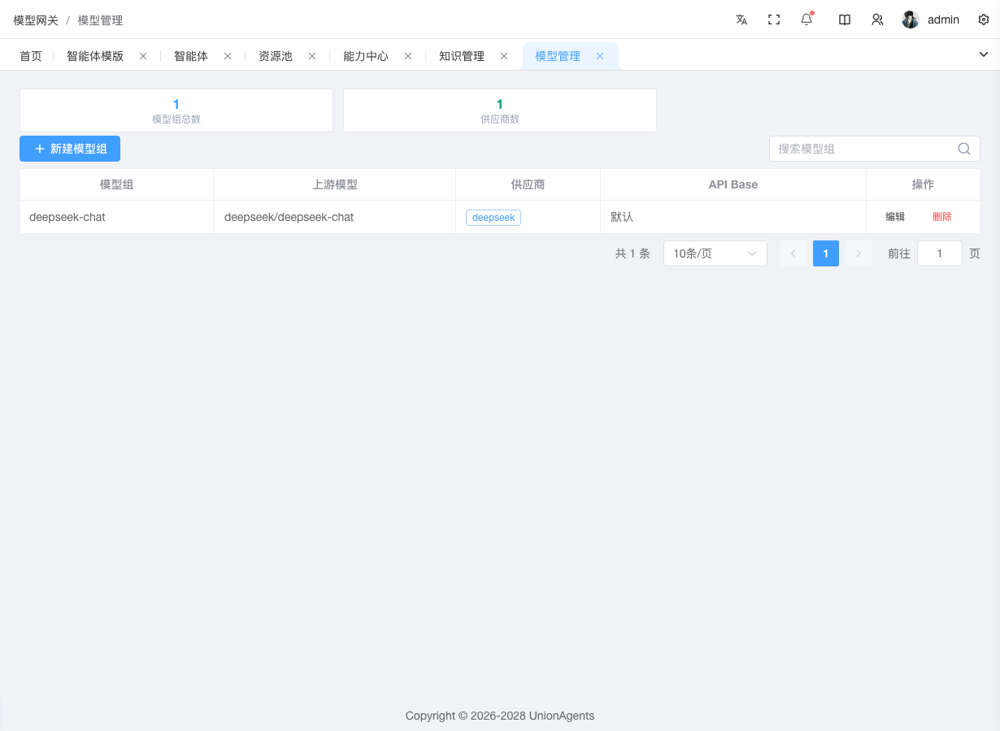
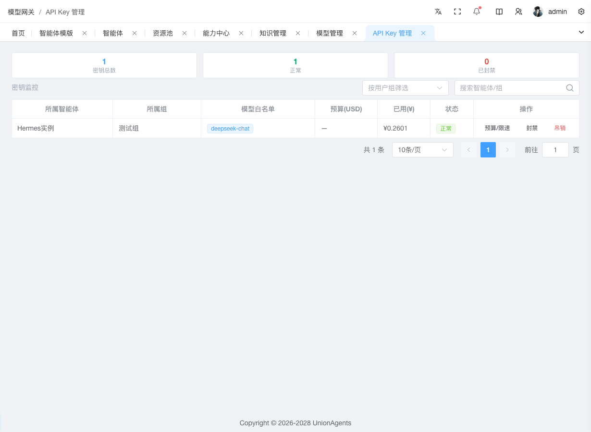

# 注册模型与管理 API Key

平台通过 LiteLLM 统一管理大模型调用——「模型组管理」定义上游模型与凭证，「API Key 管理」控制预算、限流、归属。

本页讲两个任务：**注册一个新模型** 和 **管理 API Key**。

## 注册一个新模型 {#models}

当你需要让智能体能调用某个新模型（如刚开通的 qwen-max、新接入的私有部署模型）时。

### 前提条件

- 拥有「模型组管理」的编辑权限
- 已拿到上游 Provider 的 API Key 和（如非默认）API Base

### 操作步骤

1. 在左侧导航栏，单击**模型组管理**。

2. 单击右上角**创建**按钮。

3. 在弹出对话框中填写：

   - **model_name**：模型别名，作为路由 key（如 `qwen-max`）。**编辑时不可改**
   - **上游模型**：真实模型 ID（如 `qwen/qwen-max`）
   - **api_key**：上游 Provider 的 API Key
   - **api_base**：自定义 API 地址（可选，私有部署填这个）
   - **custom_llm_provider**：可选 + 可手填，预置：openai / anthropic / azure / gemini / vertex_ai / bedrock / mistral / cohere / deepseek / dashscope / zhipu

4. 单击**确定**。列表出现新模型行。

### 预期结果

- 模型组管理表格出现新行，显示别名、上游模型、Provider（自动推导）、api_base
- 该 `model_name` 可在[智能体定义](agent-definitions.md)的模型配置中选择

### 形成模型组（多上游负载均衡）

要让 `gpt-4o` 这个别名在多个上游（如 openai 官方 + azure 备用）之间负载均衡：

1. 注册第一条：`model_name=gpt-4o`，上游 `openai/gpt-4o`，填 openai 的 key
2. 再注册第二条：`model_name=gpt-4o`（同名），上游 `azure/gpt-4o`，填 azure 的 key
3. LiteLLM 自动在两条间做负载均衡与故障转移

### 补充模型价格

模型组管理表格会展示每个模型的**输入价格**和**输出价格**两列（单位 USD / 1M tokens）：

- 上游模型 ID 能被 LiteLLM 内置 pricing 表识别的（如 `openai/gpt-4o`、`deepseek/deepseek-chat`），价格自动显示
- 自定义别名（如火山引擎 Ark 部署的 `deepseek-v4-flash-260425`）LiteLLM 查不到，对应单元格显示红色「未配置」标签，此时模型调用成本在[用量分析](monitoring.md#看谁用了多少-token)页会记为 0

补充价格的步骤：

1. 找到「未配置」的行，单击**编辑价格**。
2. 填写**输入价格**和**输出价格**（USD / 1M tokens，6 位小数精度，可只填一项）。
3. 单击**确认**。

补充价格后**立即生效**——新的调用会按补充后的价格计算成本。**历史调用记录不会回填**，保持原值（如果之前是 0 就仍是 0）。

### 编辑时不改 Key 的约定

编辑模型时，**api_key 字段留空表示保持原值**——后端只在字段非空时才更新。前端不回显已存密钥，避免泄露。

## 管理 API Key {#keys}

API Key 是 LiteLLM 虚拟密钥，**不是上游 Provider 的原始 Key**。Key 在创建[智能体实例](agent-instances.md#接入-api-key)时由系统自动签发（每实例最多 10 个），本页只做**监控与管理**。

### 前提条件

- 拥有「API Key 管理」权限

### 查看某 Agent 用了多少 Token

1. 在左侧导航栏，单击**API Key 管理**。

2. 顶部三个统计卡片：**总数** / **正常** / **已封禁**。

3. 在关键字搜索框输入 Agent 名，回车。

4. 表格按 Agent 名过滤，看对应行的**已花费**列（¥ 计价，4 位小数）。

### 给某 Agent 设预算上限

1. 找到该 Agent 的 Key 行，单击**编辑**。
2. 填写：

   - **max_budget**：最大预算（美元，2 位小数，如 `10.00`）
   - **budget_duration**：预算周期（如 `1mo` = 1 个月，到期自动重置）
   - **rpm_limit**：每分钟请求数上限（如 `60`）
   - **tpm_limit**：每分钟 Token 数上限（如 `100000`）
   - **duration**：Key 过期时间（可选）

3. 单击**保存**。

### 预期结果

- 该 Key 的「预算」列显示 `$10.00 / 1mo`
- 超出预算或限流时，调用会被 LiteLLM 拒绝（返回 429）

### 临时禁用某 Key

当某 Key 疑似泄露或需要临时停用时：

1. 找到该 Key 行，单击**封禁**（带确认弹窗）。
2. 状态变为「已封禁」，调用会被拒绝，但 Key 保留可恢复。

恢复：单击**解禁**，状态回到「正常」。

### 永久删除 Key

::: warning 不可恢复
**吊销**会永久删除 Key，不可恢复。建议优先用「封禁」（可恢复）。
:::

1. 找到该 Key 行，单击**吊销**（带确认弹窗）。
2. 二次确认后，Key 永久删除。

## Key 作用域

每个 Key 同时有两个归属：

- **实例归属**（`metadata.instance_id`）：Key 属于哪个智能体实例
- **用户组归属**（`team_id`）：Key 属于哪个用户组（`default` = 平台默认）

按用户组筛选时，选某个组只会列出 `team_id` = 该组 ID 的 Key。

## 后续步骤

- [创建智能体实例](agent-instances.md) — 实例创建时自动签发 Key
- [查看用量明细](monitoring.md#看谁用了多少-token) — 按 Agent/组/模型下钻 Token 与成本
- [API 调用指导](../api-usage) — 用 sk- Key 通过 OpenAI SDK 调用
