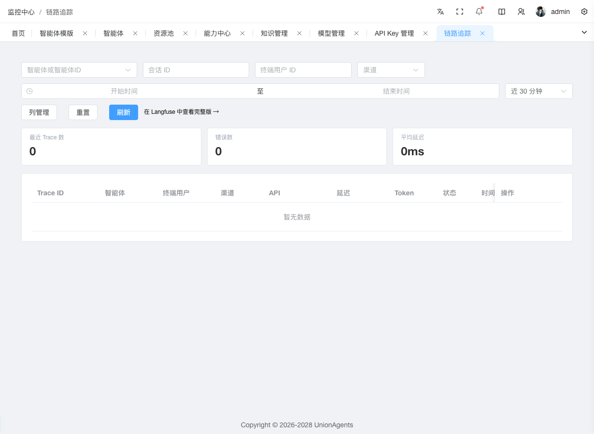
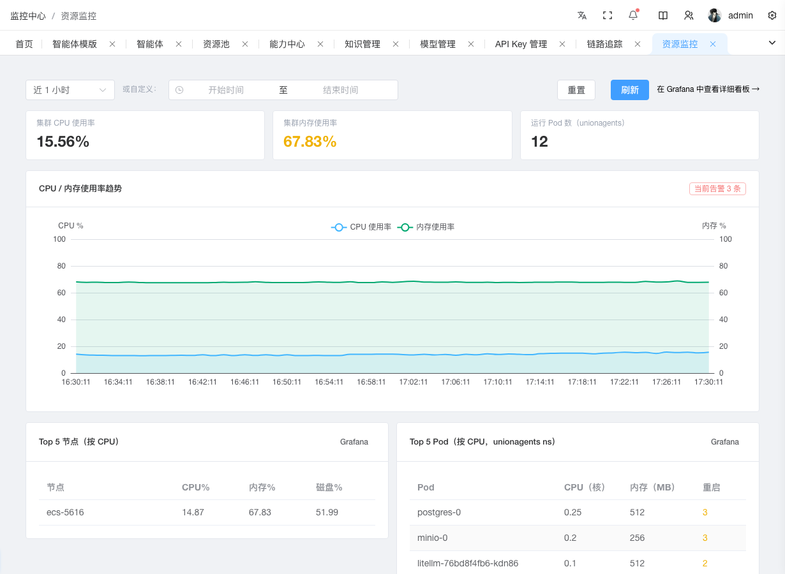
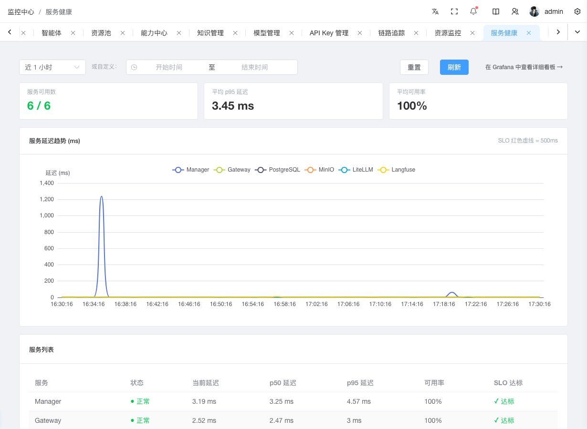
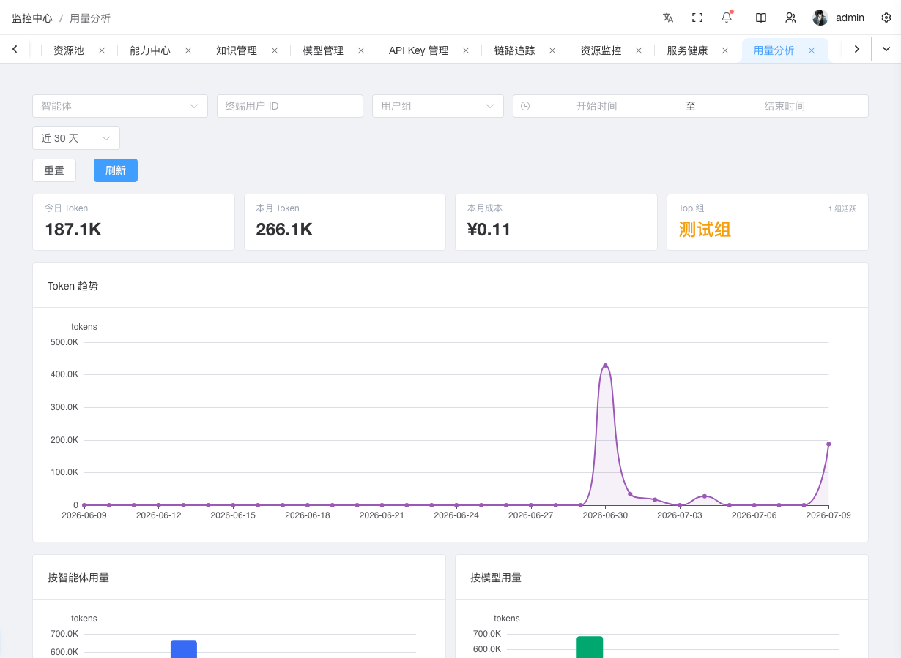
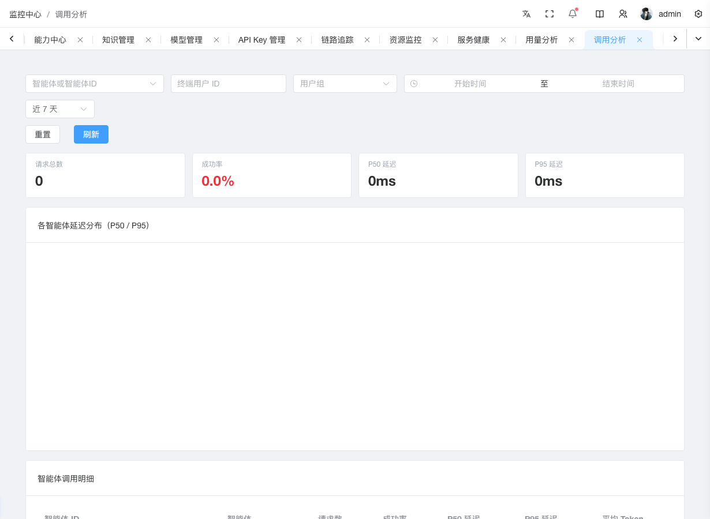
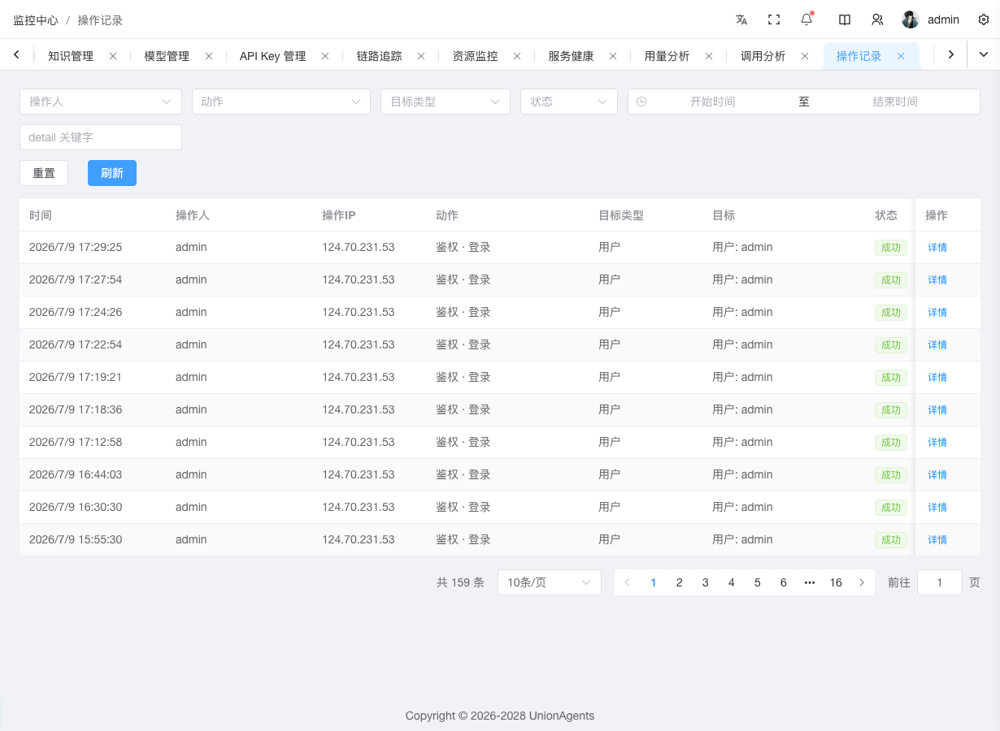
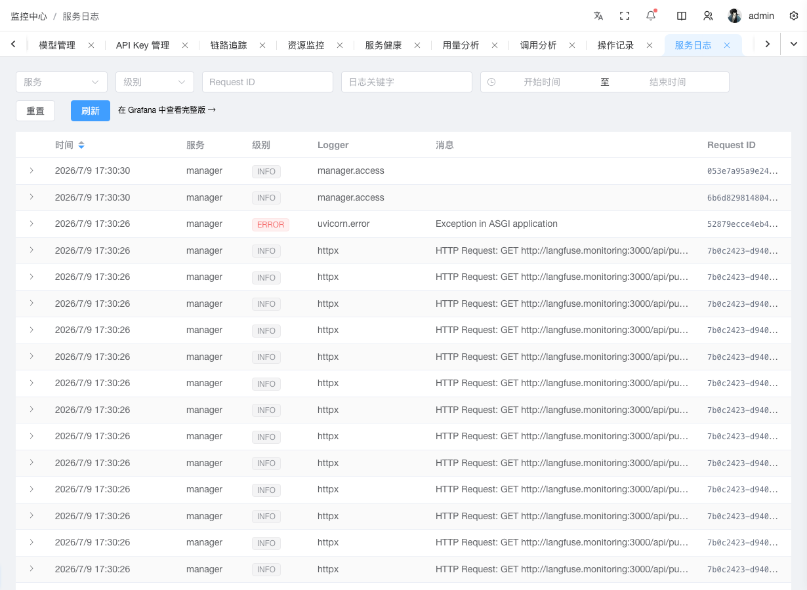
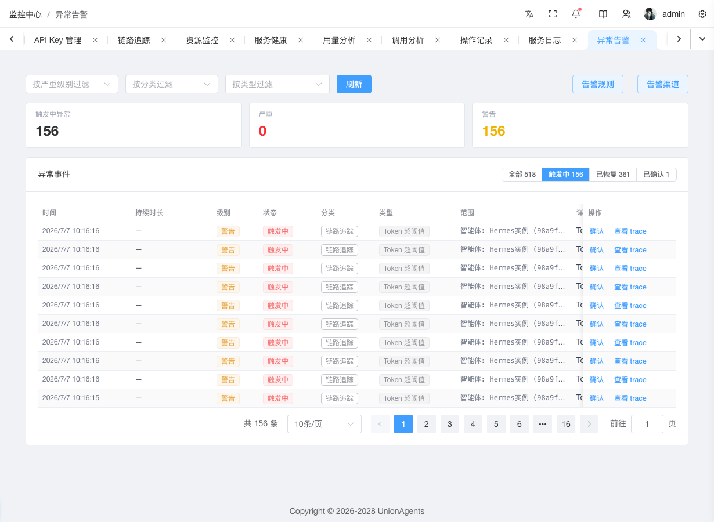

# 监控中心使用指南

监控中心是平台的可观测性入口。不按子页面罗列，**按你要排查的问题**来讲怎么用：

| 你想做什么 | 跳到哪节 |
|---|---|
| 排查某次调用慢在哪 / 为什么报错 | [排查某次调用慢在哪](#排查某次调用慢在哪) |
| 看集群 CPU/内存/Pod 是否吃紧 | [看资源够不够](#看资源够不够) |
| 看核心服务是否在线、延迟是否达标 | [看服务是否在线](#看服务是否在线) |
| 看谁用了多少 Token、花了多少钱 | [看谁用了多少 Token](#看谁用了多少-token) |
| 看成功率、P50/P95 延迟 | [看调用质量](#看调用质量) |
| 查谁改了什么（审计） | [查操作历史](#查操作历史) |
| 看 Manager/Gateway 输出的日志 | [查服务日志](#查服务日志) |
| 处理触发的告警 / 配置告警规则与通知 | [处理异常告警](#处理异常告警) |

## 数据来源

- **Prometheus** → 资源监控、服务健康
- **Langfuse** → 链路追踪、调用分析、用量统计（部分）
- **LiteLLM spend_logs** → 用量统计（Token 与成本）
- **Loki** → 服务日志
- **Manager 操作日志表** → 操作记录
- **告警引擎** → 异常告警

---

## 排查某次调用慢在哪 {#trace}

当用户反馈"某次对话特别慢"或"刚才报错了"时，用链路追踪定位。

### 前提条件

- 已配置 Langfuse（在[引擎配置](system.md#接入外部-dify)里填 Langfuse 凭证）
- 知道大约的发生时间、Agent 名、或会话 ID

### 操作步骤

1. 在左侧导航栏，单击**监控中心 → 链路追踪**。

2. 在筛选区填线索（至少填一个）：

   - **智能体**：按名称/UUID/8 位前缀过滤
   - **会话 ID**：Langfuse session_id
   - **终端用户 ID**
   - **渠道**：Web / 企微 / 飞书 / 钉钉
   - **时间范围**：日期选择器（今天/近 7 天/近 30 天/本月快捷）或分钟快捷（10min/30min/1h/24h/3d）

   ::: warning 互斥
   日期范围与分钟快捷互斥，选了「今天」就不能再选「30min」。
   :::

3. 单击**查询**。下方表格列出符合的 Trace。

4. 看表格快速判断：

   - **Trace ID**列：hover 显示完整 ID，单击右侧复制图标一键复制
   - **状态**列：成功（绿）/ 错误（红）— 先看红色的
   - **延迟**列：鼠标 hover 显示 E2E / TTFT / 增量平均 / 调用次数
   - **Token**列：hover 显示 input / output

5. 找到目标 Trace，单击行末**详情**。

6. 右侧弹出 60% 抽屉，看：

   - **延迟拆分卡**：TTFT（首字延迟）/ E2E（端到端）/ 增量平均 / Output Token 数
     - TTFT 大 = 模型首 token 慢（可能模型负载高或 prompt 太长）
     - 增量平均大 = 生成速度慢（可能模型选错了）
   - **Token 构成卡**：input / output / total / LLM 调用次数
   - **调用链路 Observation 时间线**：按 startTime 升序排列（第 1 个是首步）

7. 时间线中 Observation 类型：

   - **SPAN**（工作流节点 / agent_thought）
   - **GENERATION**（真实 LLM 调用）— 这一步慢就是模型慢
   - **EVENT**（事件标记）

   红色 ERROR 级别 Observation 就是报错点。

### 预期结果

定位到慢/错的步骤，知道是模型慢、还是某技能卡住、还是网络问题。

### 查看 Hermes 内部调用 {#hermes-correlation}

Gateway trace 只能看到"Gateway ↔ Hermes 边界"的一次请求 + 一次响应，看不到 Hermes 内部具体调了哪些 LLM、用了什么工具。当需要看清 Hermes 内部调用链时：

1. 打开 Trace 详情抽屉，在「调用链路」下方会自动加载「Hermes 内部调用」区块（前提：Hermes 引擎已启用 Langfuse 插件）。

2. 区块顶部标签显示关联状态：
   - **已关联**：成功匹配到 Hermes 内层 trace，下方时间线展示该 trace 的 observations
   - **未找到关联的 Hermes 内部 trace**：候选 trace 哈希都不匹配
   - **Gateway trace 缺少关联键**：该 trace 是老版本数据或未走双写流程
   - **Langfuse 未配置**：未启用 Langfuse

3. 时间线展示 Hermes 内部的：
   - **GENERATION**（每次 LLM 调用，带 model + usage + 延迟）
   - **SPAN**（工具调用、reasoning 步骤）
   - **EVENT**（事件标记）

   每条 observation 带「H1, H2...」前缀（H = Hermes）区分 Gateway 的「#1, #2...」。

4. 需要看完整 trace 时，单击「在 Langfuse 中查看 Hermes trace →」跳转 Langfuse UI。

关联原理：Gateway 收到请求时把 `session_id` + `last_user_message_hash` + `gateway_request_time` 写入 trace.metadata，Hermes langfuse 插件写内层 trace 时用同一 session_id。监控中心按 session_id + 哈希 + 时间窗口（±10s）匹配，找到 Hermes 内层 trace 并展示其 observations。

### 自定义显示列

点**列管理**可自定义表格显示哪些列，配置持久化到 localStorage。重置可还原默认。

### 从告警跳转

[异常告警](#处理异常告警)中的 Trace 相关事件可单击「查看 Trace」直接跳到本页，通过 `trace_id` 参数自动打开详情抽屉。

---

## 看资源够不够 {#resources}

当担心集群资源吃紧（CPU/内存/Pod 数）时。

### 前提条件

- 已部署 Prometheus（不可达时页面顶部会显示提示）

### 操作步骤

1. 在左侧导航栏，单击**监控中心 → 资源监控**。

2. 看顶部三个统计卡片：

   - **集群 CPU 使用率**：>80% 红，>60% 黄
   - **集群内存使用率**：同上
   - **运行 Pod 数**（unionagents namespace）

3. 选时间范围：预设（近 1 / 6 / 24 小时 / 7 天）或自定义日期范围，两者互斥。

4. 看趋势图（双 Y 轴折线）：

   - 蓝色面积图：CPU 使用率 %
   - 绿色面积图：内存使用率 %
   - 触发告警时标题栏显示「触发中异常 N」红色标签

5. 看两张 Top 5 排行表找热点：

   - **Top 5 节点**（按 CPU）：节点名 / CPU% / 内存% / 磁盘%
   - **Top 5 Pod**（按 CPU，unionagents ns）：Pod 名 / CPU（核）/ 内存（MB）/ 重启次数

   Pod 重启 >0 黄色高亮，CPU% >80% 红色。

6. 需要更详细看板时，单击顶部**在 Grafana 中查看详细看板**，或每张表格独立的 Grafana 跳转（`node-resources` / `engine-pods` dashboard）。

### 预期结果

知道哪些节点/Pod 是热点，决定扩容还是优化实例配置。

---

## 看服务是否在线 {#service-health}

当担心核心服务（manager/gateway/hub 等）是否正常时。

### 操作步骤

1. 在左侧导航栏，单击**监控中心 → 服务健康**。

2. 看顶部三个统计卡片：

   - **服务可用数**：`up/total` 格式（不全部 up 时红色）
   - **平均 p95 延迟**（>500ms 红色）
   - **平均可用率**（<99.5% 红色）

3. 看趋势图：每个服务一条折线，ms 级延迟；500ms 处画红色虚线 markLine 标记 SLO 阈值。

4. 看服务列表表格：

   | 列 | 说明 |
   |---|---|
   | 状态 | 绿 ● 正常 / 红 ● 异常 |
   | 当前延迟 | 实时延迟（TCP 探测加 `(TCP)` 后缀） |
   | p50 延迟 | 中位数 |
   | p95 延迟 | >500ms 红色 |
   | 可用率 | <99.5% 红色 |
   | SLO 达标 | ✓ 达标（绿）/ ✗ 未达标（红） |

5. 需要更详细看板时，单击顶部**在 Grafana 中查看详细看板**。

### SLO 阈值

- **延迟**：500ms（p95 超过即未达标）
- **可用率**：99.5%

---

## 看谁用了多少 Token {#usage}

当需要核算用量、按部门分摊成本、或排查异常消耗时。

### 前提条件

- 已配置 LiteLLM（用量主源）和 Langfuse（部分补充）

### 操作步骤

1. 在左侧导航栏，单击**监控中心 → 用量统计**。

2. 看顶部四个统计卡片：

   - **今日 Token**
   - **本月 Token**
   - **本月成本**（¥）
   - **Top 组**（带活跃组数徽章）

3. 在筛选区缩小范围：

   - **智能体**：按名称/UUID/8 位前缀
   - **终端用户 ID**
   - **用户组**
   - **时间范围**：日期范围（今天/近 7 天/近 30 天/本月快捷）或天数（7/30/90 天，与日期互斥）

4. 看 4 张图表：

   - **Token 趋势**：紫色折线，按日聚合，取 Top 15
   - **按智能体用量**：蓝色柱状
   - **按模型用量**：绿色柱状
   - **按组用量**：橙色柱状

5. 看明细表格：

   - **组明细**：组 / Token 数 / 成本（¥）/ 占比 %
   - **模型明细**：模型 / Token 数 / 成本（¥）

   成本占比 = 组成本 / 所有组成本之和 × 100。Top 组 = Token > 0 的组按降序排首位。活跃组数 = Token > 0 的组总数。

### 从告警跳转

[异常告警](#处理异常告警)用量类事件可单击「查看用量」跳到本页，通过 `agent_id` 参数预填智能体筛选。

---

## 看调用质量 {#calls}

当关注成功率、P50/P95 延迟、平均 Token 时。

### 前提条件

- 已配置 Langfuse（不可达时页面显示提示）

### 操作步骤

1. 在左侧导航栏，单击**监控中心 → 调用分析**。

2. 看顶部四个统计卡片：

   - **请求总数**
   - **成功率**（<95% 红色）
   - **P50 延迟**
   - **P95 延迟**（>5000ms 红色）

3. 筛选区：智能体 / 终端用户 / 用户组 / 日期范围 / 天数快捷（与用量统计一致）。

4. 看**各智能体延迟分布**图：分组柱状图，每个 Agent 一对柱子（P50 蓝 / P95 红），取 Top 15。

5. 看**智能体调用明细**表格：

   | 列 | 说明 |
   |---|---|
   | 智能体 ID | monospace |
   | 智能体 | 名称 |
   | 请求数 | 总请求数 |
   | 成功率 | 百分比 |
   | P50 延迟 | 中位数 |
   | P95 延迟 | 95 分位 |
   | 平均 Token | 每请求平均 Token |

延迟格式化：<1000 显示 `XX ms`，>=1000 显示 `X.XX s`。

### 从告警跳转

[异常告警](#处理异常告警)调用类事件可单击「查看调用」跳到本页，通过 `agent_id` 参数预填筛选。

---

## 查操作历史 {#operation-log}

当需要审计"谁在什么时候改了什么"时（排查误操作、合规审计）。

### 操作步骤

1. 在左侧导航栏，单击**监控中心 → 操作记录**。

2. 在筛选区缩小范围：

   - **操作人**：可搜索的用户下拉（label 显示 `真实名 (用户名)`）
   - **动作**：2 级级联选择：领域 → 动词（如 `agent_instance / deploy`）
   - **目标类型**：12 个选项（auth/user/user_group/role/agent_definition/agent_instance/agent_channel/agent_skill/resource_pool/engine_config/litellm_model/litellm_team/litellm_key）
   - **状态**：成功 / 失败
   - **时间范围**：日期范围（今天/近 7 天/近 30 天快捷）
   - **详情关键字**：在详情 JSON 中模糊匹配

3. 表格列出符合的操作：

   | 列 | 说明 |
   |---|---|
   | 时间 | 操作发生时间 |
   | 操作人 | 真实名（用户名）；用户已删除显示「已删除」标签 |
   | 操作IP | 发起请求的 IP |
   | 用户代理 | 发起请求的客户端标识（浏览器/curl/SDK 等，鼠标悬停看完整 UA） |
   | 动作 | 本地化 label，hover 显示原始动作字符串 |
   | 目标类型 | 12 种之一 |
   | 目标 | 目标对象显示名；对象已删除时回退为「类型前缀: ID 前 8 位…」 |
   | 状态 | 成功（绿）/ 失败（红） |

4. 找到目标操作，单击行末**详情**。

5. 弹出 50% 抽屉：

   - **描述列表**：ID / 时间 / 操作人 / IP / 用户代理 / 动作 / 目标类型 / 目标 / 状态 / group_id
   - **Detail JSON**：格式化 JSON 查看器，展示完整操作上下文

::: tip 不记录的操作
系统自动调用、用户不感知、对系统数据无影响的高频操作不写操作记录。例如 `鉴权 · 刷新令牌`（前端 access_token 过期时由 axios 拦截器自动调，用户无感知）就不在操作记录中展示。
:::

---

## 查服务日志 {#log-search}

当需要看 Manager 或 Gateway 服务实时输出的日志时（排查服务启动失败、接口报错）。

### 前提条件

- 已部署 Loki（不可达时页面不可用）

### 操作步骤

1. 在左侧导航栏，单击**监控中心 → 服务日志**。

2. 在筛选区填：

   - **服务**：Manager / Gateway
   - **级别**：INFO / WARNING / ERROR
   - **Request ID**：按请求 ID 过滤（与链路追踪关联）
   - **日志关键字**：LogQL `|=` 模糊匹配
   - **时间范围**：日期范围（今天/近 1 小时/6 小时/24 小时快捷）

3. 表格列出符合的日志，默认按时间降序：

   | 列 | 说明 |
   |---|---|
   | 时间 | 可排序 |
   | 服务 | Manager / Gateway |
   | 级别 | ERROR 红 / WARNING 黄 / INFO 蓝 |
   | Logger | Python logger 名 |
   | 消息 | 日志正文 |
   | Request ID | 关联 ID |

4. 单击行展开查看完整原始 JSON。

5. 看底部：

   - 当前匹配总数
   - 实际运行的 LogQL（由后端返回 `currentQuery`，可见服务端任何调整）

   页面自动构造 LogQL，排除 `uvicorn.access` 日志、`/health` 与 `/metrics` 路径的访问日志（噪音）。

6. 需要更强大查询时，单击**在 Grafana 中查看完整版**，跳转 Grafana Explore，把当前 LogQL 嵌入。

---

## 处理异常告警 {#alerts}

当告警触发时查看与处理，或配置告警规则与通知渠道时。

### 查看触发中的告警

1. 在左侧导航栏，单击**监控中心 → 异常告警**。

2. 顶部三个统计卡片：**触发中异常**（firing）/ **严重**（critical，红）/ **警告**（warning，黄）。

3. 顶部状态单选组（每项显示数量）：全部 / **触发中**（默认）/ 已恢复 / 已确认。

4. 筛选：严重级别（critical/warning）/ 分类（tracing/resource/service_health/usage/call_analysis 5 类）/ 类型（按 rule_type 分组）。

5. 事件表格：

   | 列 | 说明 |
   |---|---|
   | 时间 | 事件触发时间 |
   | 持续时长 | firing/acknowledged = `last_seen - created`；resolved = `resolved - created` |
   | 级别 | critical 红 / warning 黄 |
   | 状态 | firing / acknowledged / resolved |
   | 分类 | 5 类之一 |
   | 类型 | rule_type |
   | 范围 | 集群 / 服务: X / 全局 / 智能体: name（按分类上下文展示） |
   | 详情 | 告警消息 |
   | 操作 | 跳转对应监控页 |

6. 单击事件行末「查看 Trace/资源/健康/用量/调用」直接跳到对应监控页并预填筛选。

### 确认告警（人工跟进）

::: tip 哪些可人工确认
仅 **tracing** 和 **usage** 类支持人工确认（需要人工跟进的）；**resource / service_health / call_analysis** 会自动恢复。
:::

1. 找到 firing 状态的事件。
2. 单击**确认**按钮。
3. 状态变为 acknowledged（蓝色），避免反复通知。
4. 处理完后异常恢复，状态自动变 resolved（绿色）。

### 配置告警规则

调整某个告警的阈值、严重级别、启停：

1. 单击顶部**告警规则**按钮，打开 80% 抽屉（最大 1080px）。
2. 5 个分类 Tab，每个显示**已启用 / 总数**计数。
3. 找到要调整的规则卡片。
4. 调整：

   - **启用开关**：在线启停
   - **阈值表单**：含单位 + 「低于触发」标记（反向规则，如"成功率低于 95%"）
   - **名称**、**严重级别**、**描述**

5. 单击**保存**。

::: info 规则类型
- 大部分规则有阈值（如"P95 > 5000ms"）
- 部分规则无阈值（如"服务下线"），仅展示启停开关
- 部分规则反向触发（如"成功率低于 95%"）
:::

### 配置通知渠道

把告警推送到飞书/钉钉/企微/邮箱：

1. 单击顶部**告警渠道**按钮，打开 80% 抽屉。
2. 单击**新增渠道**开关展开创建表单。
3. 填写：

   | 字段 | 说明 |
   |---|---|
   | 名称 | 渠道名（如"运维飞书群"） |
   | 类型 | feishu / dingtalk / wecom / email |
   | Webhook URL | 飞书/钉钉/企微的 webhook URL（必须 http(s)://） |
   | 收件人 | email 类型的多选邮箱列表（必须含 @） |
   | 订阅规则 | 多选，按分类分组，含特殊的「全部规则」选项 |
   | 启用 | 开关 |

4. 单击**保存**。

::: tip 「全部规则」互斥
勾选「全部规则」会清空其他具体选择，反之亦然。email 与 webhook 类型的字段会自动清空不相关的配置。
:::

5. 已有渠道以卡片形式列出，可在线编辑或删除。
