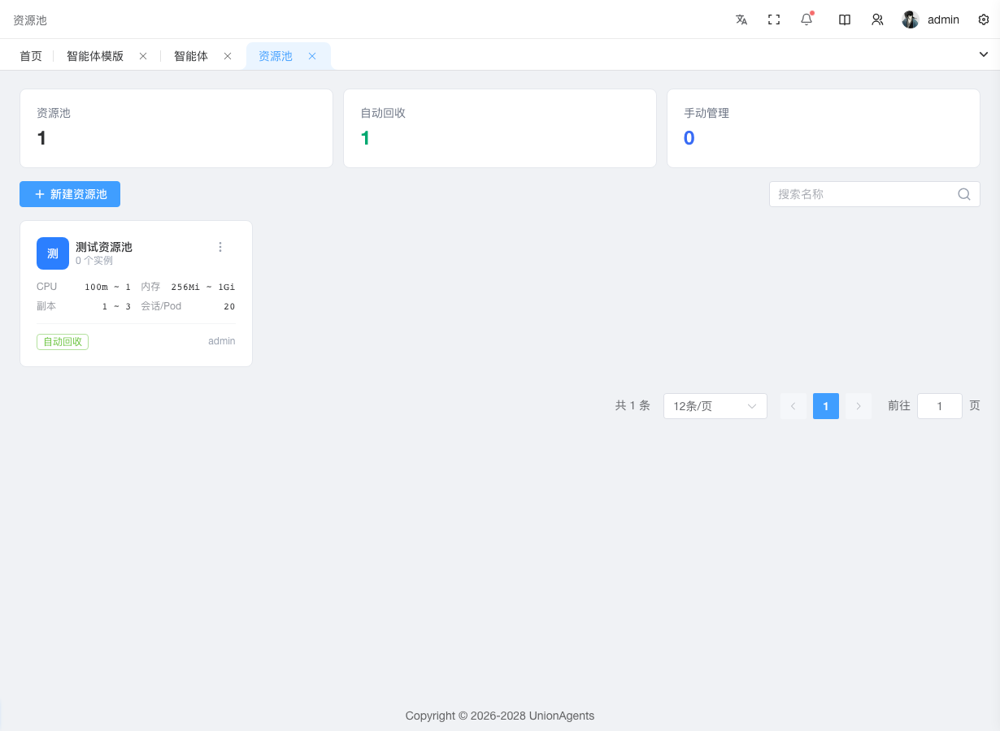

# 创建资源池承载智能体

资源池是承载[智能体实例](agent-instances.md)运行的计算底座——一组 K8s 调度策略：CPU/内存/副本数范围、单 Pod 最大会话数、空闲回收策略。Hermes/OpenClaw 实例必须绑定资源池才能部署；Dify 外部模式不需要。

## 前提条件

- 拥有「资源池」创建权限（系统管理员或运维人员）
- 已规划好：池名称、CPU/内存规格、副本数、是否自动回收

## 创建资源池

1. 在左侧导航栏，单击**资源池**。

2. 单击右上角**创建**按钮。

3. 在创建表单中填写：

   - **名称**：资源池名（如"生产池-Hermes"）
   - **CPU 范围**：最小 ~ 最大（单位 m，如 500 ~ 2000 = 0.5~2 核）
   - **内存范围**：最小 ~ 最大（单位 Mi，如 512 ~ 4096 = 0.5~4 Gi）
   - **副本数范围**：最小 ~ 最大（如 1 ~ 5，按负载弹性扩缩）
   - **单 Pod 最大会话数**：一个 Pod 同时承载多少会话（如 50）
   - **回收模式**：
     - **自动回收**：Pod 空闲 30 分钟自动挂起 → 数据归档 MinIO → 销毁 K8s 资源（节省成本）
     - **手动管理**：不自动挂起，需管理员手动操作（适合长期稳定负载）

   - 若选自动回收，还需填**空闲挂起分钟数**（默认 30）和**空闲销毁小时数**（默认 2）

4. 单击**保存**。列表出现新池卡片，显示规格摘要和实例数（初始为 0）。

## 预期结果

- 资源池列表显示新池，2×2 规格网格正确
- 卡片底部显示「自动回收」或「手动管理」标签
- 该池可被[智能体实例](agent-instances.md)创建时选择

## 查看池中 Pod

实例部署后，池中会出现 Pod。查看方法：

1. 单击资源池卡片进入详情页。
2. 单击**Pod 列表** Tab。
3. 表格按 Agent 分组展示（同 Agent 的 Pod 合并为一格）：

   | 列 | 说明 |
   |---|---|
   | 智能体 | Pod 归属的 Agent 名 |
   | Pod 名 | K8s Pod 全名 |
   | 状态 | Running 绿 / Pending 黄 / CrashLoopBackOff 红 / Terminating 灰 |
   | 重启次数 | >0 黄色高亮 |
   | 启动时间 | Pod 启动时刻 |

4. 单击某行**查看日志**，跳到「日志」Tab 并预选该 Pod。

## 看池整体资源消耗

1. 在资源池详情页，单击**监控** Tab。
2. ECharts 展示池整体 CPU（蓝）和内存（绿）使用率趋势。
3. 时间范围切换：1h / 6h / 24h / 7d。
4. 可选显示 `request` 阈值参考线（资源分配量），判断"实际用量 vs 分配量"差距。

如果 CPU/内存长期接近 limit，考虑：
- 编辑池配置提高 limit（仅影响后续创建的 Pod，不影响已运行的）
- 或新建更大规格的池，迁移实例过来

## 看 Pod 日志

1. 在资源池详情页，单击**日志** Tab。
2. 配置日志查看参数：
   - **Pod 选择器**：下拉选该池中的 Pod
   - **来源**：engine stdout（引擎日志）/ gateway per-profile（Gateway 按 Profile 隔离的日志）
   - **Profile**：选要看的 Profile 配置
   - **尾行数**：200 / 500 / 1000 / 2000
   - **自动刷新**：开启后定时拉新日志

## 资源池的作用域

| 类型 | group_id | 谁能管理 | 谁能绑实例 |
|---|---|---|---|
| 平台共享池 | 空 | 仅平台管理员 | 平台所有 Hermes/OpenClaw 实例 |
| 组私有池 | 具体 group_id | 对应组管理员 | 仅本组实例 |

::: tip 多实例共享一个池
多个 Hermes/OpenClaw 实例可绑同一个资源池，Pod 按 `agent_id` 标签隔离，互不干扰。实例详情页会回链到所属池；池的 Pod 列表会显示每个 Pod 属于哪个 Agent。
:::

## 后续步骤

- [创建智能体实例](agent-instances.md#创建并部署实例) — 绑定此资源池部署
- [排查 Pod 异常](agent-instances.md#排查实例异常) — Pod 起不来时看日志
