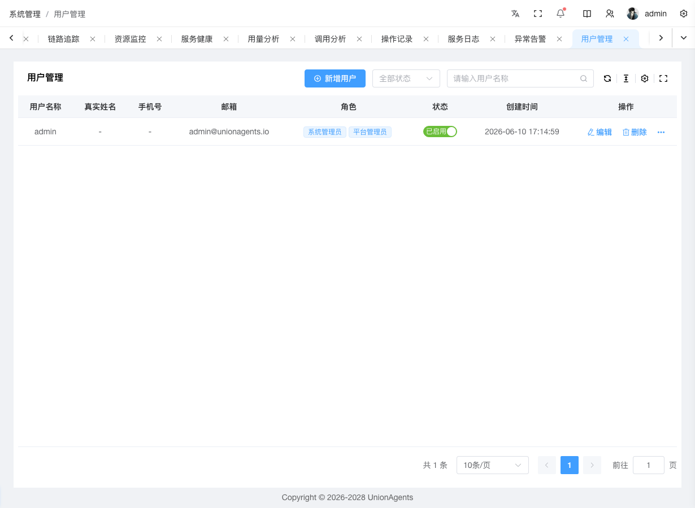
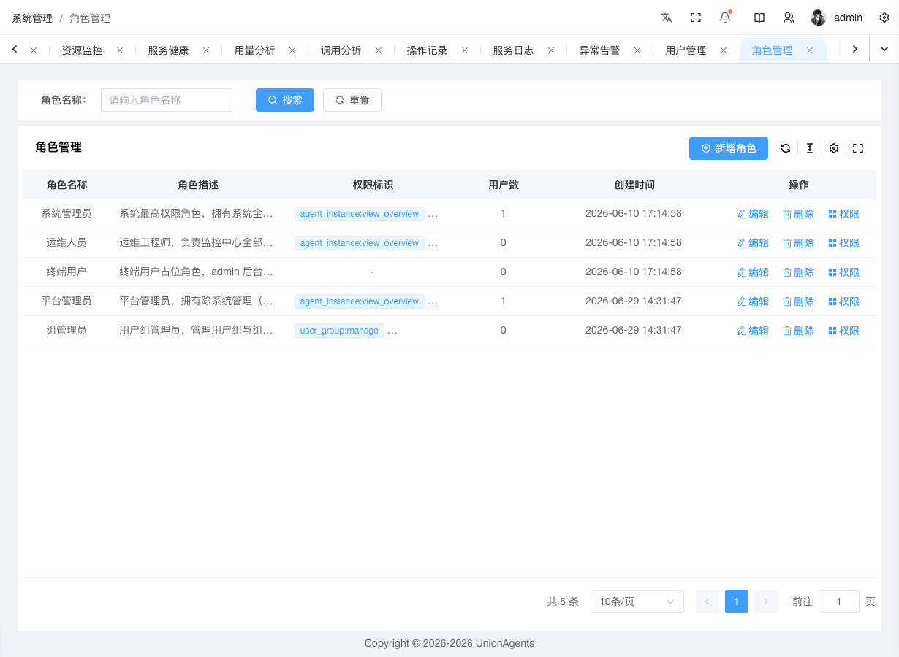
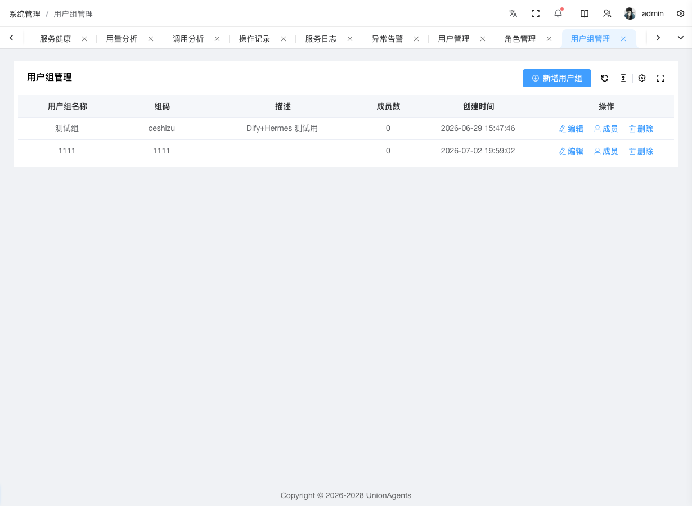
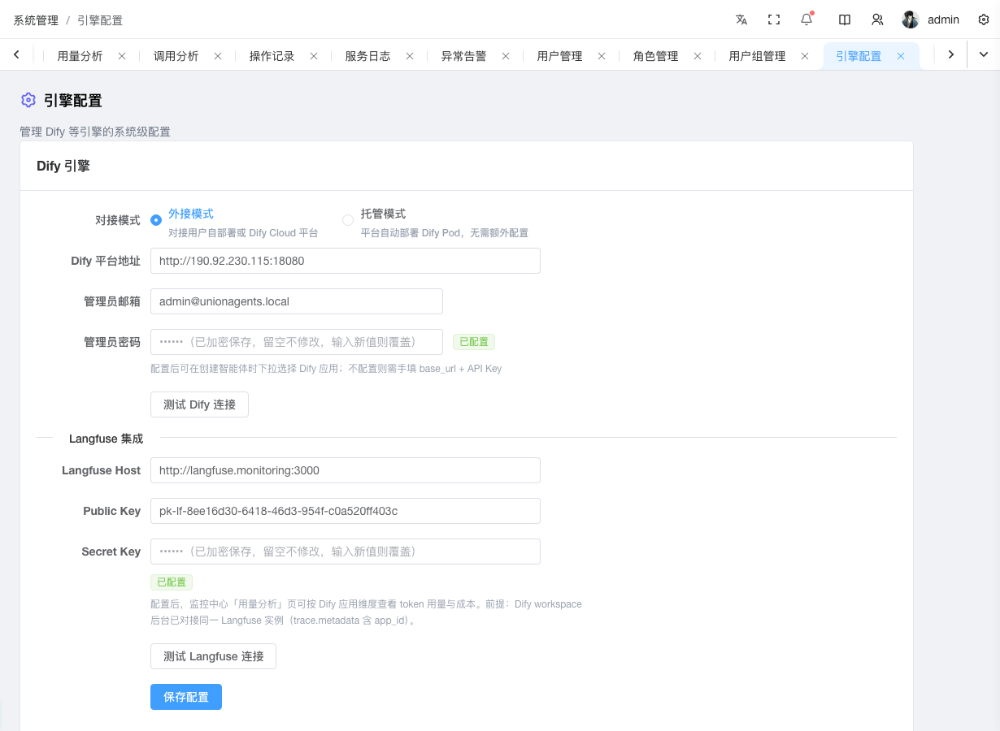
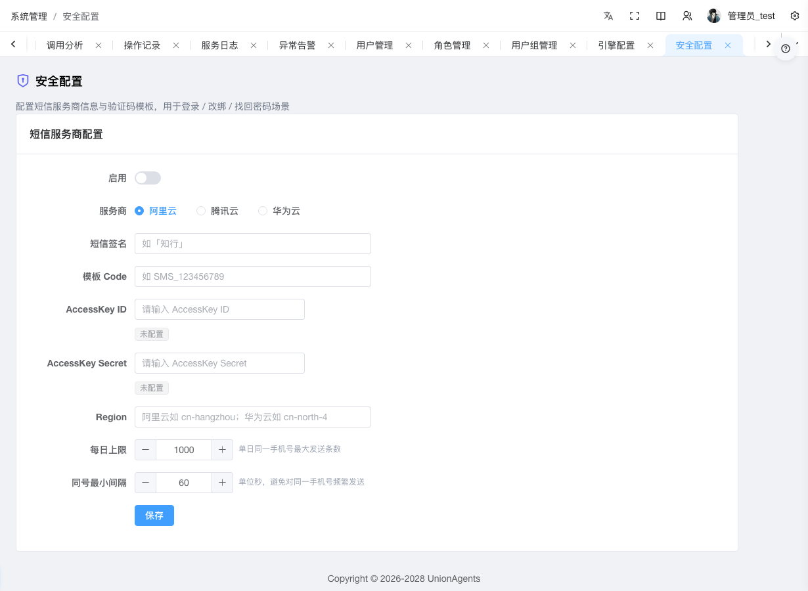

# 系统管理使用指南

系统管理包含 6 个子页面，按你要做的事来讲：

| 你想做什么 | 跳到哪节 |
|---|---|
| 添加新用户 / 重置密码 / 绑定 IM | [添加并管理用户](#添加并管理用户) |
| 创建角色 / 给角色分配权限 | [创建角色与分配权限](#创建角色与分配权限) |
| 创建用户组 / 加组成员 | [创建用户组](#创建用户组) |
| 接入外部 Dify / 接 Langfuse 看链路 | [接入外部 Dify](#接入外部-dify) |
| 配置短信服务商 / 验证码模板 | [安全配置](#安全配置) |
| 发布终端用户 APP / 替换 APK 后端地址 | [APP 管理](#app-management) |
| 忘记密码 / 改绑手机邮箱 / 账号锁定解锁 | [验证码使用指南](#验证码使用指南) |

## 添加并管理用户 {#user}

### 前提条件

- 拥有「用户管理」权限（系统管理员）
- 已[创建好角色](#创建角色与分配权限)（可选，创建用户时可分配）

### 添加新用户

1. 在左侧导航栏，单击**系统管理 → 用户管理**。

2. 单击右上角**创建**按钮。

3. 在创建表单中填写：

   - **用户名**：login id（必填）
   - **真实姓名**：显示名
   - **密码**：必填，旁边有 5 段强度计（很弱 → 很强，基于 zxcvbn 评估），建议达到"强"
   - **邮箱**、**手机**：均为可选。新建用户默认「未认证」状态，未认证的邮箱/手机可作为关联信息填写，不会与其他用户冲突，但**不能用于登录、找回密码、账号解锁**
   - **启用**：默认开启

4. 单击**保存**。表格出现新用户行，邮箱/手机列显示「未认证」灰色徽章。

5. （可选）分配角色：单击该行**更多 → 分配角色**，多选角色（预选当前角色），单击**确认**。

### 预期结果

- 用户管理表格出现新用户，状态「启用」，角色列显示已分配的角色角色标签
- 邮箱列、手机列显示该用户的邮箱/手机号 + 「未认证」灰色徽章（未绑定时显示「未绑定」）
- 该用户可用账号密码登录控制台

### 认证邮箱/手机

未认证的邮箱/手机只是关联信息，不能用于登录、找回密码、账号解锁。需通过验证码认证后才能正式生效：

1. 找到目标用户行，单击**更多 → 认证邮箱**（或**认证手机**）。
2. 系统自动通过当前激活的短信/邮件服务商向用户绑定的邮箱/手机发送 6 位验证码（10 分钟有效）。
3. 在弹窗中输入用户收到的验证码，单击**确认**。
4. 验证通过后，该用户邮箱/手机状态变为「已认证」绿色徽章。

::: tip 唯一性约束
- 已认证的邮箱/手机在系统中全局唯一，不可被多个用户同时认证
- 未认证的邮箱/手机允许多人重复填写（例如管理员为多个用户预填了同一个备用邮箱）
- 用户改绑邮箱/手机后，状态自动回退为「未认证」，需重新认证才能用于登录/找回密码
:::

::: tip 用户自助认证
用户也可自行在「账户设置 → 个人信息」页对自己的邮箱/手机发起认证（参见 [账户设置文档](account-settings.md#认证邮箱与手机)），无需管理员介入。管理员认证适合用户无法收到验证码或需要批量初始化认证的场景。
:::

### 重置用户密码

当用户忘记密码或疑似泄露时：

1. 找到目标用户行，单击**更多 → 重置密码**。
2. 在弹窗中输入新密码，观察强度计。
3. 单击**确认**，密码立即生效（无需用户邮箱验证）。

### 启用/禁用用户

切换用户状态（如离职、临时封禁）：

- 表格中**状态**列是行内开关。切换时有确认弹窗，确认后调用 `updateUserApi` 更新 `is_active`。
- 禁用后用户无法登录，但记录保留（可重新启用）。

### 绑定 IM 渠道

让用户从企微/飞书/钉钉发起的对话自动归属到本人：

1. 找到目标用户行，单击**编辑**。
2. 在编辑表单底部找到 **IM 渠道绑定**子表。
3. 单击**添加绑定**，选择平台（企业微信/飞书/钉钉）+ 填 IM 用户 ID + 显示名。
4. 单击**保存**。

::: tip 用途
绑定后，该用户从对应 IM 渠道发起的对话可自动归属到本人，便于[用量统计](monitoring.md#看谁用了多少-token)按用户下钻。
:::

### 删除用户

单击目标用户行的**删除**，确认弹窗会提示该用户在多少个智能体实例上存在独立会话空间：

- 确认后，系统会一并清理该用户在各智能体实例上的独立会话空间及相关数据，并解除 IM 渠道绑定。
- 此操作不可撤销。

### 批量删除

勾选多行后，点批量操作栏的**批量删除**，二次确认后批量删除。

### 登录安全策略

平台对登录侧实施了以下加固：

| 策略 | 触发 | 响应 |
|---|---|---|
| 失败计数 | 连续 5 次密码错误 | 账号锁定 15 分钟 |
| IP 频率限制 | 单 IP 每分钟 10 次登录 | 第 11 次起拒绝 |
| IP 失败拉黑 | 单 IP 每小时 50 次失败 | 该 IP 封禁 1 小时 |
| 密码强度 | 新建用户 / 改密时 | 强度评分 ≥ 3（强），不允许常见弱密码 |
| 用户枚举防御 | 不存在的用户登录 | 返回统一错误文案，避免探测账号是否存在 |

被锁定的账号在锁定期间无法登录，需等待 15 分钟自动解锁。系统管理员账号被锁也会受影响。

### 用户锁定与解锁

当用户连续输错 5 次密码后，账号会被锁定 15 分钟。被锁定的用户行在用户管理页会显示红色「已锁定 剩 N 分钟」徽章，状态列后面新增了「锁定」列。

**管理员解锁**（无需等 15 分钟）：

1. 在左侧导航栏单击 **系统管理 → 用户管理**。
2. 在搜索框输入用户名或邮箱，找到该用户。
3. 看到该用户行有红色「已锁定」徽章后，单击该行操作列的 **更多 → 解锁账号**。
4. 在弹出的确认框中单击 **确定**。
5. 该用户的失败计数与锁定时间立即清零，可正常登录。

::: tip 用户自助解锁
被锁定的用户也可在登录页单击「忘记密码」走邮件验证码流程自助解锁（前提是已配置邮件服务商）。但管理员解锁是即时操作，无需等待邮件，适合内部用户支持场景。
:::

::: warning 解锁接口不静默成功
未锁定的用户调解锁接口会返回 400 `user_not_locked`（不静默成功），这是为了防止管理员误操作。列表上的解锁按钮仅对锁定用户显示。
:::

---

## 创建角色与分配权限 {#role}

### 前提条件

- 拥有「角色管理」权限（系统管理员）

### 创建自定义角色

1. 在左侧导航栏，单击**系统管理 → 角色管理**。

2. 单击**创建**按钮。

3. 填写：

   - **名称**：角色名（必填，如"运营审核员"）
   - **描述**：角色说明

4. 单击**保存**。表格出现新角色行。

### 给角色分配权限

1. 找到目标角色行，单击**权限**。
2. 右侧滑入抽屉，展示权限树：

   - 父节点按 `resource_type` 分组（如 `agent_instance`、`litellm_key`）
   - 叶节点是具体权限（如 `agent_instance.deploy`、`litellm_key.update`）
   - 树是虚拟化的（`el-tree-v2`），支持大数据量

3. 用搜索框过滤权限名，或单击**全展开**/**全选**。

4. 勾选该角色需要的权限（叶子节点）。

5. 单击右上**保存**图标。

   保存时只提交叶节点 ID（`getCheckedKeys(true)`），父节点自动推导。

### 预期结果

- 角色管理表格的「权限」列显示前 3 个权限标签
- 分配该角色给用户后，用户获得对应权限

### 内置角色

平台预置五个角色：

| 角色 | 权限范围 |
|---|---|
| 系统管理员 | 全部权限（系统最高权限角色） |
| 平台管理员 | 除系统管理（用户/角色/用户组/引擎配置）外的全部权限 |
| 组管理员 | 用户组管理 + 用户管理 |
| 运维人员 | 监控中心全部 + 智能体实例管理全部 CRUD + 社区发布 |
| 终端用户 | admin 后台无权限（占位角色，走 enduser-portal） |

::: tip 角色缓存
角色列表前端缓存，搜索/分页在缓存内进行；增删改后失效缓存重拉。
:::

---

## 创建用户组 {#user-group}

用户组是一组用户的集合，用于按组隔离资源（Agent 实例、LiteLLM Key 的 `team_id`、资源池）。

### 前提条件

- 拥有「用户组管理」权限（系统管理员）

### 创建用户组

1. 在左侧导航栏，单击**系统管理 → 用户组管理**。

2. 单击**创建**按钮。

3. 填写：

   - **名称**：组名（必填，如"研发一组"）
   - **描述**：组说明

4. 单击**保存**。表格出现新组行，**Code 列由服务端自动生成**（不可编辑，用作 LiteLLM `team_id`）。

### 加组成员

1. 找到目标组行，单击**成员**。
2. 弹出成员管理对话框：

   - 可搜索的用户列表（最多 100 个）
   - 每行复选框 + 已加入标签
   - 头部显示已选数

3. 勾选要加入的用户（可点行或勾选框切换）。
4. 单击**保存**，提交 `member_ids` 数组。

### 预期结果

- 用户组管理表格的「成员数」列更新
- 组内用户创建的 Agent 实例、LiteLLM Key 自动归属该组
- 组私有资源池仅本组实例可绑

### 组与资源的隔离

| 资源 | 组归属方式 |
|---|---|
| 资源池 | `group_id` 字段，空=平台共享，具体值=组私有 |
| API Key | `team_id` = 组 ID，预算与限流按组聚合 |
| Agent 实例 | 默认按组隔离，组间不可见 |
| 用量统计 | 可按组下钻查看 |

---

## 接入外部 Dify {#engine-config}

当你需要把平台对接到自管的 Dify 实例时（EXTERNAL 模式）。

### 前提条件

- 拥有「引擎配置」权限（系统管理员）
- 已部署好外部 Dify 实例，有 base_url 和管理员账号
- （可选）已部署 Langfuse，有 host 和公钥/私钥

### 操作步骤

1. 在左侧导航栏，单击**系统管理 → 引擎配置**。

2. **模式**选 `EXTERNAL`（连接外部 Dify）。

3. 填写：

   - **base_url**：外部 Dify 实例地址（必填，如 `https://dify.mycompany.com`）
   - **admin_email**：Dify 管理员邮箱
   - **admin_password**：密码；**留空表示不修改**，已配置时显示「已配置」标签

4. 单击**保存**。

5. 单击**测试连接**按钮（admin 配置后可见），返回 `apps_count` 说明连通正常。

6. 测试通过后，下方出现 **Dify Apps 卡**，列出所有 Dify 应用：

   | 列 | 说明 |
   |---|---|
   | 应用名 | Dify 应用名 |
   | 模式 | 标签（Chat / Workflow / Agent 等） |
   | 描述 | 应用说明 |
   | AppId | Dify 应用 ID（code 字体） |

7. 单击**刷新应用**可重新拉取。

### 接 Langfuse 看链路（可选）

让 Dify 应用的调用链路能在[链路追踪](monitoring.md#排查某次调用慢在哪)看到：

1. 在引擎配置页，找到 **Langfuse 集成**区。
2. 填写：

   - **langfuse_host**：Langfuse 地址
   - **langfuse_public_key**：公钥
   - **langfuse_secret_key**：私钥；留空表示不修改，已配置显示「已配置」标签

3. 单击**保存**。

4. 单击**测试 Langfuse**按钮（secret_key 配置后可见），返回 `trace_count` 说明连通正常。

### 预期结果

- 引擎配置页显示「已配置」标签
- 测试连接返回 apps_count
- Dify Apps 卡列出应用
- （若接了 Langfuse）链路追踪页能看到 Dify 应用的 trace

### 凭证安全

密码与 Langfuse secret_key 字段均采用「**留空表示不修改**」约定——后端只在字段非空时才更新。前端不回显已存密钥，避免泄露。

---

## 安全配置 {#security-config}

配置短信与邮件服务商信息，用于登录 / 改绑 / 找回密码场景。本页包含两张卡：**短信服务商配置**和**邮件服务商配置**，分别对应手机号和邮箱两条验证码发送渠道。两张卡均支持同时配置多个服务商（每行一条），全局只有一行被标为「当前发码渠道」用作实际发码。每个服务商只允许建一条记录——新建对话框里已建过的服务商会自动禁用并提示「已配置」，需选用其他服务商。

### 前提条件

- 拥有「系统管理员」权限
- 已开通阿里云 / 腾讯云 / 华为云 任一短信服务，取得签名 + 模板 Code + AccessKey
- （可选）已开通 SMTP 邮件服务（如 QQ / 163 / Gmail 邮箱的授权码）

### 操作步骤（短信）

在第一张卡（短信服务商配置）中，v1 支持 3 个服务商：阿里云短信、腾讯云短信、华为云短信。

1. 单击右上角**新建**按钮，弹出新建对话框。

2. 选择 **服务商**（创建后不可改）：

   | 服务商 | 必填字段 | 默认 Region |
   |---|---|---|
   | 阿里云 | 签名、模板 Code、AccessKey ID/Secret、Region | `cn-hangzhou` |
   | 腾讯云 | 签名、模板 Code、AccessKey ID/Secret、SDK AppID | `ap-guangzhou` |
   | 华为云 | 签名、模板 Code、AccessKey ID/Secret、Region | `cn-north-4` |

3. 填写 **AccessKey ID** 和 **AccessKey Secret**。已配置时显示「已配置」标签，输入框留空表示不修改（编辑时）。

4. （可选）调整风控参数：

   - **每日上限**：单日同一手机号最大发送条数
   - **同号最小间隔**：避免对同一手机号频繁发送，单位秒

5. 单击**保存**，配置出现在列表中。

6. 在列表中单击**测试连接**按钮，做真实 SDK 探活（阿里云调 `QuerySmsTemplateList`，腾讯云调 `DescribeSmsTemplateList`，华为云用 SDK-HMAC-SHA256 签名直接调 RESTful `ListSmsTemplate`）。返回「探活成功」说明 AK/SK + region 可用。

7. 测试通过后，单击**设为发码渠道**按钮，把该行标为「当前发码渠道」（列表中其他行会被自动取消激活，全局仅一行 active）。active 行上的按钮会变为**取消发码渠道**，单击可清除该行的 active 标记（全局将无发码渠道，验证码发码请求会返回 no_provider）。

### 操作步骤（邮件）

在第二张卡（邮件服务商配置）中，可以同时配置多个邮件服务商（每行一条），全局只有一行被标为「当前发码渠道」用作实际发码渠道。v1 支持 4 个服务商：SMTP（任何邮箱通用）、阿里云 DirectMail、腾讯云 SES、华为云 Cloud Email。每个服务商只允许建一条记录。

1. 单击右上角**新建**按钮，弹出新建对话框。

2. 选择 **服务商**（创建后不可改）：

   | 服务商 | 必填字段 | 默认 Region |
   |---|---|---|
   | SMTP | SMTP 主机 / 端口 / 加密方式 / 发件邮箱 / SMTP 密码 | — |
   | 阿里云 | AccessKey ID / AccessKey Secret / 地域 / 发信地址 | `cn-hangzhou` |
   | 腾讯云 | AccessKey ID / AccessKey Secret / 地域 / 发信地址 | `ap-hongkong` |
   | 华为云 | AccessKey ID / AccessKey Secret / 地域 / 发信地址 | `cn-north-4` |

3. 填写服务商特有字段（按所选服务商切换显示）。SMTP 端口与加密方式三选一：

   | 加密方式 | 默认端口 | 适用场景 |
   |---|---|---|
   | SSL/TLS | 465 | QQ / 163 / 企业邮箱默认（推荐） |
   | STARTTLS | 587 | Gmail / 自建 Postfix 常用 |
   | None | 25 | 仅内网测试，不推荐 |

   ::: tip 授权码
   主流邮箱（QQ / 163 / Gmail）均已禁用密码直接登录，需在邮箱设置中开启 SMTP 服务并生成「授权码」，把授权码填到 SMTP 密码字段。
   :::

4. （可选）填写 **发件人显示名**（如「知行平台」，收件人看到的发件人名称）。

5. （可选）调整风控参数：

   - **每日上限**：单日同一邮箱最大发送条数
   - **同邮箱最小间隔**：避免对同一邮箱频繁发送，单位秒

6. 单击**保存**，配置出现在列表中。

7. 在列表中单击**测试连接**按钮，做真实 SDK 探活（SMTP 调 `smtplib.login`，云厂商调只读 list 发信地址 API）。返回「探活成功」说明 AK/SK + region 可用。

8. 测试通过后，单击**设为发码渠道**按钮，把该行标为「当前发码渠道」（列表中其他行会被自动取消激活，全局仅一行 active）。active 行上的按钮会变为**取消发码渠道**，单击可清除该行的 active 标记。

### 预期结果

- 安全配置页两张卡均显示「已配置」标签
- 短信测试连接返回「探活成功」
- 邮件测试连接返回「探活成功」
- 短信与邮件列表中各自只能有一行被标为「当前发码渠道」
- 每个服务商在两张卡里都只能建一条记录（删除后才能再建）
- 后续版本接入发码 endpoint 后，登录 / 改绑 / 找回密码场景会使用 active 行的配置发送验证码

### 凭证安全

AccessKey Secret 和 SMTP 密码字段均采用「**留空表示不修改**」约定——后端只在字段非空时才更新。前端不回显已存密钥，避免泄露。所有密钥均用 Fernet 加密落库。

---

## APP 管理 {#app-release}

管理终端用户 APP 的发布物，支持 Android（`.apk`）与鸿蒙 HarmonyOS NEXT（`.hap`）双平台。部署环境时，带占位符后端地址的 base APK 会自动注册为「待发布」记录；管理员可在此页面编辑名称、图标、描述并发布，发布后下载页可直接下载到指向当前环境后端的安装包。

列表按平台分页展示，可用右上角的平台筛选器只看 Android 或鸿蒙记录。两个平台的版本号相互独立——同一版本号可以分别发布 Android 与鸿蒙安装包。

### 前提条件

- 拥有「系统管理员」权限
- 部署时已注入 release keystore（dev 在 `.env.local` 配置 `RELEASE_KEYSTORE_PATH` + keystore 三件套；prod 由 k8s Secret 自动注入）

### 上传安装包

环境部署后，已注册的基础 APK 自动出现在列表里。如需手动上传新的安装包：

1. 单击右上角**上传安装包** 按钮。
2. 选择本地构建的安装包。Android 选择 `.apk` 文件，鸿蒙选择 `.hap` 文件；文件名必须以 `-版本.apk` 或 `-版本.hap` 结尾（如 `知行-0.8.123.apk`），系统从中解析版本号并识别平台。
3. 同平台同版本号不重复创建（幂等）。

### 编辑 APP 信息

1. 在记录行单击**编辑**。
2. 修改**名称**（如「知行」）或**描述**。
3. 单击**保存**。

### 上传图标

1. 在记录行单击**上传图标**。
2. 选择 PNG / JPG / WebP / GIF 图片，≤ 2MB。
3. 上传成功后图标即时刷新。

### 发布

1. 在记录行单击**发布**，弹出确认对话框。后端地址自动使用当前站点地址，无需填写。
2. 单击**确认发布**，对话框内显示进度条，请耐心等待。
3. 发布完成后状态变为「已发布」，记录行出现**复制下载地址**按钮，可直接分享给用户。

### 下载页联动

发布成功后，下载页（landing）会自动拉取对应平台最新已发布记录并展示名称、描述、图标和下载按钮。鸿蒙记录发布后，下载页的鸿蒙卡片变为「已发布」并提供 HAP 下载，同时展示基于 auto-installer 的安装步骤说明。

## 验证码使用指南 {#verification-code}

当您忘记密码、被锁定、或要改绑手机/邮箱时，平台通过验证码帮您验证身份。验证码支持短信和邮件两条渠道。

### 忘记密码

当您忘记登录密码时：

1. 在登录页，单击**忘记密码**。
2. 选择通过邮箱或短信渠道，输入注册时的**邮箱或手机号**。
3. 输入图形验证码（4 位数字，单击图片可刷新），单击**发送验证码**。
4. 收到 6 位数字验证码后填入，单击**验证**。
5. 通过后输入新密码（强度需达到「强」以上），单击**重置密码**。
6. 用新密码重新登录。

验证码 10 分钟内有效，5 次输错失效，需重新发送。

::: tip 渠道按系统配置展示
忘记密码页只展示系统已开启的发码渠道（邮箱/短信）。如果两个渠道都未开启，页面会显示「请联系系统管理员」提示，无法自助重置密码。渠道开启请联系系统管理员在「安全配置」页配置。
:::

### 用邮箱或手机号登录

如果您的邮箱或手机号已通过认证，无需输入账号名即可登录：

1. 在登录页顶部切换到**邮箱**或**手机** Tab。
2. 输入已认证的邮箱或手机号 + 密码，单击**登录**。
3. 系统按邮箱/手机反查账号，成功则进入系统。

### 用手机验证码登录

如果系统开启了短信渠道，您还可以用手机验证码免密登录：

1. 在登录页顶部切换到**手机验证码** Tab（仅在系统配置了短信渠道时显示）。
2. 输入已认证的手机号 + 图形验证码 → 单击**发送验证码**。
3. 收到 6 位验证码后填入，单击**登录**。
4. 验证码通过即登录成功，无需密码。

### 账号锁定后邮件解锁

当账号因连续 5 次密码错误被锁 15 分钟时，**不想等 15 分钟自动解锁**可走邮件解锁：

1. 在登录页输错密码看到「账号已锁定」提示后，单击**忘记密码**。
2. 选择邮箱渠道，输入您的邮箱（必须与账号绑定的邮箱一致）+ 图形验证码 → 发码。
3. 邮箱收到验证码 → 验证 → 系统立即解锁账号。
4. 重新登录。

::: tip 短信暂不支持解锁
账号锁定邮件解锁只走邮箱渠道（短信发送成本高 + 锁定时不知道用户名）。短信解锁可走「忘记密码」流程改密后重登。
:::

### 修改绑定的邮箱

登录后修改自己的邮箱：

1. 单击右上角头像 → **个人资料**。
2. 邮箱字段单击**修改邮箱**。
3. 输入新邮箱 + 图形验证码 → 发码到新邮箱。
4. 收到验证码后填入 → 单击**确认修改**。
5. 旧邮箱上的所有验证码立即失效（防止改完一个再改一个）。

### 修改绑定的手机

同上，但走短信渠道。

### 安全策略

| 策略 | 触发 | 响应 |
|---|---|---|
| 图形验证码 | 发码前必填 | 1 次错误失效，需重新获取 |
| 单号频率限制 | 同号 60s 内 1 条 | 429 code_too_frequent |
| 单号小时限制 | 同号 1h 内 5 条 | 429 code_target_hourly_limit |
| 单号每日上限 | 同号 10 条/天（继承安全配置） | 429 code_target_daily_limit |
| 单 IP 频率限制 | 单 IP 1h 内 10 条验证码 | 403 ip_code_banned |
| 验证码错误次数 | 5 次/(target+purpose) | code 立即失效 |
| 用户枚举防御 | 不存在的 target 发码 | 返回 sent=true 但实际不发码 |
