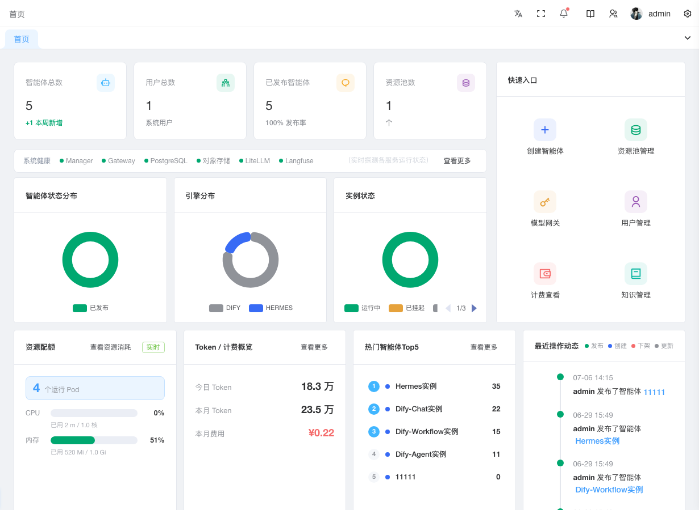

# 看懂平台运行状态

首页（Dashboard）是你登录控制台后看到的第一个页面，用来快速了解"平台现在跑得怎么样、有没有异常、谁在用"。首页按你的角色自动切换内容：系统管理员看全平台，运维人员看本组，终端用户看自己的 Agent。

## 前提条件

- 已登录控制台（角色不同看到的卡片不同）

## 怎么看（系统管理员）

登录后默认进入首页，从上到下、从左到右依次看：

### 1. 看四个数字卡片，判断"规模对不对"

顶部一排四个卡片：**Agent 总数**、**用户总数**、**已发布 Agent**、**资源池库存**。

- **Agent 总数**下方有"本周新增 +N"，如果这个数异常大，说明有人在批量建实例，要确认是否预期
- **已发布 Agent**下方的发布率 = 已发布 / 总数，如果 < 50%，说明很多实例建了没上线，可问下原因

### 2. 看系统健康条，判断"服务有没有挂"

数字卡片下方一排彩色圆点，每个圆点对应一个核心服务：

- 🟢 绿色：正常
- ⚫ 灰色：未部署（不一定要管，有些可选服务没装）
- 🔴 红色 + "已停机"：异常，需要排查

单击右侧**查看更多**跳到[服务健康](monitoring.md#看服务是否在线)页排查。

### 3. 看三个分布图，判断"结构合不合理"

左侧三个环形图：**Agent 状态分布**、**引擎类型分布**、**引擎实例状态**。

- **引擎实例状态**如果红色（Failed）占比高，说明有 Pod 起不来，去[智能体实例](agent-instances.md#排查实例异常)详情页看日志
- **Agent 状态分布**看 DRAFT 占比，草稿太多说明定义建了没发布，跟进下

### 4. 看右侧快捷入口，快速跳转

右侧 2×3 网格是常用操作的快捷跳转：创建 Agent / 引擎资源池 / 模型网关 Key / 用户管理 / 用量计费 / 知识库。单击任一图标直接跳到对应页。

### 5. 看底部一排四个卡片，判断"资源/成本/热度/动态"

底部四个等宽卡片：

- **资源配额**：CPU / 内存进度条。>80% 时要扩容，右上标签显示「实时」或「分配」（实时 = 真实占用，分配 = 仅看 request 值）
- **Token / 计费**：今日 Token、本月 Token、本月成本（¥）。如果本月成本异常高，单击**查看更多**到[用量统计](monitoring.md#看谁用了多少-token)按 Agent/组下钻
- **热门 Agent Top5**：近 30 天对话次数 Top 5，单击行跳到该 Agent 详情
- **最近操作动态**：时间线展示最近 30 天内智能体的 8 条操作记录（发布/创建/下线/编辑等生命周期事件），数据源与[查操作历史](monitoring.md#operation-log)页面一致

## 怎么看（运维人员 / 用户组管理员）

看到的是组级数据：组内 Agent 数、组成员数、今日对话数，以及本组 Agent 状态分布的横向进度条。

需要管理本组 Agent 时，单击**管理本组 Agent** 跳到[智能体实例](agent-instances.md)页。

## 怎么看（终端用户）

看到的是个人数据：可访问 Agent 数、月度对话次数、我的 Agent 列表、7 天对话趋势柱状图。

单击任一 Agent 卡片跳到该 Agent 的终端门户对话页。

## 数据什么时候更新

首页数据**进入页面时加载一次**，不做自动轮询。要刷新看最新，直接按 F5 或单击侧边栏**首页**重新进入。后端接口都有兜底，单个接口失败不会阻塞整页，对应卡片显示空状态或 0。

## 后续步骤

- [排查服务异常](monitoring.md#看服务是否在线) — 健康条有红色时
- [查看用量明细](monitoring.md#看谁用了多少-token) — 成本偏高时按 Agent/组下钻
- [创建新智能体](agent-definitions.md) — 从快捷入口开始建
