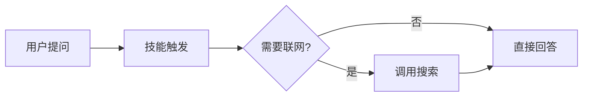

# 技能图表展示规范

Skill Studio 开发的技能在对话区回复里需要展示图表时，按图表类型选择产出方式。对话区（`@ua/chat`）原生支持 **mermaid 代码块** 渲染与 **工作区图片** 内联解析，技能按下列约定产出即可被正确展示。

## 1. 流程图 / 结构图 / 关系图 → mermaid 代码块

对于流程图、架构图、状态机、关系图等「结构化示意图」，直接在回复的 markdown 里写 mermaid 代码块，对话区原生渲染，无需产出文件：

````markdown

````

## 2. 数据图表（柱 / 折线 / 饼等）→ 脚本产出图片 + markdown 引用

对于数据可视化图表（柱状图、折线图、饼图等），用 `scripts/` 下的脚本（如 matplotlib、pyecharts）把图渲染成 **PNG 或 SVG** 文件写入工作区，再在回复 markdown 里用相对路径引用：

```python
# scripts/draw_chart.py
import matplotlib
matplotlib.use("Agg")
import matplotlib.pyplot as plt

def weekly_sales(data):
    fig, ax = plt.subplots(figsize=(8, 4))
    ax.bar(data["days"], data["values"])
    ax.set_title("本周销售")
    fig.tight_layout()
    fig.savefig("output/charts/weekly-sales.png", dpi=120)
    return "output/charts/weekly-sales.png"
```

回复 markdown：

```markdown
本周销售情况如下：


```

对话区经 imageResolver 自动把 `output/charts/weekly-sales.png` 解析为 base64 内联展示。

### 路径约定

- 图片统一写入 `output/charts/<名称>.png`（或 `.svg`）。
- markdown 引用写工作区相对路径（如 `output/charts/weekly-sales.png`）。
- 文件名用小写中划线（kebab-case），避免中文 / 空格 / 特殊字符。

## 3. 反模式（不要做）

- ❌ 用 ASCII 表格 / 字符画冒充数据图表——一律走「脚本产出图片 + 引用」。
- ❌ 把 base64 字符串直接写进回复 markdown——体积大、不可读，且无法缓存。让 imageResolver 处理。
- ❌ 把图片写到 `.pi/`、`node_modules/` 等被排除的目录——会被打包发布忽略，且文件树不显示。写到 `output/charts/` 下。
- ❌ 引用绝对路径或工作区外的路径——imageResolver 只解析工作区相对路径。

## 4. 对话区实现要点

- mermaid 渲染：`packages/ua-chat/src/renderEnhancements.ts` 的 `renderMermaidBlocks`，lazy import mermaid，`securityLevel: "loose"`。
- 图片解析：`packages/ua-chat/src/renderEnhancements.ts` 的 `resolveAgentImages`，经 `chatContextKey` 注入的 `imageResolver` 回调按需把 `img.agent-img-pending` 解析为 data URL。
- Skill Studio 接线：`apps/admin/src/views/skill-studio/components/ChatPanel.vue` `provide(chatContextKey, { imageResolver })`，闭包调 `readFileAsImageApi`（`?base64=1`）取工作区图片 base64。
