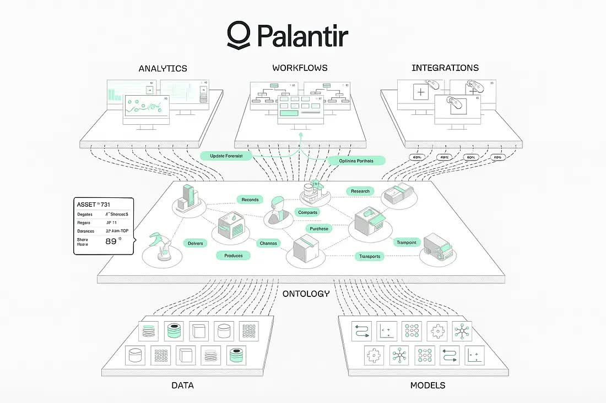
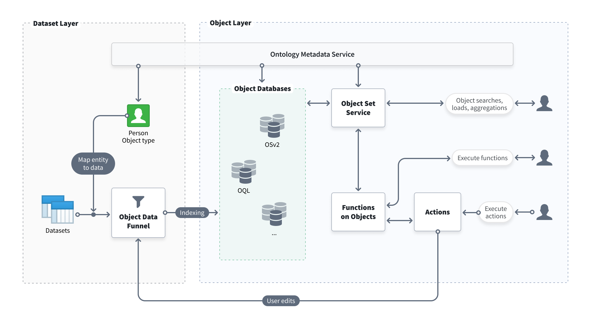
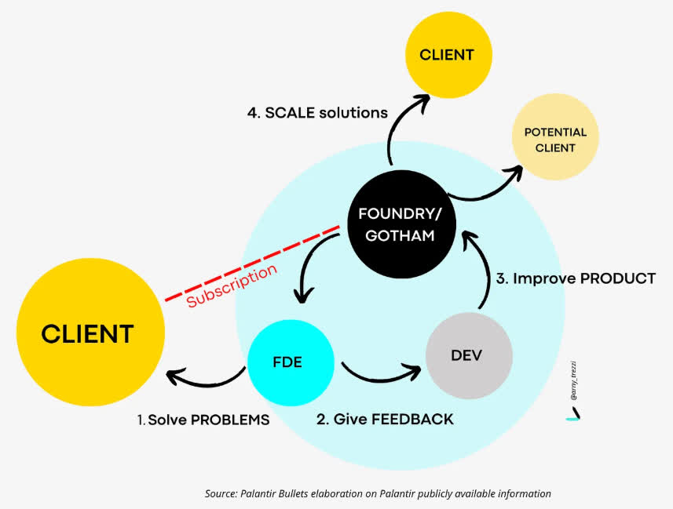

# 从 Palantir 到开源版

> **读者**：产品负责人 / 架构师 / 技术评估者
> **预计阅读**：25 min
>
> 本文是「开源版 Palantir」系列的第一篇。这个系列共四篇，从"为什么做"到"怎么做"到"设计背后的教训"，完整拆解一套对标 Palantir Foundry 的开源本体平台：
>
> 1. **从 Palantir 到开源版**（本文）——Palantir 凭什么、我们为什么做、整体长什么样
> 2. [本体体系](./03-ontology-system)——从数字孪生到可信 AI：本体怎么建模组织、怎么约束 AI、怎么沉淀成资产
> 3. [数据流场景](./04-data-flow)——六种核心数据流，每一条背后的设计权衡
> 4. [设计哲学与红线](./05-design-principles)——四条设计哲学 + 八条架构红线，每条都是真金白银踩出来的
>
> 建议按顺序读。如果你只关心架构怎么落地，可以直接从本文第四节"架构总览"开始。

## 一、Palantir 是什么

要理解 Palantir 为什么值几百亿美元，得先看它解决的是什么问题。

### 1.1 传统数据架构的尽头是"看见但做不到"

过去二十年，企业花大力气建数仓、上 BI、做数据中台。结果是什么？数据确实能查了，报表确实好看了，但业务决策的效率并没有质变。

问题出在架构是断的——数据从各个系统抽到数仓，加工成报表，人看着报表做判断，再回到业务系统里去执行。从"看见问题"到"采取行动"之间，隔着会议、邮件、跨系统操作。更关键的是，决策本身的上下文没有沉淀：为什么这么决定、当时评估了哪些方案、结果怎么样——这些全在人的脑子里或邮件里，系统不知道，也没法学习。

一家航空公司，某架飞机的发动机传感器读数异常。传统方式下，处理这件事需要人打开四个系统：传感器数据在时序库里，维护记录在工单系统里，备件库存和采购信息在 ERP 里，航班调度在运控系统里。数据都在，但**它们之间的关系靠人来串联**——人把"传感器读数异常"理解成"可能要停飞检修"，再查"停飞检修"意味着哪些航班受影响，再查受影响的旅客怎么办。每一步都是人工跨系统搬数据、做关联。周期以小时甚至天计。而且这次处理完，下次换个工程师又得重来一遍。

### 1.2 Palantir 的核心洞察：数据、逻辑、动作不能割裂



Palantir 的核心判断是：问题不是数据不够、也不是查得不够快，而是**数据、逻辑、动作是割裂的**。数据在数仓里，业务规则散在各个应用代码里，执行要回到业务系统里，安全策略在网关上。这四样东西分属不同系统，所以从"发现情况"到"做出决策"到"执行动作"这条链路是断的，只能靠人来衔接。

Palantir 的解法是把它们合到同一个模型里——这就是**本体（Ontology）**。本体不是数据字典，不是 ER 图，它是**组织的数字孪生**：把分散在各业务系统里的原始数据，转化为对业务世界的结构化、语义化理解。一个"发动机"不是一个数据库行，是一个完整的对象，带着型号、服役时间、维护历史、关联的传感器、装在哪架飞机上，同时也带着"这台发动机能做什么操作"（比如"申请停飞检修"）和"谁能看到它的什么数据"。数据、逻辑、动作、安全，四样东西在同一个地方定义、在同一个地方运行。

回到发动机的例子。传感器读数异常进来后，系统沿着本体里预设的关联链自动遍历：传感器→发动机→飞机→航班→旅客，整个过程不需要人切换系统。人看到的是已经被系统推理好的影响范围，只需要做价值判断。如果决定停飞检修，这个"决定"不是回到别的系统里去执行——它直接在本体里触发一个 Action，原子地更新航班状态、通知旅客、调整后续航班、写审计日志，一个事务内完成。

这就是 Palantir 和传统数据平台的本质区别：**不是你查数据更快，是系统把数据、推理、执行闭环了。** 传统 BI 是"看见就完了"，Palantir 是"看见→决定→执行→学习"。每一次决策的上下文都沉淀回本体，下一次遇到类似情况，系统可以参考上一次怎么处理的。Palantir 不是数据集成工具，也不是 AI 建模工具，而是一个**以决策为中心的操作系统**。

### 1.3 安全是原生的，不是后加的

正因为动作能直接执行到业务系统，安全就变成了生死问题。传统 BI 看错一个数字最多开会吵架，但一个能直接触发退款、停飞、调拨的系统，如果权限没控住、规则没校验，一个错误就会沿着业务链路放大。

Palantir 的安全模型不是后加的合规 checkbox，是架构级、预防性的：读操作自动过滤权限（你只能看到你有权看的数据），写操作强制三重校验（权限、参数合法性、业务规则——任何一步不过直接拒绝），全链路自动血缘不可变（谁在什么时候基于什么数据做了什么操作，全部有记录且不可篡改）。安全控制是多模态的——不只是角色，还有数据分类标记、使用目的约束。这些不是建议，是硬编码在引擎里的，大模型也绕不过去。

这正是军工、航空、医疗这些行业选择 Palantir 的原因。这三个行业对"出错"的容忍度为零——电商推荐错了可以划走，航空调度错了可能是人命。一个被这些行业验证的系统，它的安全模型是架构原生的，不是后来贴上去的。**如果一套系统能在航空和军工被信任，它对企业 AI 场景的安全需求是够用的。**

### 1.4 建模即工具

Palantir 还有一个容易被忽视的设计：**你定义了本体，工具就自动生成了**。定义一个对象类型，对应的查询、过滤、遍历工具自动就绪。定义一条关系，对应的图遍历工具自动就绪。定义一套操作规则，对应的执行工具自动就绪。

它的意义不是"省了写工具代码的功夫"。而是工具的定义永远不会和本体脱节——它们是从同一份定义生成的。本体改了（新增属性、修改规则），工具自动更新。不存在"数据库 schema 变了但 Agent 拿到的工具描述还是旧的"这种场景。这一点到了 AI 时代尤其重要——大模型要操作企业数据，靠的就是这些工具，工具和本体同源，AI 才不会拿着过时的认知去执行。

## 二、为什么做开源版 Palantir

Palantir 的范式是对的，但它在国内无法直接使用。而我们在项目实践中确实碰到了同样的问题——小巧灵团队（公司内部专注于企业数据架构落地的交付团队）支撑车厂本体架构等军团灯塔项目（军团是公司面向垂直行业的交付组织），但缺少抽象的产品架构和平台基础，阻碍了可复制的垂直行业 know-how 沉淀，也阻碍了在企业持续深入做出差异化价值、增强客户粘性。

基于这个现实，三个原因推动了开源版 Palantir 的启动。

**项目经验缺少沉淀为平台能力的路径**。前面说的车厂灯塔项目就是典型——做得深，但缺平台基座，经验难复制。

**用 AI 增强交付，从 FDE 到 AI FDE**。Palantir 交付项目的速度是它商业成功的关键——传统 IT 合同要走 6-12 个月的 PoC，Palantir 靠 Bootcamp 压缩到 5 天。能这么快，是因为它把 AI 用到了交付本身：AI FDE（Forward Deployed Engineer，前方交付工程师——Palantir 的核心交付角色，嵌入客户现场识别痛点并落地）是一个嵌在平台里的 Agent，FDE 用自然语言跟它对话，它就能做数据集成、本体建模、函数创建、治理审计，原本要人工干一周的话几天甚至几小时完成。平台上能锚定本体让 AI 可信，平台下能用 AI 加速 FDE 交付，上下两面都用 AI，才是 Palantir “智能化”的全貌。我们要复刻的不只是本体架构，还有这种“AI 贯穿交付”的能力——否则再好的架构，交付跟不上也走不进行业。

**需要一个对标 Palantir 的开源平台基座**。基于以上原因，小巧灵团队作为 FDE 先行识别客户痛点和业务需求，通过技术规划和选型对标开源版 Palantir，为关键难题提供技术和资源支持，推动公司层面产品竞争力提升。

开源版 Palantir 是抛砖引玉。真正的期望是公司层面能有一个统一的平台基座——项目里积攒的能力能落入产品线，产品线的核心能力又能进一步拓展到新行业、新场景，形成 Palantir 那种 FDE 在前线交付、PD 把验证过的能力回流产品的飞轮。

## 三、开源版 Palantir 长什么样

讲太多概念不如看一个具体场景。下面用一个供应商停产的例子，说清楚这套系统和传统系统的区别——不靠技术名词，靠体验。

供应商停产，需要评估影响范围和处理方案。

在传统系统里，这件事意味着：采购员先去供应商系统查这家供应商供哪些零件，再去 ERP 查这些零件用在哪些产线上，再去订单系统查这些产线的在途订单，最后人工汇总成一份受影响清单，发邮件通知相关客户。每一步都是人在跨系统搬数据、做关联。

在开源版 Palantir 里，这件事是这样发生的：

```
供应商停产事件进入系统
  → 系统沿业务关系自动遍历：供应商 → 零件 → 产线 → 订单 → 客户
  → 自动生成受影响订单清单
  → AI 提议处理方案（如“触发延期通知”）
  → 系统校验：该不该做 / 参数对不对 / 符不符合业务规则
  → 通过 → 执行，并同步更新所有相关数据
  → 全过程留下审计记录
```

关键区别不在“自动化”，而在三个地方：

**关联是系统做的，不是人做的**。供应商、零件、产线、订单、客户之间的关系，在建模时就已经定义好了。事件一进来，系统沿着这些关系自动遍历，不需要人去四个系统里查、对、拼。人看到的是已经推理好的影响范围，只需要做价值判断。

**AI 能提议，但不能越过规则**。AI 可以判断“这种情况应该发延期通知”，但它只负责选动作、提参数。该不该执行、参数是否合法、是否符合业务规则，由系统强制校验——任何一步不过，直接拒绝。AI 绕不过去。

**执行是一次性原子完成的，不会留半截状态**。一个动作要么全部成功（订单状态更新、客户通知发出、审计记录写入都一起完成），要么全部不生效。不会出现“通知发了但订单状态没改”这种中间态。

这种体验的背后，是一套开源组件在协同——存元数据的、做主存储的、加速在线读的、做联邦查询的、同步数据的、做图遍历的、做时空分析的。它们怎么分层、怎么协作、怎么替换，下面展开。

---

## 四、架构总览

### 4.1 概念分层：三层视角

上面那个供应商场景，看起来是一气呵成的体验，但背后分了三个抽象层次。从使用者的视角看开源版 Palantir，它由三层构成。这种分法对齐 Palantir Foundry 的"数据 → 本体 → 决策"递进，也是理解系统最直观的入口。

```
┌──────────────────────────────────────────────────────────────┐
│                    智能决策层                                │
│   AI Agent · TextQL 自然语言查询 · 图关联推理 · HITL 审批    │
│   把数据"看懂"，并沿业务关系推演、提议和执行操作            │
├──────────────────────────────────────────────────────────────┤
│                    本体语义层                                │
│   ObjectType / Property / LinkType / ActionType             │
│   把数据从"表和列"翻译成"对象、属性、关系、操作规则"        │
│   统一安全标记、命名规范、数据映射                          │
├──────────────────────────────────────────────────────────────┤
│                    业务数据层                                │
│   Dataset（Iceberg 主存储）· DataSource（外部数据源连接）   │
│   Index（Doris 在线读）· Pipeline（SeaTunnel 数据同步）     │
│   Engine（Trino 联邦查询）· Graph（Neo4j）· GeoTime（PG）   │
└──────────────────────────────────────────────────────────────┘
```

#### 4.1.1 各层各自承担什么

| 层 | 解决什么问题 | 包含什么 |
|----|-------------|---------|
| **智能决策层** | 数据准备好了，但谁来“用”它做决策？怎么把大模型的能力接到企业数据上，且不失控？ | AI Agent（对话式建模、推演）、TextQL（自然语言查询的语义理解）、图关联推理（ObjectSet IR——一种描述对象集查询逻辑的结构化中间表示，用于编排多引擎联动）、HITL（人工审批切面） |
| **本体语义层** | 物理数据存在表和列里，但人和 AI 需要的是业务概念——"客户"、"订单"、它们的关系、能做什么操作 | ObjectType、Property、LinkType、ActionType 的定义；安全标记；命名规范（displayName / apiName / backing column 三层分离）；数据映射 |
| **业务数据层** | 数据从哪来、存哪、怎么读得快、怎么保证完整性和可追溯 | Dataset（Iceberg 主存储 + 历史快照）、DataSource（外部源连接与同步）、Index（Doris 在线读加速）、Engine（Trino 联邦）、Pipeline（SeaTunnel 同步）、Graph（Neo4j 图遍历）、GeoTime（PostGIS+Timescale 时空） |

#### 4.1.2 层间关系：自上而下递进

```
决策层调用本体层暴露的能力（一组语义派生工具）
         │
         ▼
本体层定义"业务长什么样"，并控制决策层能做什么（安全、规则、命名）
         │
         ▼
数据层按本体层的映射规则，存取和查询实际的业务数据
```

这三层不是技术组件的简单堆叠——是**抽象层次的递进**。同一份数据，在业务数据层是 Iceberg 表的若干列，在本体语义层是"供应商"对象的"产能"属性，在智能决策层是 AI 推演"供应商停产影响范围"时的输入。每一层只做自己该做的事，向上提供语义，向下落到具体存储。

### 4.2 业务数据层的开源组件构成

#### 4.2.1 Palantir 的本体存储不是单一数据库



Palantir 的本体存储（OSv2，Object Storage V2）不是一张表，也不是一个数据库，而是一套**多模型混合存储**体系——针对不同访问模式用不同的专用对象库并行工作，通过本体层统一语义。它的核心特征是"读写职责严格分离"：所有写经 Funnel（写入编排与索引构建），所有读经 OSS（对象查询网关），中间是 OSv2 的存储与索引层。

OSv2 内部按访问模式拆为几类专用存储：

| 存储类型 | 承载什么 |
|---------|--------|
| 属性图核心存储 | 对象节点、链接关系及属性，支持高效图遍历与模式匹配 |
| 时序存储引擎 | 传感器、交易流水、轨迹点等时间序列，时间窗口查询毫秒级响应 |
| 空间地理存储 | 多边形、坐标、区域数据，支持空间相交、邻近查询 |
| 非结构化存储 | 文档、图像、视频等大文件，本体中仅保留引用指针与元数据 |
| 数据虚拟化层 | 查询下推，不集中迁移数据即可对接外部数据源 |

这套设计的关键洞察：**不同数据类型选择最优存储方案，通过本体层统一语义**，避免单一数据库在时序、空间、图遍历上的性能短板。本体对象在物理上被拆成多个投影，在语义层被映射回统一对象，属性还可以由数据管道计算派生——这就是"多层存储 + 语义映射 + 计算派生"。

#### 4.2.2 开源版 Palantir 复现这套机制需要什么能力

开源版 Palantir 要用开源组件复现 OSv2 的多模型混合存储。从架构实现的需求出发，需要以下几类能力，每类选一个开源组件：

<figure>

| 需要的能力 | 为什么需要 | 选的开源组件 | 选型理由 |
|----------|----------|------------|--------|
| **本体元数据与操作态存储** | 存 ObjectType/Property/LinkType/ActionType 定义、object_state 操作态、outbox 队列——这是本体语义层的真相源 | PostgreSQL 16 | JSONB 存灵活属性 + 关系表存结构化关联，一套库覆盖两种存储模式 |
| **全量明细与历史快照** | 对象的完整数据要 ACID 写入、可时间旅行、schema 可演进——对应 OSv2 的对象事实 KV + 持久日志 | Apache Iceberg（RustFS 做 S3 底层） | 开放表格式社区最大、REST Catalog 支持最好；写不乱、改不丢、回得去。RustFS 是 S3 兼容的开源对象存储（Rust 实现），可替换为 MinIO、OBS 或任何 S3 兼容服务 |
| **在线读加速** | 点查和过滤要亚秒返回，不能每次扫全量——对应 OSv2 的倒排属性索引 | Apache Doris | 倒排+向量双索引、SIMD 加速扫描、单表百亿行亚秒 |
| **联邦查询与数据虚拟化** | 不落地的外部数据源要能查，Doris 不可用时要能降级——对应 OSv2 的数据虚拟化层 | Apache Trino | 40+ 数据源原生连接；通过 Gravitino Connector 联邦路由 |
| **物理资产注册与权限** | 记录数据在哪、谁能访问、血缘关系——对应 OSv2 的路由目录与权限下推 | Apache Gravitino | Iceberg REST Catalog 原生支持，RBAC 内建，不绑定云厂商 |
| **数据同步与计算派生** | 外部源 → 主存储搬运、派生属性计算——对应 OSv2 的 Funnel 写入编排 | Apache SeaTunnel | 原生 Iceberg/TimescaleDB connector，不依赖 Hadoop 生态。注：主存储→索引（Iceberg→Doris/Neo4j/PostGIS）的写入不经 SeaTunnel，由 ObjectIndexFunnel/OutboxExecutor 直连各引擎 |
| **图遍历与关系邻接** | 多跳关系遍历不能用 JOIN，要原生图存储——对应 OSv2 的关系图谱索引 | Neo4j | 原生图存储，多跳遍历是图遍历不是表 JOIN |
| **空间与时序分析** | 空间过滤、时序查询要专用索引——对应 OSv2 的空间地理存储 + 时序存储引擎 | PostGIS + TimescaleDB（PG 扩展） | 与 PostgreSQL 同库，不跨库 JOIN；超表自动分区 |

</figure>

#### 4.2.3 这些能力怎么协作

举一个典型的查询为例，看这些能力怎么联动：

```
查询请求"找出所有高风险供应商"
    │
    ▼
ObjectQueryService（本体语义层编排）
    │  从 PostgreSQL 拿到 Supplier 对象定义 + 安全标记 + 数据映射
    │  从 Gravitino 检查读权限
    ▼
按 storage_type 分流：
    ├─ MANAGED → Doris 用倒排索引过滤（主路径，亚秒）
    │           └─ Doris 挂了 → 降级到 Trino 扫 Iceberg
    └─ VIRTUAL → Trino 直连外部源联邦查询
    │
    ▼
IcebergStore.load_by_ids 拉全量属性
    │
    ▼
返回结果，按 displayName 渲染给人看
```

这个流程里 PostgreSQL（元数据）、Doris（在线读）、Iceberg（全量与快照）、Trino（联邦与降级）、Gravitino（权限与路由）各司其职。它们之间的关系是协作而非层次堆叠——Trino 知道怎么从 Iceberg 读，Doris 的数据由 ObjectIndexFunnel（外部接入）/ OutboxExecutor（Action 写入）从 Iceberg/object_state 同步而来，ObjectQueryService 知道在 Doris 失败时切换到 Trino。一次查询可能同时触发多个引擎，调用者只看一份结果。

值得注意的是：这些能力之间有交集，不是"一个组件一层"的严格排布。PostgreSQL 同时承载本体语义层的元数据和 GeoTime 的空间/时序数据；Trino 既是联邦查询引擎也是 Doris 不可用时的降级路径；Doris 既是 Index 同步的目标也是在线读主源。交集是设计而非缺陷——同一份数据在不同引擎里有不同投影，每个投影服务一类查询场景。

### 4.3 组件的可替换性

业务数据层的组件选型原则是**优选开源成熟组件**。但即使尽力选了成熟开源组件，仍有两个现实限制：

1. **开源组件本身带限制**。不少开源组件只有单机版、企业特性未开源、或有社区版规模上限，业务增长后可能触顶。
2. **设计上要预留替换空间**。数据引擎领域发展快，新引擎会不断涌现，架构不应该把产品绑定在某个组件的实现细节上。

所以架构层通过**接口契约**考虑了组件可替换性：每个组件对外暴露一组明确的方法签名，上层只通过这组签名调用，不直接依赖具体实现。换一个组件 = 实现同一组接口签名 = 上层代码不动。

可替换的例子：

| 当前选型（开源） | 华为云对应产品 | 其他开源替代 |
|---------|---------|---------|
| Doris | DWS | ClickHouse / StarRocks |
| Neo4j | GES | JanusGraph / ArangoDB |
| SeaTunnel | CDM | Flink / Spark |
| Gravitino | LakeFormation | Unity Catalog / Polaris |
| RustFS | OBS | MinIO |

不同部署环境的基础设施也不同——有 Neo4j 集群的、没有的、用 ClickHouse 的、还在用 MinIO 的。架构层可替换才能保证一套代码适配多种环境。

### 4.4 层间的接口契约

三层之间不是直接调用，每一层都有明确的接口边界。对外部读者来说，真正重要的是两个层间接口：

<figure>

| 边界 | 接口形式 | 含义 |
|------|---------|------|
| 决策层 ↔ 本体层 | 一组语义派生工具（MCP / AG-UI / REST 三入口共享） | 决策层通过这组工具操作本体——查询对象、遍历关系、执行动作、定义新对象。工具从本体定义自动派生，本体改了工具自动同步。MCP（Model Context Protocol）是面向大模型的工具暴露标准，AG-UI 是面向 Agent 交互的流式协议，两者与 REST 共享同一套工具实现 |
| 本体层 ↔ 数据层 | 接口契约（ICD） | 本体层不直接碰具体存储引擎，而是通过一组约定的方法签名调用数据层。换一个存储引擎 = 实现同一组接口签名 = 本体层代码不动 |

</figure>

上面表格里"决策层 ↔ 本体层"这一行，具体来说是一组语义派生工具——工具不是手工封装的，是对本体的直接映射，大致按能力分组：

| 能力分组 | 工具 | 做什么 |
|---------|------|--------|
| 元数据读取 | `list_ontologies`, `list_object_types`, `describe_object_type`, `describe_link_type` | Agent 首先得知道有哪些本体、有哪些对象类型、它们长什么样 |
| 对象查询 | `query_with_sql`, `query_with_dataframe` | `query_with_sql` 是实例层的统一 SQL 入口——过滤、聚合、点查、时间旅行都走它，由编译器做 apiName→物理列名映射 + Doris 主/Trino 降级；`query_with_dataframe` 是推理线入口，吃结构化 ObjectSet IR（一种描述对象集查询逻辑的中间表示），递归求值多引擎联动 |
| 关系遍历 | `traverse_link`, `find_paths`, `exists_link` | 沿本体定义的 LinkType 自动跳，单跳/多跳路径/存在性检查 |
| 元数据编辑 | `define_object_type`, `add_property`, `define_link_type`, `link_dataset` | 对话式建模：人对 AI 说"新增一个供应商对象"，AI 调工具创建 |
| 动作执行 | `invoke_action` | AI 提议执行哪个 Action，系统校验权限/参数/业务规则后执行 |

三类消费者（MCP、AG-UI、REST）调同一套工具。本体的定义改了，工具自动更新，不发生脱节。

两层之间还有一层内部编排逻辑（查询路由、Action 闭环、索引同步、权限校验等），这是开源版 Palantir 的实现细节，不在接口契约的讨论范围内——它的存在是为了把层间的协作逻辑收口在一处，而不是散落在各层里。

**核心约束**：层与层之间不直接互相调用（例如 Index 层不能调 Dataset 层）。跨层协调由 Service 层完成。这是可替换性的前提——如果 Metadata 层混了物理表信息，换 PG 就要迁移物理表元数据，成本翻倍；如果 Index 作为写入入口，换 Doris 就要重写所有 Action 逻辑。

### 4.5 两条核心路径

#### 4.5.1 读路径

```
查询请求
  → ObjectQueryService 判断对象类型
  → MANAGED → Doris 直出（主路径）
      └─ Doris 挂了 → 自动降级到 Trino 扫 Iceberg（无需手动切换）
  → VIRTUAL → Trino 联邦查外部源（不落地，性能由源决定）
```

Doris 是在线读主源——存全量结构化属性和索引，点查/过滤/聚合都能直接出结果，不用再去翻底层存储。大字段和二进制以序列化引用形式存。Iceberg 退为历史快照和时间旅行的路径，平时读不走它。这样在线读的性能和历史完整性各归各位，不需要在同一套存储上互相妥协。降级是自动的：查询服务捕获 Doris 不可用异常后，把同一个逻辑 SQL 重编译成 Trino 方言执行，调用方不感知切换。

#### 4.5.2 写路径（Action 闭环）

```
Action 执行
  → 三重校验（权限 / 参数 / 业务规则）
  → 原子写入 PG object_state（OCC 乐观锁）+ outbox 消息
     └─ 同一事务提交，返回 applied
  → OutboxExecutor 后台消费 INDEX → Doris upsert（≤1s 近实时）
  → SyncFlushScheduler 后台消费 ARCHIVE → Iceberg MERGE（≤5min 微批归档）
```

这种用 outbox 驱动同步的设计，比额外维护一套 CDC 管道更简单、更可靠。

**写完立即可读（read-your-writes）怎么保证？** Action 返回 `applied` 时，数据已经在 PostgreSQL 的 `object_state` 表里生效。但读路径主入口走 Doris，而 Doris 的同步是异步的（INDEX outbox 后台消费，≤1s 延迟）。这个间隙靠两个机制填补：一是 Action 内部在提交后直接从 PG `object_state` 读后态填充返回结果，调用方拿到的就是刚写入的数据；二是推理线查询（`query_with_dataframe`）的水合阶段直接从 PG `object_state` 读取，不走 Doris。只有实例层的 SQL 查询（`query_with_sql`）走 Doris 主路径，在 INDEX outbox 未消费完的≤1s 窗口内可能查不到刚写入的数据——这是一个可接受的最终一致性窗口，不是一致性问题。

#### 4.5.3 初始数据集成到索引的链路

上面的写路径只覆盖了“对象操作态”（Action 变更）的同步。但业务数据首次从外部源进入系统并建立索引，是另一条链路：

```
外部源（MySQL/Oracle/国产库…）
  → SeaTunnel MAIN 管道写入 Iceberg（全量快照或增量 CDC）
  → Iceberg 落地后，ObjectIndexFunnel 从 scan_latest 读全量数据
  → rid 分配/复用（按业务主键查 Doris 已有 rid）+ DorisIndexStore.upsert（索引列）
  → 可选：按 capabilities 门控扇出 Neo4j / PostGIS 投影
  → Doris 索引表就绪，可供在线读
```

这条链路里，SeaTunnel 只负责「外部源 → Iceberg」的搬运；从 Iceberg 到 Doris / Neo4j / PostGIS 的写入由 `ObjectIndexFunnel`（Python 侧直连各引擎）完成，不再走 SeaTunnel（2026-07 去 SeaTunnel 化）。`OntologyService.define_object_type` 调用 `IndexSyncService.provision` 时只创建 Doris 索引表 DDL，不启动任何 SeaTunnel 管道；数据同步由 `ObjectIndexFunnel` 在数据接入后触发（当前需手动 rebuild，SeaTunnel backfill 完成自动触发的链路待接）。

#### 4.5.4 安全下推到查询引擎

安全不是另走一道网关，而是下推到查询引擎里。读路径上，`AuthorizationService.evaluate_query_scope` 会返回一个 `QueryScope`——包含行级残留谓词（Cedar 策略求值后生成的 SQL WHERE 片段）和列级脱敏属性列表。查询服务在编译 SQL 时把这个谓词注入到 WHERE 子句、把脱敏属性的值置为 null，权限过滤在数据层就完成了，不会把数据查出来再在应用层过滤。写路径上，三层校验内置在 Action 执行链路里：执行权限（能不能调这个动作）、行级写权限（能改哪些对象）、参数级权限（敏感参数过滤）。审计日志（`execution_log`）记录每次操作的 before/after 快照、操作者、参数，和业务写在同一事务提交。

---

## 五、战略价值：保护数据主权下的 AI 差异化



回到最根本的问题——为什么这套架构对华为在 AI2B 领域有战略意义。

企业让 AI 进到核心业务数据里，最大的顾虑是数据主权。数据出不出去、谁能看、AI 能不能改——这些不是性能问题，是信任问题。开源版 Palantir 的本体体系把权限、规则、审计内置在引擎层，AI 在受控范围内做推理和执行，数据主权始终在企业自己手里。这是做出 AI 差异化价值的前提。

在这个前提下，本体+决策沉淀的是行业 know-how。每做一个垂直行业项目，本体语义层都更厚一层——业务对象、关系、操作规则、安全标记都在累计。这些沉淀是可复制的，是提升客户粘性的根。而本体越厚、决策越多，对算力和存储的牵引就越强——这是一个正向飞轮。

有了本体+决策这个基座，再叠加 FDE 和 AI FDE 的工作模式，华为公司的 2B 服务基因可以被放大。FDE 先行识别客户痛点和业务需求，AI FDE 基于本体快速推演和验证方案，两者结合让项目交付的速度和质量都有量级提升。这种“本体语义层可跨行业复用 + FDE 前线识别行业差异 + AI FDE 加速交付”的组合，是华为在 AI2B 领域的差异化优势——不是单点技术突破，而是一套可复制的交付方法论。

---

## 这个系列还会讲什么

本文是系列首篇，把"为什么做"和"整体长什么样"讲清楚了。但很多问题只点了题，还没展开——它们是后面三篇的内容。

**[本体体系](./03-ontology-system)**——本文只讲了本体让系统自动做关联，但本体到底由什么构成、开源版怎么把四要素落地、为什么说它是"组织的数字孪生"、它又怎么用约束把 AI 关进可信边界、并因此沉淀成可复用的行业资产——这些要讲清楚存储机制和命名规范才能服人。这篇会展开。

**[数据流场景](./04-data-flow)**——本文的供应商场景只走了一条路径。实际上数据进来、被查、被改、被追溯、被自然语言问、被图推理分析，是六种不同的流，每一条都有"为什么要这样走而不是那样走"的权衡。比如虚拟表为什么不落地、为什么没有降级路径；时间旅行为什么用快照不用日志。

**[设计哲学与红线](./05-design-principles)**——本文讲了很多"是这样设计的"，但没讲"为什么必须这样、不这样会怎样"。这篇列了四条设计哲学和八条架构红线，每一条背后都是一个真实的坑——为什么写入必须经统一链路、为什么虚拟表禁止写入、为什么不用 Redis、为什么本体 API 不吃自然语言。不是规定，是教训。

如果你已经对整体有了感觉，想直接动手试，可以从[快速开始](../02-tutorials/01-quickstart)入手。

---

## 现状与路线图

开源版 Palantir 不是一份设计文档，是一套已经跑起来的系统。当前状态：

- **本体语义层**已完整落地：ObjectType / Property / LinkType / ActionType 的 CRUD、数据映射、三层命名规范、对话式建模（AI 推导 apiName + 用户可改 + 后端校验）。
- **业务数据层**多引擎投影已接通：PostgreSQL（元数据 + 操作态 + outbox）、Iceberg（全量明细 + 快照）、Doris（在线读主源）、Trino（联邦查询 + 降级）、SeaTunnel（外部源→Iceberg 搬运）、Neo4j（图遍历）、PostGIS + TimescaleDB（时空分析）。Doris/Neo4j/PostGIS 的写入由 ObjectIndexFunnel + OutboxExecutor 直连各引擎完成（不经 SeaTunnel）。
- **智能决策层**已接通：一组从本体定义自动派生的工具（查询 / 遍历 / 写入 / 动作执行 / 元数据编辑）、AG-UI ReAct Agent、TextQL 自然语言查询、图关联推理（ObjectSet IR 多引擎联动）、HITL 人工审批切面。
- **安全治理体系**已落地：三层 RBAC + MAC 标记 + 行/列级权限下推（Cedar 策略 → SQL 谓词注入）+ 审计日志 + JIT 访问申请。
- **前端**已有本体管理台（对象类型/属性/关系/动作的可视化建模 + 图探索画布 + 对话式 AI 建模 + 权限管理页面）。
- 后端代码超过 100 个源文件、1268 个测试函数；前端 169 个测试用例。CI 全绿。

正在推进的方向：图探索画布的决策分析能力增强、对话式建模的多轮体验打磨、权限治理的企业联邦（SCIM 对接）、全链路血缘追踪。

## 如何参与

如果你对以下方向感兴趣，欢迎加入：

- **本体建模与行业落地**：把本体体系落到具体行业（制造、金融、能源），沉淀可复制的行业本体模板。
- **引擎适配与性能调优**：Doris/Trino/SeaTunnel 的深度调优、国产数据库适配、云服务替换方案验证。
- **AI Agent 与工具链**：AG-UI Agent 的推理策略、工具设计、HITL 交互体验。
- **前端可视化**：图探索画布、决策分析看板、对话式建模交互。

联系小巧灵团队获取代码仓库和开发环境配置。
