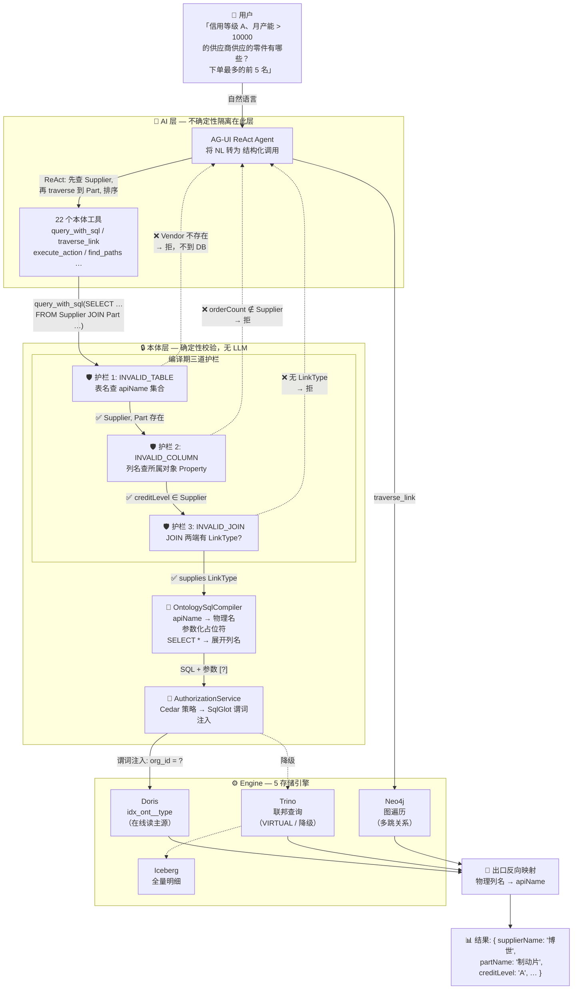

# 本体体系——从数字孪生到可信 AI

> **读者**：架构师 / 产品负责人 / 想理解"本体到底有什么不同"的读者
> **预计阅读**：18 min

[从 Palantir 到开源版](./01-palantir-and-gaia) 讲了本体为什么是连接数据与决策的中枢。但"本体"这个词被用得太泛——知识图谱叫本体，语义网叫本体，有些数据字典也叫本体。这篇要讲清楚：本体到底由什么构成、开源版怎么把它们落到代码里、以及为什么这套范式在 AI 时代不可替代。

Palantir 对本体有一句明确的判断：**"本体不是一个语义层（The Ontology is not a 'semantic layer'）。"**

语义层的职责是把物理表名翻译成业务名词、把指标口径写成 SQL——它解决的是"指标怎么算"。但一个组织要做决策，光翻译名词还不够：还需要定义事物之间的关联、状态变化时该做什么动作、谁有权限做。这四样——**数据（data）、逻辑（logic）、动作（action）、安全（security）**——在传统架构里散落在数据仓库、规则引擎、权限系统、应用代码四个地方，各自为政。Palantir 的做法是把它们整合进同一个模型：不是一层翻译，是组织的**数字孪生 + 运行时**。这个四合一的、能直接跑起来的，就是它说的本体（Ontology）。

Palantir 把这套东西叫做 **Ontology system**（本体系统）——"system"而不是"layer"，因为它不止定义，还要能执行。

语义层只翻译名词，本体把名词、动词、规则、权限、工具一起收进同一份定义并驱动执行——这个区别会贯穿全篇。但"讲清楚本体是什么"只是第一步。这篇真正要回答的是三个更硬的问题：开源版**怎么把这个四合一的模型落成可运行的代码**？落成之后，它**怎么用约束把 AI 关进可信边界**？以及，为什么这套约束反而让本体**沉淀成可跨客户、跨行业复用的资产**？

---

## 一、本体的四要素：从定义到可运行

Palantir 用"名词与动词"类比本体：对象和属性是名词，动作是动词，逻辑把名词和动词组成有意义的句子。本体的官方定义——"本体不只是个数据存储，它是一个**需要被设计的 API**"——关键不在"API"，在"需要被设计"：你定义的对象类型不是把源系统的表搬过来，而是要为支撑决策重新设计。

下面逐个讲这四个要素。每一块先说 Palantir 的设计意图，再说开源版如何将其落成可运行的能力——后者是本文重点。

### 1.1 ObjectType：名词——现实实体的类型化定义

ObjectType 是现实世界里某类实体或事件的 schema 定义。一个对象（object）是它的实例，一组对象（object set）是多个实例的集合。

Palantir 的设计意图很明确：ObjectType 映射的是**业务概念**，不是数据库表。一个 `Supplier`（供应商）的数据可能来自三张表，也可能三张表的数据被映射到同一个 `Supplier`。建模原则是"对象类型必须映射自然语言业务概念"——`PurchaseOrder` 是个好名字，`po_tbl_v2` 不是。

**开源版怎么落地。** ObjectType 在数据层是 `ObjectTypeModel`：

```python
class ObjectTypeModel(Base):
    api_name: Mapped[str]          # PascalCase，本体内唯一（uq_object_types_ontology_api_name）
    display_name: Mapped[str]      # 人类可读，可中文，可随时改
    primary_key: Mapped[str]       # 主键属性 apiName（字符串，天然唯一）
    storage_type: Mapped[str]      # MANAGED（落地 Iceberg）| VIRTUAL（Trino 联邦代理，不落地）
    capabilities: Mapped[dict]     # 门控：是否投影到 Neo4j/PostGIS/TimescaleDB
```

几个关键点对应 Palantir 的建模规范：

- **主键必须是字符串**。`primary_key` 存的是属性 apiName，值是字符串——字符串能表示数字，反过来不行，主键类型一旦定下改不动。这是 Palantir 的建模规范，开源版照搬。
- **`storage_type` 区分落地与不落地**。`MANAGED` 落到 Iceberg（唯一写入入口），`VIRTUAL` 是外部数据源的联邦代理指针，不落地、不可写。这个区分直接决定了查询走哪条路（Doris 主 / Trino 联邦）、写入是否被允许（VIRTUAL 写入直接 guard 拒绝）。
- **`capabilities` 是能力开关**。一个 ObjectType 启用 `graph_indexing_enabled`，定义时就会 best-effort 在 Neo4j 里 provision 它的节点 schema；启用 `geotime_indexing_enabled` 就在 PostGIS/TimescaleDB 里 provision。能力是按对象类型粒度开的，不是全局的——不同对象类型服务不同查询场景。

### 1.2 Property：名词的特征

Property 是 ObjectType 上的特征定义。`Supplier` 上有供应商名称、信用等级、月产能等属性。

给属性起名字，在不同的上下文里有不同的需求：界面上显示给用户看的名字（可能是中文，如"供应商名称"）；代码和 AI 调用时用的标识符（需要是稳定的英文，如 `supplierName`）；数据库里实际的列名（跟源系统走，如 SAP 的 `LIFNR`）。这三个名字用途不同、生命周期不同、变更频率不同——如果不分开存，其中任何一个变了都会牵动另外两个。

开源版的做法就是**三个名字严格分离，各自独立字段存储**。这是整个本体能跨客户复用、能约束 AI 的根基，后面两章都要回来引用它，先在这里讲透：

| 名字 | 作用 | 谁看得到 | 稳定性 |
|------|------|----------|--------|
| **displayName** | 人类可读的显示名（可中文） | 用户、页面 | 可随时改 |
| **apiName** | 机器可读的唯一标识 | API、代码、AI 工具调用 | 一旦确定不改 |
| **backingColumn** | 物理数据列名 | 数据库、查询引擎 | 跟数据源走，可切换 |

开源版里这三个名字是 `PropertyDefModel` 的三个独立字段：

```python
class PropertyDefModel(Base):
    api_name: Mapped[str]                    # camelCase，(object_type_id, api_name) 唯一
    display_name: Mapped[str]
    backing_column: Mapped[str | None]       # 物理列名，可空（建模期可不绑定）
    backing_table: Mapped[str | None]
    backing_dataset_api_name: Mapped[str | None]
```

为什么必须分三个？因为它们的生命周期完全不同。displayName 给人看，改了不影响程序；apiName 给程序和 AI 用，一旦确定就永久固化；backingColumn 跟数据源走——换一个 ERP，列名可能从 `supplier_name` 变成 `vendor_nm`。

**关键规则**：apiName 只能从 displayName 推导，一旦生成就永久固化，后续改 displayName 不影响 apiName。这个不可变性在 service 层强制实现——更新属性时不会同步更新已保存的 apiName。如果反过来让 apiName 从 backingColumn 生成，换一次数据源就会生成一套不同的 apiName，所有业务逻辑、工具描述、AI 上下文全部断裂。

> 这一段先记住结论：**三个名字里，apiName 是稳定的锚，backingColumn 是可切换的物理映射。** 第三章会讲这个锚怎么让本体约束住 LLM，第四章会讲它怎么让本体脱离物理层沉淀成资产。两个价值面同根，根就在这里。

### 1.3 LinkType：名词之间的关系

LinkType 是两个 ObjectType 之间关系的 schema 定义。`Supplier` 和 `Part` 之间有 `supplies`（供应）；`Aircraft` 和 `Engine` 之间有 `equippedWith`（装有）；`Employee` 和 `Employee` 自身之间可以有 `manager` / `directReports`。

底层通常由外键实现，但本体的关键在于：**它把外键提升为有业务含义的、可遍历的、带名称的关系**。用户和 AI 不写 JOIN，沿关系名遍历：`supplier.supplies.all()` 拿到这个供应商供应的所有零件。

开源版里 LinkType 是 `LinkTypeModel`，关键字段是 `foreign_key_property_api_name`——指向一个 Property（外键），这个 Property 又属于某个 ObjectType。关系不是独立存储的图边，是挂在 Property 上的语义标注。遍历工具 `traverse_link` / `find_paths` / `exists_link` 读这个标注，落到具体查询时由编译器翻译成 JOIN 或 Neo4j 图遍历（取决于跳数和 capabilities）。

Palantir 有句话："孤立的对象是本体设计不良的信号。"开源版把它落成了编译期约束——见第三章的 JOIN 护栏：两个没有 LinkType 的 ObjectType 不允许 JOIN。

### 1.4 ActionType：动词——能对对象做什么

这是本体区别于一切数据技术、图谱技术的关键概念。**本体不只描述世界，还能改变世界。**

ActionType 是一组可以对对象、属性、关系一次性执行的变更定义。Palantir 的表述很精准："动作让用户在处理数据时想的是目标，而不是具体改哪个字段。"用户点"评估供应商风险"，不用关心这会改哪些属性、触发哪些通知——动作把这些封装成一次有业务含义的操作。

两个关键机制：

- **提交条件（submission criteria）**：基于上下文和静态信息的逻辑判断，控制动作在什么条件下可被提交。比如"创建排班"动作设条件 `start_timestamp > now()`——不能创建过去开始的排班。这既是权限控制，也是业务规则校验。
- **副作用（side effect）**：动作执行时可向外部系统回写数据，联动外部业务系统——决策和执行真正连起来。

开源版里 ActionType 是 `ActionTypeModel`，把这两个机制存成字段：

```python
class ActionTypeModel(Base):
    affected_object_type_id: Mapped[str | None]  # ON DELETE SET NULL（保留历史）
    parameters: Mapped[dict]       # 含 rules（派生+约束）和参数定义
    rules: Mapped[dict]            # 业务规则
    submission_criteria: Mapped[dict]  # 提交条件
```

执行链路在 `ActionService.execute_action` 里是一个多步骤的事务：解析定义 → 三层权限校验 → 幂等检查 → 参数校验 → 规则求值 → 提交条件求值 → VIRTUAL 写入 guard → 构建 mutations → 行级 OCC 写 `object_state` → 写执行日志 + outbox → PG 原子提交 → 图边投影。写操作返回 `applied` 时，数据已经在 PostgreSQL 的 `object_state` 表生效，各投影引擎（Doris/Iceberg/Neo4j）的最终一致性由 outbox 后台消费保证。

> ActionType 是第二章"一次建模，三件套同时就位"里最集中体现的一块——定义一个动作，Language 记录规则、Engine 执行校验、Toolchain 暴露为可调用工具，三件套一次落地。第二章会展开。

### 1.5 四要素之上是系统，不是层

四个要素单独看都不新鲜：ObjectType 像表，Property 像列，LinkType 像外键，ActionType 像存储过程。Palantir 反复强调的一句话正是在这里成立：**"本体不是一个语义层（The Ontology is not a semantic layer）。"** 语义层也定义对象和关系，但它停在"定义"这一步。本体不止定义，还要能跑。

Palantir 把这套能跑的东西叫做 **Ontology system**（本体系统），在架构中心文档中明确定义为"一个多模态系统，由数十个子组件构成，概念上可归入三项：**Language（语言）、Engine（引擎）、Toolchain（工具链）**"——三个组件共同构成一个 3×4 的矩阵（横向是数据/逻辑/动作/安全四合一的四个维度，纵向是 Language/Engine/Toolchain 三层的实现）。

- **Language**：本体的建模面——语义对象、属性、链接（名词），以及动作、自动化、定义动作如何运转的逻辑（动词）。Palantir 原话："Language models the semantic objects, links, and properties; along with the kinetic actions and automations; and the literal pieces of logic that define how those actions operate." 对应开源版的 ORM 模型（`core/models/ontology.py` 里的 `ObjectTypeModel` / `PropertyDefModel` / `LinkTypeModel` / `ActionTypeModel`）和 pydantic schema——所有的"定义"都在这里。
- **Engine**：本体的运行时——把 Language 的所有定义跑起来。读这一侧：高并发 SQL 查询、对象状态实时订阅、人和 AI 协同所需的物化视图；写这一侧：原子持久化事务、大批量变更、高吞吐流、以及 CDC 对操作系统的低延迟镜像。对应开源版的 services + 8 个 layer：`ObjectQueryService`（读路由）、`ActionService`（写事务）、Doris / Iceberg / Trino / Neo4j / PostGIS+TimescaleDB 五存储引擎。
- **Toolchain**：本体的暴露面——让开发者把本体当后端用。Palantir 有 OSDK（Ontology SDK）和 DevOps 工具链；对应开源版的 tools/ 工具层 + MCP / AG-UI / REST 三入口——外部 Agent 通过 MCP 调用，内置 Agent 通过 AG-UI 调用，人类开发者通过 REST 调用，三入口共享同一套 22 工具 8 toolset。

> 参考：[Palantir Architecture Center — The Ontology system](https://palantir.com/docs/foundry/architecture-center/ontology-system/)

光有 Language 没有 Engine 和 Toolchain，本体就退化回语义层——"定义了对象却不能查询、不能执行动作、不能被外部调用"。三件套合一，让"四合一整合"的所有维度在同一份定义下被同一套引擎驱动、被同一套工具链暴露——这是第二章要展开的主题。

---

## 二、一次建模，三件套同时就位

第一章 1.5 节点出本体是 Language + Engine + Toolchain 的系统。这句话落到代码里的兑现方式是：**把数据、逻辑、动作、安全四个维度收进 ObjectType 的一份定义，平台在运行时从同一份定义读取。** 一次建模动作，三件套同时就位。

定义一个 `Supplier` 对象类型时，一次建模动作同时驱动 Language、Engine、Toolchain 三件套：

| 建模动作 | Language 产出 | Engine 执行 | Toolchain 暴露 |
|---------|-------------|-----------|--------------|
| 定义 ObjectType + Property | `ObjectTypeModel` / `PropertyDefModel` 记录 | 查询编译器：apiName → 物理列名 | `describe_object_type` 返回 schema 元信息 |
| 定义 ActionType | `ActionTypeModel.rules` / `submission_criteria` 记录 | Action 执行链路：Step 5 rules eval + Step 5.1 条件求值 | `execute_action` 工具暴露给 Agent 调用 |
| 绑定安全策略 | Property marking + Cedar 策略 + `ActionAuthorizer` 记录 | 读：SQL 谓词下推到 Doris/Trino；写：三层权限逐项校验 | 权限策略对调用者透明生效，不可见即不可用 |
| 挂载能力开关 | `capabilities` 字段记录 | graph_indexing → Neo4j provision；geotime → PostGIS provision | 图遍历/时空过滤工具按 capabilities 门控暴露 |

表里每一行都是一条从"定义"到"执行"到"暴露"的完整链路——Language 存定义（ORM 模型），Engine 跑逻辑（services + layers），Toolchain 暴露能力（MCP/AG-UI/REST）。传统架构里这些能力分散在多个系统——数据映射在 ETL 配置、操作规则在应用代码、安全在网关、AI 工具是手写脚本——各自独立演进，改一处要协调四处。在本体里，一次建模在三件套里同步落成，**改一处全平台生效**。

这就是"本体是系统不是语义层"的工程含义：语义层只翻译名词，本体把名词、动词、规则、权限、工具一起收进同一份定义，由 Engine 驱动执行，由 Toolchain 暴露为可调用能力——三件套缺一不可。

> 一个细节：`OntologyService.link_dataset` 的 `column_mappings` 可以分批补——建模期可以先不绑定物理列，数据就绪后再补映射。这实现了"先建模后对接"：业务语义先沉淀，物理对接后跟进。第四章会讲为什么这个顺序对沉淀行业资产至关重要。

---

## 三、给 AI 立边界：本体如何约束 LLM 的输出

Forrester 在 2025 年说了段话，把问题点透了：

> "Agents don't just retrieve data — they interpret, decide, and act. Without explicit context, they **guess**. And when agents guess, they **get joins wrong, misinterpret metrics, and act on flawed assumptions**."

——智能体不只是检索数据，它们解释、决策、行动。没有显式上下文，它们就猜。一猜，就 join 错、指标误读、基于错误假设行动。

这不是模型缺陷，是概率系统的本性。AtScale 有个数据：没有治理的语义层时，LLM 回答业务问题准确率约 70%；有了治理的语义层，升到 100%。差的这 30% 不是幻觉，是"让概率系统每次自己发明业务定义"的代价。

Palantir 的解法是 **grounding + tools**：LLM 不直接碰数据，而是调用本体派生的工具（data tools / logic tools / action tools），在"被配置和授权的边界（configured and authorized boundary）"内操作。VentureBeat 给这个思路起了个名字——"**ontology is the real guardrail**"（本体才是真正的护栏）。

开源版把这个"边界"落成了**两道约束**：编译期挡住结构性错误，执行期挡住语义越权。LLM 的灵活性被保留在"写哪条逻辑 SQL"上，不确定性被压缩在"SQL 是否合法"这条窄缝里，这条缝由本体兜底。

### 3.1 apiName 是约束的锚点

先讲清楚为什么约束必须挂在 apiName 上，而不是物理名上——这是整章的地基。

物理名是漂移的：MySQL 可能大写，Oracle 混合大小写，国产数据库拼音命名，同一个业务字段在不同库叫 `user_id` / `usr_id` / `yhbh`。如果约束挂在物理名上，换一个数据源，约束就失效——`INVALID_COLUMN` 校验对不上新列名，权限策略写死了旧列名。

apiName 永久固化（第一章 1.2 讲过的不可变性），约束挂在 apiName 上才稳定。LLM 写 `SELECT supplierName FROM Supplier`，这条 SQL 里的 `supplierName` 和 `Supplier` 都是 apiName——本体用这两个 apiName 去查"对象存不存在""属性属不属于它"，跟底下物理列叫什么完全无关。

**这就是边界的地基**：边界画在 apiName 这一层，物理层怎么变都不影响边界的有效性。

### 3.2 编译期约束：挡住结构性错误

LLM 生成 SQL 时会犯三类结构性错误（正好对应 Forrester 说的"join 错、指标误读、错误假设"）。开源版的 `OntologySqlCompiler` 在编译期用三道护栏逐类挡住。先看入口——`compile()` 方法里，整条管道一目了然：

```python
class OntologySqlCompiler:
    def compile(self, logical_sql: str, dialect: Dialect) -> tuple[str, list[Any]]:
        """Compile logical SQL → physical SQL.
        Raises OntologyError(code=INVALID_TABLE|INVALID_COLUMN|
        INVALID_JOIN|UNSUPPORTED_SQL|SQL_PARSE_ERROR) on guardrail violations.
        """
        self._alias_map = {}
        ast = sqlglot.parse_one(logical_sql, read=_READ_DIALECT)
        # ① Scope check — reject DML, UNION, etc.
        self._enforce_scope(ast)
        # ② Pass 1: collect table aliases, CTE defs, subquery output cols
        self._pass1_collect(ast)
        # ③ Expand SELECT * to explicit columns
        self._expand_stars(ast)
        # ④ Pass 2: rewrite — guardrails fire HERE
        out_aliases = self._collect_output_aliases(ast)
        ast = self._rewrite(ast, dialect, out_aliases)
        return ast.sql(dialect=dialect), self.params
```

`sqlglot` 把逻辑 SQL 解析成 AST，两次遍历（Pass 1 收集上下文，Pass 2 改写并校验），三道护栏全在 `_rewrite` 里——下面逐个拆开看。

**护栏 1：表必须存在（挡"幻觉对象"）。**
LLM 可能幻觉出不存在的对象：`SELECT * FROM Vendor`——但本体里只有 `Supplier`，没有 `Vendor`。`_rewrite` 遍历 AST 中的每个 Table 节点，查本体元数据 `object_types()`，找不到直接拒：

```python
# Inside _rewrite: Table node → physical name + guardrail
ot = self._resolve_object_type(node.name)
if ot is None:
    raise OntologyError(f"未知 ObjectType: {node.name!r}",
                        code="INVALID_TABLE")
# → resolve to physical table name (Doris: idx_<ont>__<type>,
#   Trino: iceberg.ontology.<snake> or external catalog.schema.table)
```

关键是 `_resolve_object_type` 查的是本体的 apiName 集合，不是数据库的 information_schema。LLM 幻觉出的 `Vendor` 在本体元数据里根本不存在，编译期就死掉，不会"查了个不存在的表"返回空结果骗人。

**护栏 2：列必须属于所在对象（挡"张冠李戴"）。**
LLM 可能把属性安错对象：`SELECT s.creditLevel FROM Supplier s` 没问题，但 `SELECT s.orderCount FROM Supplier s` 就错了——`orderCount` 不属于 `Supplier`，属于 `Order`。`_rewrite` 遍历 Column 节点时调 `_resolve_owner` 做三层归属解析，解析不出就拒：

```python
# Inside _rewrite: Column node → physical column + guardrail
owner_ot = self._resolve_owner(node)  # three-tier fallback
if owner_ot is None:
    raise OntologyError(
        f"无法解析列归属: {col_api!r}（多表查询请加表前缀）",
        code="CANNOT_RESOLVE_COLUMN_OWNER",
    )
props = self._schema.properties().get(owner_ot, {})
if col_api not in props:
    raise OntologyError(
        f"未知 Property: {col_api!r} 不属于 ObjectType {owner_ot}",
        code="INVALID_COLUMN",
    )
# → rewrite column to physical column name
node.set("this", exp.to_identifier(props[col_api], quoted=False))
```

`_resolve_owner` 的三层归属解析对应三种实际场景：① 列带了表前缀（`s.creditLevel`）→ 从别名映射查 ObjectType；② 列没前缀但 enclosing SELECT 只 FROM 了一个表 → 单表兜底；③ 列没前缀且多表 → 歧义，`CANNOT_RESOLVE_COLUMN_OWNER`。这一步同时挡住了 Forrester 说的"指标误读"——LLM 不能随便给一个对象安一个它没有的指标。

**护栏 3：JOIN 两端必须有 LinkType（挡"乱连关系"）。**
这是最关键的一道。LLM 凭"字段名看起来像"就 JOIN 是最常见的事故：`Supplier JOIN Order ON supplier_id = supplier_id`——但本体里 `Supplier` 和 `Order` 之间根本没定义直接关系（它们通过 `Part` 间接关联）。`_validate_join` 查的是本体元数据的 `links()` 集合，而非数据库外键：

```python
def _validate_join(self, join: exp.Join) -> None:
    """Every JOIN pair must be a defined LinkType in the ontology."""
    ots: set[str] = set()
    for t in select.find_all(exp.Table):
        ot = self._resolve_object_type(t.name)
        if ot:
            ots.add(ot)
    if len(ots) < 2:
        return
    links = self._schema.links()  # {(Supplier, Part), (Part, Order), ...}
    for a, b in itertools.combinations(ots, 2):
        if (a, b) in links or (b, a) in links:
            return  # ✅ defined link found
    raise OntologyError(
        f"ObjectType 组合 {ots} 之间未定义 LinkType，禁止 JOIN",
        code="INVALID_JOIN",
    )
```

`links()` 返回的是本体的 LinkType 集合——第一章 1.3 定义的那些 `supplies`、`equippedWith`、`manager`。这里的关键设计是 **LinkType 支持多跳**：`Supplier` 和 `Order` 不能直接 JOIN，但可以通过 `Supplier → supplies → Part ← orderedAs ← Order` 三跳遍历。编译器不阻止间接关系的遍历（那是 `find_paths` / `traverse_link` 工具的职责），但它阻止 LLM 凭空发明一条本体里不存在的关系——**关系必须先建模才能 JOIN，不能临时发明。**

这三道护栏都是确定性的——同一个逻辑 SQL 永远编译成同一个物理 SQL，可审计、可测试。LLM 在这一层没有发挥空间，只有合规与不合规。

### 3.3 执行期约束：挡住语义越权

编译期挡住了"SQL 结构对不对"，执行期挡住"这条 SQL 该不该被执行"——分读越权和写越权两类。

**读越权：权限下推到查询引擎。**
权限不走单独网关，而是下推到查询引擎里。`AuthorizationService.evaluate_query_scope` 对 SQL 涉及的每个 ObjectType 求 Cedar 策略，返回一个 `QueryScope`：

- `forbidden`（整个对象类型对该主体不可见）→ 直接返回空，不可见即安全；
- `residual`（行级残留谓词，Cedar 求值后生成的 SQL WHERE 片段）→ `inject_permission` 把它 AND 进编译后的 SQL 的每个 WHERE 子句（含子查询/CTE/JOIN）；
- `masked_properties`（列级脱敏属性集合）→ 结果出口处把这些属性的值置 null。

关键：谓词注入发生在 SQL 到达 Doris/Trino **之前**，引擎在扫描节点就过滤，不可见的数据行根本不会到达应用层。这不是事后过滤，是事前下推。LLM 写的 SQL 拿不到它没权限看的数据，且它感知不到权限的存在——查询照常返回，只是结果集被裁剪过。

**写越权：Action 三层校验 + 写操作路由。**
写操作不能走 SQL——编译器的 `_enforce_scope` 对 `UPDATE / INSERT / DELETE` AST 节点直接抛 `UNSUPPORTED_SQL`，路由到 Action 工具。这是硬隔离：LLM 不能用 SQL 绕过 Action 的校验偷改数据。

```python
def _enforce_scope(self, ast: exp.Expression) -> None:
    """Reject SQL constructs outside the supported scope."""
    if isinstance(ast, (exp.Update, exp.Insert, exp.Delete)):
        raise OntologyError(
            "text2sql 仅支持 SELECT；写操作请走 Action 工具",
            code="UNSUPPORTED_SQL"
        )
```

走 Action 就要过 `ActionAuthorizer` 三层——每层一个方法，职责和异常边界精确分离：

```python
class ActionAuthorizer:
    """Three-layer Action authorization.

    Layer 1 — execution: can the caller invoke this ActionType?
    Layer 2 — row-write: which objects can the caller NOT write?
    Layer 3 — parameter: strip sensitive params from non-admin callers.
    """

    async def check_execute_permission(self, action_type, context) -> None:
        # Stacked check: PDP five-layer + ADR-011 declarative permissions.
        result = await self._authz.check_access(
            context.principal, "ACTION_TYPE",
            action_type.api_name, "action_type:execute"
        )
        if not result.allowed:
            raise ForbiddenError(f"Action denied: {result.reason}")
        # Also evaluate role allowlist + dynamic condition from ActionType config.
        # Both must pass; this is an additional restriction, not a fallback.
        perms = _extract_permissions(action_type)  # reads parameters.permissions
        if perms:
            if perms.get("roles") and not _has_any_role(context.user_roles, perms["roles"]):
                raise ForbiddenError(...)
            if perms.get("condition"):
                self._rule_engine.evaluate_submission_criteria(...)  # raises if fails

    async def check_row_write_permission(
        self, object_type_api_name, rids, context
    ) -> set[str]:
        """Returns the set of rids the caller CANNOT write."""
        return await self._authz.check_action_permission(
            context.principal, object_type_api_name, rids, "object:write"
        )

    def filter_sensitive_parameters(
        self, action_type, parameters, context
    ) -> dict[str, Any]:
        """Layer 3: strip sensitive params. Admins see everything."""
        sensitive = (action_type.parameters or {}).get("permissions", {}).get("sensitive_params") or []
        if "admin" in context.user_roles:
            return parameters
        return {k: v for k, v in parameters.items() if k not in sensitive}
```

三层各司其职：Layer 1 控"能不能执行这个操作"（PDP + 声明式角色/条件双检），Layer 2 控"能改哪些行"（返回 forbidden 集合，全 forbidden → `ForbiddenError`），Layer 3 控"能看到哪些参数"（非 admin 直接剥离敏感字段）。加上 `execute_action` 执行链路里 Step 5 的规则求值和 Step 5.1 的提交条件求值，以及 Step 5b 的 VIRTUAL 写入 guard（`storage_type=VIRTUAL → ValidationError`）——业务规则和执行条件都硬编码在执行链路里，LLM 绕不过任何一道。

### 3.4 两道约束之外：出口反向映射

编译期和执行期之外，还有一道容易被忽视的约束——**出口反向映射**。查询结果从 Doris/Trino 出来时，列名是物理名（`supplier_name`），`_map_backing_to_api_multi` 把它们反查回 apiName（`supplierName`）。

这意味着：**LLM 全程只碰 apiName。** 它写的是 apiName，它读回来的也是 apiName，物理层（列名、表名、方言）被本体完全吸收。LLM 不需要、也接触不到物理细节——这本身就是一种约束：你不知道物理层长什么样，就没法绕过本体去搞事。

### 3.5 边界之外：把不确定性隔离在 AI 层

上面两道约束是本体层的，确定性的。那 LLM 的不确定性放在哪？放在 AI 层——`/ai/*` 路由。`/ai/agent` 是 AG-UI ReAct Agent，LLM 在这里把自然语言转成逻辑 SQL 或 ObjectSet IR，再调本体层的 `query_with_sql` / `query_with_dataframe` 工具。

这是个刻意的分层：**本体层只吃结构化输入，NL→结构化的转换放在 AI 层。** NL→IR 的转换由 LLM 完成（这一步允许出错、允许概率性），但 IR 一旦进入本体层就被确定性校验（语法、对象存在性、参数合法性）。换新模型时只改 AI 层配置，本体 API 不动。两层在各自轨道演进，互不污染——本体保持可信赖，"不可信赖"的部分被隔离在可控的 AI 层。

这就是 Palantir 说的 "operate within a configured and authorized boundary" 的开源版实现：**配置的边界在编译期（三道护栏），授权的边界在执行期（权限下推 + Action 校验），LLM 只在边界内活动。**

下图把整条链路串起来——用户一个自然语言问题，从 AI 层到本体层到 Engine 层，在每一层被谁校验、被谁改写、最终怎么原路返回：



以上图里的同一个查询为例，三段 SQL 对照如下——从自然语言到 LLM 生成的逻辑 SQL，再到编译器基于本体翻译的物理 SQL：

```
┌─ ① 自然语言（用户输入）
│  "信用等级 A、月产能 > 10000 的供应商供应的零件有哪些？下单最多的前 5 名"
│
├─ ② 逻辑 SQL（LLM 基于本体 apiName 生成，提交给编译器）
│  SELECT s.supplierName, s.creditLevel, p.partName, p.orderCount
│  FROM Supplier s
│  JOIN Part p ON s.supplierId = p.supplierId
│  WHERE s.creditLevel = 'A' AND s.monthlyCapacity > 10000
│  ORDER BY p.orderCount DESC
│  LIMIT 5
│
├─ ③ 物理 SQL（编译器翻译产物，发给 Doris 执行）
│  SELECT s.supplier_name, s.credit_level, p.part_name, p.order_count
│  FROM idx_ordermgmt__supplier s
│  JOIN idx_ordermgmt__part p ON s.supplier_id = p.supplier_id
│  WHERE s.credit_level = ? AND s.monthly_capacity > ?
│    AND (s.org_id = ?)           ← 权限谓词注入
│  ORDER BY p.order_count DESC
│  LIMIT 5
│  参数: ['A', 10000, 'tenant_x']
│
└─ ③→① 结果返回前，出口反向映射把列名从物理名翻回 apiName
```

三段之间做的事：①→② LLM 把"信用等级"翻译成 apiName `creditLevel`，"供应商"翻译成 `Supplier`——这一步依赖本体元数据，LLM 可能错（把 `creditLevel` 写成 `creditRating`），错了就撞护栏 2。②→③ 编译器查本体元数据确认 `Supplier` 和 `Part` 之间有 `supplies` LinkType（护栏 3），然后把所有 apiName 翻成物理名、字面量参数化、注入权限谓词。③→① 出口反向映射把物理列名翻回 apiName，用户全程看不到物理层。

---

## 四、独立于物理层：本体作为可沉淀的行业资产

第三章讲了约束挂 apiName 让 AI 可信。这一章讲同一个根长出来的另一棵树：**正因为约束挂在 apiName 上、独立于物理层，本体才能沉淀成可复用的行业资产。**

物理层每家公司都不一样。同样是制造业：A 厂的 ERP 是 SAP，列名是 `LIFNR`（德语 Lieferant 编号）；B 厂是国产 ERP，列名是 `gys_bh`（供应商编号拼音）；C 厂是 Oracle，列名是 `VENDOR_ID`。表结构也各异——有的供应商信息一张表，有的拆成主表+扩展表+联系表三张。

但**本体的对象定义在 apiName 这一层是稳定的**。三家厂的"供应商"都叫 `Supplier`，都有 `supplierName` / `creditLevel` / `capacity` 三个属性，都通过 `supplies` 关系关联到 `Part`，都可以执行 `assessSupplier` 动作。区别只在 `backing_column` 的映射——A 厂映射到 `LIFNR`，B 厂映射到 `gys_bh`，C 厂映射到三张表的 JOIN 结果。

这个稳定性带来三个能力，正是第一篇"本体是可积累的资产"那个钩子的工程根因：

**同行业高度复用。** 做完车厂 A 的本体，搬到车厂 B：本体定义（ObjectType/Property/LinkType/ActionType）几乎照搬，只改 `backing_column` 映射。第一章 1.2 说的"建模期可不绑定列、数据就绪后补映射"（`link_dataset` 的 `column_mappings` 分批补）在这里兑现——业务语义先沉淀，物理对接后跟进，迁移成本压到最低。

**跨行业可迁移。** 制造业的"供应商评估"动作（`assessSupplier`），迁移到能源行业就是"承包商评估"（`assessContractor`）。ObjectType + ActionType 的**结构**是可复用的——属性构成、关系拓扑、动作的提交条件和规则模式，跨行业高度相似。要改的是 displayName（业务词汇）和 backing 映射，apiName 和结构可以继承。

**越用越厚。** 每做一个项目，本体的对象定义都比上一个项目厚一层——新增的对象类型、关系、动作叠加进来，且都挂在稳定的 apiName 上，不会因为下个客户的物理层不同而失效。第一篇说的"每做一个项目本体更厚一层"，根因就在这里：**沉淀发生在 apiName 层，apiName 不会随物理层漂移，所以沉淀不会流失。**

这三点合起来，就是开源版相对于 Palantir 的差异化叙事。Palantir 是闭源商业产品，它讲 "digital twin of the organization"（组织的数字孪生），但不讲跨客户复用——因为客户各自部署、本体不互通。开源版可以讲，而且必须讲：**本体的价值不只是给单个组织建数字孪生，更是把跨组织、跨行业验证过的语义模型沉淀成可复用的资产。** 这个可能性，根在三层命名分离，根在约束挂 apiName。

回到全篇开头那句 Palantir 的判断——"本体不是语义层，是 Language + Engine + Toolchain 的系统"。开源版的补充是：**这个"系统"之所以成立，根在于约束挂在 apiName 这一层而非物理名上。** 把约束挂在 apiName 上，本体同时获得了可信（约束稳定不随库漂移）和可沉淀（语义独立于物理层）——这是同一根上长出的两棵树，缺了任何一个，本体都退化回一个更复杂的语义层，而不是系统。

---

## 深入

- 本体为什么是连接数据与决策的中枢：[从 Palantir 到开源版](./01-palantir-and-gaia)
- 六种数据流怎么走、每条背后的权衡：[数据流场景](./04-data-flow)
- 建模规范和工具详情：[本体建模](../04-concepts/01-ontology-modeling)
- 设计哲学和踩过的坑：[设计哲学与红线](./05-design-principles)
