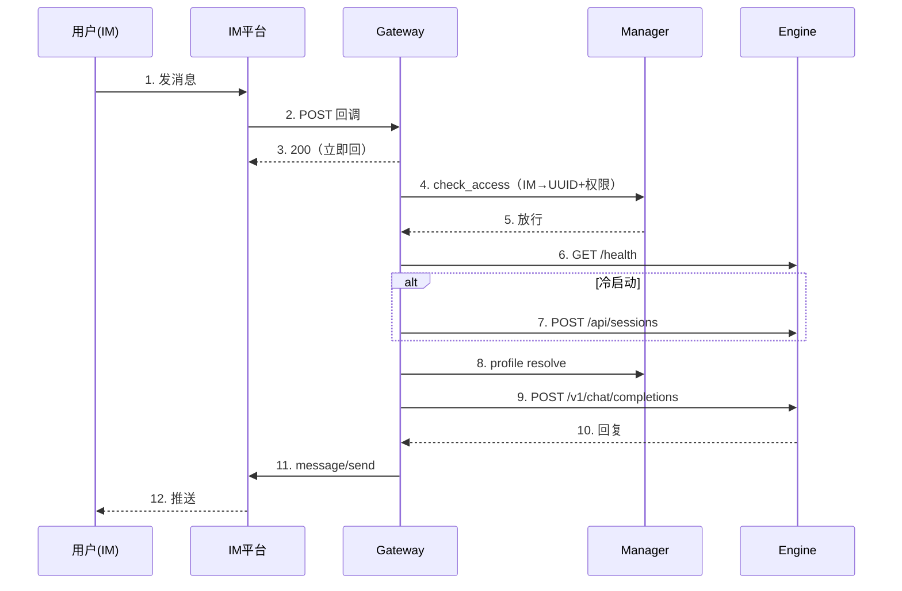

# Gateway 设计方案（develop 分支）

> 本文档对应 `services/gateway`（develop 分支）。它是 main 分支 `services/channel-gateway` 的重构下一代：FastAPI 分层架构、多渠道、多引擎、显式 session。
>
> **渠道命名**（wecom 拆为三个 channel_type）：
> - `wecom` = 企微自建应用 HTTP 回调（文本/卡片/按钮/语音/菜单）—— `channel/wecom.py`
> - `wecom_bot` = 企微 AI Bot WS 透明桥接 —— `channel/wecom_bot.py`（透传，不走 dispatcher）
> - `wecom_bot_callback` = 企微 AI Bot URL 回调（流式 stream + 卡片 + 多媒体）—— `channel/wecom_bot_callback.py`（**新增**，走 dispatcher，支持企微原生流式）
>
> main 已实现的 AI Bot WS 桥、卡片、按钮交互、语音、菜单均已移植到 develop（见各自方案文档与 PR #3/#4/#5/#6）。

## 一、背景与目标

### 1.1 业务场景

以汽车销售门店智能体平台为例：

- 200+ 门店，每店运行多个智能体 Profile（店长、销售）
- Gateway 是**唯一公网出口**：对外承接 IM 平台 webhook + 前端 OpenAI 兼容 API，对内桥接到各引擎 Pod
- 支持多种 IM 渠道（企微/飞书/钉钉）与多种引擎（Hermes/Dify/OpenClaw）

### 1.2 设计目标

| 维度 | 目标 |
|------|------|
| **统一公网出口** | 引擎 Pod 不暴露公网，经 Gateway 对外通信 |
| **多渠道** | wecom / feishu / dingtalk，`BaseChannelAdapter` 统一抽象，registry 动态注册 |
| **多引擎** | hermes / dify / openclaw，`EngineAdapter` 统一抽象，按 `X-Engine-Type` 路由 |
| **会话连续** | 确定性 session_id（agent+channel+chat 哈希），引擎重启自动重建，跨重启上下文不丢 |
| **安全隔离** | IM webhook 签名校验；前端 API 走 JWT；Profile 名服务端计算，不信任客户端 |

## 二、整体架构

```
┌═══ 外网（公网）════════════════════════════════════════════════════════┐
║                                                                         ║
║   ┌───────────────────┐              ┌──────────────────┐              ║
║   │ IM 平台            │              │ 前端 / SDK        │              ║
║   │ 企微·飞书·钉钉     │              │ /v1/chat/... JWT │              ║
║   │ POST callback      │              │                  │              ║
║   └────────┬──────────┘              └────────┬─────────┘              ║
║            │ webhook                          │ JWT API                ║
╚════════════╪══════════════════════════════════╪═══════════════════════╝
             │ NodePort 30843                   │ NodePort 30010
             ▼                                  ▼
┌═══ 内网（K8s 集群 unionagents）═════════════════════════════════════════┐
║                                                                         ║
║   ┌─ Gateway (FastAPI :8010) ────────────────────────────────────────┐ ║
║   │                                                                   │ ║
║   │  ┌──────────────────┐        ┌────────────────────────────────┐  │ ║
║   │  │ Channel Webhook  │        │ Reverse Proxy (/v1/* catch-all)│  │ ║
║   │  │ Router           │        │ JWT→X-Agent-ID→adapter 管线    │  │ ║
║   │  │ (签名校验,无JWT) │        │                                │  │ ║
║   │  └────────┬─────────┘        └──────────────┬─────────────────┘  │ ║
║   │           ▼                                  ▼                    │ ║
║   │  ┌──────────────────────────────────────────────────────────┐    │ ║
║   │  │ ChannelDispatcher (per-agent 队列 + 去重 + 全生命周期)   │    │ ║
║   │  │ 权限闸门 → ensure_engine_ready → session → profile        │    │ ║
║   │  │ → 转发引擎(流式/非流式) → 回 IM                           │    │ ║
║   │  └─────────┬────────────────────────┬───────────────────────┘    │ ║
║   │            ▼                        ▼                            │ ║
║   │  ┌──────────────────┐    ┌────────────────────────────────┐     │ ║
║   │  │ profile_resolver │    │ EngineAdapter                  │     │ ║
║   │  │ IM用户→UUID+权限 │    │ hermes/dify/openclaw           │     │ ║
║   │  └────────┬─────────┘    └──────────────┬─────────────────┘     │ ║
║   └───────────┼──────────────────────────────┼──────────────────────┘ ║
║               │                              │                        ║
║               ▼                              ▼                        ║
║   ┌──────────────────┐          ┌──────────────────────────────┐      ║
║   │ Manager (:8002)  │          │ Engine Pod                   │      ║
║   │ /api/controller/ │◄─deploy──│ engine-hermes-{id}.svc:8642  │      ║
║   │ profile resolve  │  profile │ + 外部 ASR (OpenSpeech)      │      ║
║   └────────┬─────────┘          └──────────────────────────────┘      ║
║            │                                                          ║
║            ▼                                                          ║
║   ┌──────────────────┐                                                ║
║   │ PostgreSQL       │ agent_instance_channels / im_user_bindings     ║
║   │                  │ agent_deployments / agent_profiles             ║
║   └──────────────────┘                                                ║
╚═══════════════════════════════════════════════════════════════════════╝
```

> **网络边界**：外网（IM 平台 + 前端/SDK）经 NodePort 进入内网 K8s 集群；Gateway 是唯一公网出口，Engine Pod / Manager / DB 不暴露公网。IM webhook 走签名校验（无 JWT），前端 API 走 JWT 鉴权。
>
> 注：架构图未画出 Langfuse trace 链路（`proxy.py`/`dispatcher.py` 大量调用 `trace_chat`/`finalize_chat`）和 Prometheus `/metrics` 端点（`prometheus_fastapi_instrumentator`）。

## 三、模块结构

```
services/gateway/
├── app/
│   ├── main.py                # FastAPI 入口：/v1/* 显式路由 + catch-all 代理 + channel webhook
│   ├── proxy.py               # 反向代理 handler（adapter 驱动）
│   ├── settings.py            # Pydantic Settings（UA_ 前缀环境变量）
│   ├── models.py              # DB 表 + 渠道配置缓存
│   ├── lifecycle.py           # 引擎生命周期：resolve_engine_url / check_health / ensure_engine_ready
│   ├── profile_resolver.py    # (user,agent,channel) → profile/pod/scope 解析
│   ├── channel/
│   │   ├── base.py            # BaseChannelAdapter 抽象
│   │   ├── registry.py        # @register 注册 + get_adapter 查找
│   │   ├── router.py          # /{type}/{agent_id}/callback webhook 路由
│   │   ├── dispatcher.py      # ChannelDispatcher 全生命周期编排
│   │   ├── models.py          # MessageEvent 统一消息模型
│   │   ├── wecom.py           # 企微回调适配器
│   │   ├── feishu.py          # 飞书适配器
│   │   └── dingtalk.py        # 钉钉适配器
│   └── adapter/
│       ├── base.py            # EngineAdapter 抽象 + build_engine_dns
│       ├── registry.py        # 引擎适配器注册
│       ├── hermes.py          # Hermes（OpenAI 兼容）
│       ├── dify.py            # Dify
│       └── openclaw.py        # OpenClaw
├── deploy/ci/deploy-gateway.yaml
├── Dockerfile
├── requirements.txt
└── tests/                     # 23 个测试文件（channel/adapter/lifecycle/profile/e2e）
```

## 四、渠道适配器（ChannelAdapter）

### 4.1 抽象接口（`channel/base.py`）

每个 IM 平台适配器继承 `BaseChannelAdapter`，实现：

| 方法 | 必选 | 职责 |
|------|------|------|
| `verify_signature(request)` | ✅ | webhook 签名校验 |
| `parse_incoming(request)` | ✅ | 平台 payload → `list[MessageEvent]` |
| `send_message(chat_id, text, reply_to)` | ✅ | 发文本/markdown |
| `verify_url(request)` | 可选 | GET URL 验证（企微 echostr） |
| `handle_verification(request)` | 可选 | 平台握手（飞书 challenge） |
| `send_processing(chat_id)` | 可选 | "处理中"占位卡，返回 msg_id 供后续更新 |
| `replace_with_response(...)` | 可选 | 用回复替换占位卡（飞书/钉钉可编辑消息） |
| `supports_streaming` | 属性 | 是否支持增量更新（飞书=True；企微/钉钉=False） |
| `send_streaming_update(...)` | 可选 | 流式 chunk 刷新 |

### 4.2 已实现渠道

| 渠道 | 文件 | 入站 | 出站 | 流式 |
|------|------|------|------|------|
| 企微 wecom | `channel/wecom.py` | text/voice/event（卡片点击/菜单点击） | markdown + template_card 全系 + update_template_card | ✅ chunk-flush（满 2048B 发新消息） |
| 企微 wecom_bot（AI Bot 长连接） | `channel/wecom_bot.py` | WS 透传（不解包） | WS 透传 | —（企微平台自带 ASR，Profile 自带会话） |
| 企微 wecom_bot_callback（AI Bot URL 回调） | `channel/wecom_bot_callback.py` | text/event（进入会话/卡片点击） | stream（流式覆盖更新）+ template_card + stream_with_template_card | ✅ 企微原生 stream（pull 覆盖式，三个点动画） |
| 飞书 feishu | `channel/feishu.py` | text | text/markdown | ✅ 增量编辑 |
| 钉钉 dingtalk | `channel/dingtalk.py` | text | text/markdown | ❌ |

> **wecom 已补齐**（PR #3/#4/#6/#83）：语音 ASR、卡片（template_card 全系，`card_utils` 容错提取支持文本+多卡片共存）、按钮交互（button_interaction + update_template_card）、菜单（menu/create + 点击事件）。流式 chunk-flush 下卡片 JSON 缓冲保护、整体下发。卡片详见 `wecom-card设计.md`，语音详见 `wecom(callback)支持语音方案设计.md`。
>
> **wecom_bot（AI Bot 长连接）**（PR #5）：WS 1:1 透传桥，不走 dispatcher（无 session/无消息处理）。Profile 连 `ws://gateway/api/gateway/channel/wecom_bot/{agent_id}/ws` → gateway 连企微 openws → 双向透传。鉴权由 Profile 发的 aibot_subscribe 完成。
>
> **wecom_bot_callback（AI Bot URL 回调）**（新增）：走 dispatcher 完整生命周期（session/profile/引擎转发），支持企微原生 `msgtype: stream` 流式回复。与 `wecom`（自建应用回调）的关键区别：AI Bot 是企微为 AI 场景设计的新协议，自带流式 stream（pull 覆盖式更新同一条消息）、三个点等待动画、`stream_with_template_card`（流式+卡片组合回复）；自建应用是传统消息通道，无 stream msgtype，不能编辑已发消息，只能 chunk-flush 发多条独立消息。两者虽然都是 URL 回调，但是企微的两个不同产品、两套不同的 API 协议，加解密机制相同（AES-256-CBC + SHA1 签名），回调格式不同（AI Bot 用 JSON `{"encrypt": "..."}`，自建应用用加密 XML）。详见 `wecom_bot流程设计.md`。

#### 4.2.1 三种企微通道流式能力对比

| 通道 | 连接方式 | 企微 API 原生流式 | 流式机制 | 当前展示效果 |
|------|---------|-------------------|---------|------------|
| wecom | URL 回调（自建应用） | ❌ | chunk-flush（满 2048B 发新消息） | 多条独立消息 |
| wecom_bot | WS 长连接（AI Bot） | ❌ | —（透传，无流式） | 一次性消息 |
| wecom_bot_callback | URL 回调（AI Bot） | ✅ `msgtype: stream` | pull 覆盖式（企微发刷新回调拉取，首帧 `content=""` 触发三个点动画，`finish=true` 结束） | 三个点动画 + 同一条消息逐步更新 |

> **wecom_bot_callback 流式原理**（已技术验证）：第一次回调（用户消息推送，`msgtype: text`）立即返回 `{"msgtype": "stream", "stream": {"id": "xxx", "finish": false, "content": ""}}`，企微客户端显示三个点动画；后续企微发刷新回调（`msgtype: stream`，带 `stream.id`）拉取最新内容，gateway 返回当前累积全文（覆盖式，非增量）；引擎回复完成后返回 `finish: true`，三个点消失。被动回复消息必须 AES 加密后返回 `{"encrypt": "...", "msgsignature": "...", "timestamp": ..., "nonce": ...}`。

### 4.3 注册机制

`@register("wecom")` 装饰器把适配器类注册到 `_registry`，`get_adapter(channel_type, config)` 按类型实例化。新增渠道只需实现 `BaseChannelAdapter` + `@register`，无需改 dispatcher。

## 五、引擎适配器（EngineAdapter）

### 5.1 抽象接口（`adapter/base.py`）

每个引擎适配器继承 `EngineAdapter`，实现：

| 方法 | 职责 |
|------|------|
| `engine_type` | HERMES / DIFY / OPENCLAW |
| `build_upstream_url(agent_id, path)` | 构造引擎 URL（DNS 命名规范） |
| `transform_headers(raw, key)` | header 转换（去 Origin/Referer/x-hermes-profile，注入 key） |
| `map_path(path)` | 路径映射（Dify 覆盖） |
| `transform_request_body / transform_response_body` | body 协议转换（Dify 覆盖） |
| `is_sse_transformable / transform_sse_stream` | SSE 流式转换（Dify 覆盖） |
| `get_session_*_url / get_files_url` | session/files URL 钩子（Hermes 实现） |

### 5.2 DNS 命名规范

```
engine-{engine_type}-{agent_id去-取前8位}.{namespace}.svc.cluster.local:{port}
```

端口：hermes=8642、openclaw=8642、dify=8080。

**设计约束**：adapter **不得**查 manager/controller 获取 upstream 地址，仅靠 `X-Agent-ID` + DNS 规范构造 URL（反向依赖禁止）。

### 5.3 引擎对照

| 引擎 | 协议 | body/SSE 转换 | session |
|------|------|--------------|---------|
| Hermes | OpenAI 兼容 | identity（透传） | `/v1/sessions` 托管，`X-Session-Id`→`X-Hermes-Session-Id` |
| Dify | 原生 | OpenAI↔Dify 转换 | `/v1/conversations` |
| OpenClaw | OpenAI 兼容 | identity | — |

## 六、消息处理全生命周期（ChannelDispatcher）

`dispatcher.py` 的 `_process_one(event)` 编排：

```
webhook 到达 → router 鉴权+解析 → dispatcher.dispatch（去重+入队）→ 立即回 200
                                   │
                                   ▼ per-agent 串行 worker
                          _process_one:
  0.5. 语音转录（若 event 为语音）：调 ASR（faster-whisper sidecar / 企微 ASR）转文字，event 类型降级为 text 后继续
  0.6. 卡片点击（若 event 含 card_click 键）：转 _process_card_click 提前 return（不走引擎，仅更新卡片状态）
  1. 加载渠道配置（60s 缓存）
  2. 权限闸门 _check_im_access（profile_resolver.check_access：IM 用户绑定→UUID、组访问权限、channel 存在）
     └─ 拒绝 → 回 IM 提示并终止（不启动引擎，防冷启动 DoS）
  3. ensure_engine_ready（lifecycle：/health 探测→触发 Controller deploy→轮询 /health 最多 300s）
     └─ 返回 (ready, was_already_running)
  4. 引擎刚启动 → _invalidate_agent_sessions + send_processing 占位卡
  5. _get_or_create_session（确定性 session_id，见 §七）
  6. _resolve_profile（profile_resolver.resolve → profile_name；V2 多 profile 隔离，V1 兜底）
  6.5. 卡片事件（若 event 含 card_event 键）：转 _process_card_event（注：企微渠道不可达，预留扩展）
  7. 加载模型配置
  8. 转发引擎：
     ├─ supports_streaming=True → _process_one_streaming（SSE chunk-flush）
     └─ supports_streaming=False → _process_one_response（一次取完整回复）
  9. 回 IM（流式增量更新 / 一次性发送）
```


**时序图：**



**可靠性机制**：

| 机制 | 说明 |
|------|------|
| MsgId 去重 | `(agent_id, platform_message_id)` 120s TTL（与企微回调重试窗口对齐），重复投递只处理一次 |
| per-agent 串行 | 每个 agent 一个队列 + worker，消息串行，避免并发冲突 |
| 引擎转发重试 | 非 200 状态码（含 503/超时/连接错误）指数退避重试 3 次（1s/2s/4s） |
| 权限闸门先行 | 启动引擎前校验，未绑定/无权 → 回提示终止，不冷启动 |
| 失败兜底 | 引擎启动失败 → "🛠️ 智能体启动异常，请联系管理员"；回复失败 → "⚠️ 回复失败，请稍后重试"（详见 `messages.py`） |

## 七、会话管理（确定性 session_id）—— 规避上下文丢失

> 这是 develop 相对 main 的关键改进。main 用隐式 `user_id + X-Agent-ID`，依赖引擎内存 session，曾因用户映射缺失导致上下文丢失（见 main 侧 `语音支持方案.md` 待确认项）。

### 7.1 session_id 派生

```python
session_key = f"{agent_id}:{channel_type}:{chat_id}"
session_id  = sha256(session_key)[:24]   # 确定性
```

同一 `(agent, 渠道, 用户)` 永远映射到**同一个 session_id**，跨 Gateway 重启、引擎 Pod 重启均稳定。

### 7.2 创建/恢复

- 首次或缓存过期（30min TTL）→ `POST {engine_url}/api/sessions`（带 origin 元数据）。
- 409（已存在）→ 视为成功，复用。
- API 失败 → 仍用确定性 ID 兜底（引擎端按 ID 幂等累积历史）。

### 7.3 引擎重启失效

`ensure_engine_ready` 返回 `was_already_running=False`（冷启动）→ `_invalidate_agent_sessions(agent_id)` 清该 agent 全部 session 缓存 → 下条消息重建 session 行（但 session_id 不变，引擎端 state.db 历史仍在）。

### 7.4 转发时的 session 头

```
POST {engine_url}/v1/chat/completions
x-hermes-session-id: {session_id}      # HermesAdapter 转换
x-hermes-profile: {profile_name}       # V2 多 profile 隔离（可选）
authorization: Bearer {api_server_key}
```

### 7.5 会话重置（用户自助命令）

确定性 session_id 让历史跨重启不丢，但也意味着**用户的历史无法自然清理**——引擎 state.db 按 session_id 无限累积。`_invalidate_agent_sessions` 只清 gateway 缓存、agent 级全清、不清引擎历史，无法满足"单个用户重置对话"场景（用户卡住想重来、上下文污染、调试）。

**自助命令**：用户在 IM 发送 `/重置会话`（别名 `/reset`、`/清空会话`，由 `UA_SESSION_RESET_COMMANDS` 配置）→ dispatcher 拦截 → 删引擎 session → 回 `✅ 会话已重置，请重新提问`，不转发引擎。

```
_process_one Step 2.1（ensure_engine_ready 之后、转发之前）:
  event.message_type == TEXT and _is_reset_command(event.text)
    → dispatcher.reset_session(event)
        · session_key = agent_id:channel_type:chat_id
        · session_id  = _deterministic_session_id(session_key)   # 复用 7.1 派生
        · 清 gateway _sessions 缓存
        · DELETE {engine_url}/api/sessions/{session_id}           # 引擎级联删 历史+消息+文件
        · 200/204/404 视为成功（404 = 幂等，会话本就不存在）
    → adapter.send_message(chat_id, SESSION_RESET)
    → return（不转发引擎）
```

删除后下条消息以**同一确定性 session_id** 重建空会话（不必换 id），`im_user_binding` 等不受影响。命令精确匹配（trim+小写），不做包含/前缀匹配，避免自然语言误触。只影响发送者自己（chat_id 即其 IM userid），权限闸门已校验。

**四通道统一支持**：wecom / feishu / dingtalk / wecom_bot_callback 的 text 消息都走 `_process_one`（wecom_bot_callback 的 `handle_callback` 对 text 事件调 `dispatch` 入队，只有 stream 刷新回调才内联不 dispatch），故命令拦截对四个通道统一生效。wecom_bot_callback 的 `send_message` 见活跃流调 `_store_finish`（SESSION_RESET 非 transient），正确终结流式（三个点消失、显示重置提示）。

> 引擎侧 `DELETE /api/sessions/{id}` 已就绪（hermes `web_server.py` → `delete_session` 级联删行+消息+磁盘 transcript）；gateway adapter `get_session_delete_url` 钩子已在，但 reset 直接按 `{engine_url}/api/sessions/{id}` 构造（与 `_get_or_create_session` 一致），无需引擎类型分支。

## 八、Profile 解析（profile_resolver）

`profile_resolver.resolve(user_id, agent_id, channel_type)` 流程：

1. **IM 用户映射**：`im_user_bindings` 表把 IM 平台用户 ID（如企微 FromUserName）转为内部 UUID。未绑定 → `NotBound` 拒绝。
2. **agent 校验**：`agent_instances` 存在且 `status='PUBLISHED'`。
3. **访问权限**：组隔离——平台管理员跨组；否则必须是 `agent.group_id` 组成员。
4. **channel 匹配**：`agent_instance_channels` 存在且 enabled。
5. **scope 派生**：默认 INDEPENDENT → USER 级独立 profile；仅显式配 `profile_type=SHARED` 才走 USER_GROUP 共享。
6. **profile_name 构造**：`{agent前8位}-{scope_hash}-{user前8位}`。
7. **deployment 查找**：`agent_deployments`（按 agent_id，1:1）。
8. **ensure profile**：DB upsert `agent_profiles` + 调 Controller 在 Pod 上创建 profile（返回 internal_port）。
9. 缓存 60s + pod_name 变化检测（Pod 重启 → 缓存失效）+ 负缓存 10s（防刷）。

**安全约束**：Profile 名服务端计算，不信任客户端 `X-Hermes-Profile`（gateway 显式剥离）。

## 九、引擎生命周期（lifecycle）

| 函数 | 职责 |
|------|------|
| `resolve_engine_url(agent_id)` | 查 DB `agent_deployments.pod_name` 构造 URL；fallback DNS 规范 |
| `check_engine_health(agent_id)` | GET `{engine_url}/health`，3s 超时 |
| `trigger_deploy(agent_id)` | POST `manager/api/controller/agents/{id}/deploy`（短超时触发，不等完成） |
| `ensure_engine_ready(agent_id, max_wait=300)` | health 探测 → 触发 deploy → 轮询 /health 最多 300s，返回 `(ready, was_already_running)` |

> Controller 已并入 Manager：`/api/controller/*` 由 `manager:8002` 提供。

## 十、Reverse Proxy（前端 /v1/* 路由）

Gateway 同时是前端/SDK 的 OpenAI 兼容反代：

| 路由 | 方法 | 说明 |
|------|------|------|
| `/v1/chat/completions` | POST | SSE 流式 chat（adapter 按 `X-Engine-Type` 转协议） |
| `/v1/models` | GET | 动态模型加载（Dify→/parameters） |
| `/v1/sessions(*)` | CRUD | 会话管理（Dify→/v1/conversations） |
| `/v1/sessions/{id}/messages` | GET | 会话消息（引擎托管优先、SQLite 兜底） |
| `/v1/files` | GET | 文件浏览器 |
| `/{path:path}` | * | catch-all 兜底代理（同样走 adapter 管线） |

所有 `/v1/*` 路由：JWT 鉴权 → 提取 `X-Agent-ID` → `proxy_handler` 走 adapter 管线。客户端传的 `X-Hermes-Profile` 被忽略并告警。

> **双鉴权**：`_proxy_v1` 支持 JWT 和 sk- API Key 双鉴权（`_resolve_auth` 分流）：sk- 开头走 `verify_api_key`（agent_id 由 Key 决定），其他走 JWT。

## 十一、配置（settings.py）

Pydantic Settings，`UA_` 前缀环境变量：

| 变量 | 默认 | 说明 |
|------|------|------|
| `UA_JWT_SECRET` | dev 默认 | prod 下强制显式设置 |
| `UA_API_SERVER_KEY` | change-me（占位） | 引擎 API key |
| `UA_K8S_NAMESPACE` | unionagents | 引擎 Pod 命名空间 |
| `UA_ENGINE_PORT` | 8642 | 引擎端口（fallback） |
| `UA_CONTROLLER_URL` | http://manager:8002 | Controller（已并入 manager） |
| `UA_ENVIRONMENT` | dev | dev/prod |
| `UA_CORS_ORIGINS` | * | CORS 白名单 |

> 以上为核心配置项，完整配置见 `settings.py`（还含 `asr_*`、`api_key_hmac_secret`、`wecom_openws_url`、`log_level` 等）。特别注意 `UA_API_KEY_HMAC_SECRET` 在 prod 下强制要求（`assert_api_key_hmac_secret` fail-fast）。

## 十二、部署

- 部署清单：`deploy/ci/deploy-gateway.yaml`
- 镜像：FastAPI + httpx + cryptography（slim）
- 端口：8010
- 健康检查：`/health`
