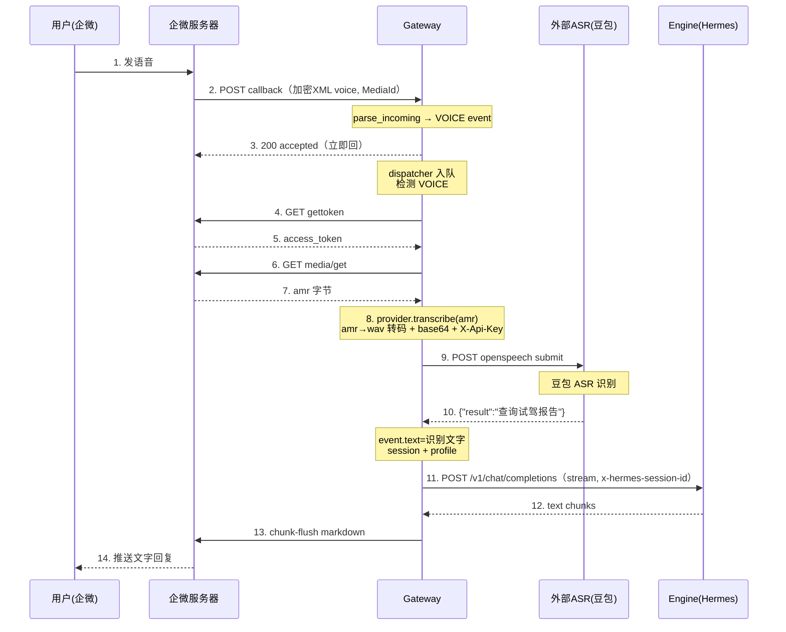

# 语音支持方案（develop gateway · 外部 ASR）

> 本文档描述 wecom(callback) 入站语音的 ASR 方案。
> **v1（已落地）**：移植 main 的 asr-sidecar（faster-whisper 本地推理）到 develop gateway。
> **v2（本次）**：改用外部云 ASR，首期接入豆包（火山引擎），Provider 抽象可扩展阿里/腾讯/华为云；gateway 直调，撤 asr-sidecar sidecar，保留本地 whisper 作 fallback。
> 代码基线：develop 分支 `services/gateway`、`services/asr-sidecar`、`deploy/k8s/services/gateway.yaml`

---

## 一、现状与背景

### 1.1 已落地架构（v1：ASR sidecar）

```
企微 voice (amr)
  → gateway wecom.py WeComCallback.transcribe()        [channel/wecom.py:324]
    → settings.asr_url (=http://localhost:9100)
    → POST {asr_url}/transcribe  body=amr  ?format=amr
    → asr-sidecar server.py /transcribe                 [asr-sidecar/app/server.py]
      → asr.py ASR.transcribe()  (faster-whisper 本地推理) [asr-sidecar/app/asr.py]
      → {"text": "..."}
```

- asr-sidecar 作为 gateway pod 的 sidecar 容器（`deploy/k8s/services/gateway.yaml`），同 pod 共享 `localhost:9100`
- faster-whisper，`WHISPER_MODEL=small`（build-arg 预下载进镜像，`HF_HUB_OFFLINE=1` 运行不联网）
- `initial_prompt="以下是普通话的句子。"` 引导简体输出
- voice 触发点：`dispatcher._process_one` 检测 `VOICE` → `adapter.transcribe()`（见 §九流程）

### 1.2 实测问题（141 客户测试机，2026-07）

| 问题 | 表现 | 根因 |
|---|---|---|
| 识别错字 | "试驾报告" → "世界報告" | small 模型对音近词区分弱 |
| 繁体不稳 | "查詢世界報告"（时而繁体） | initial_prompt 简体引导对部分词不生效 |
| 镜像重 | asr-sidecar 镜像 ~500MB+，含 whisper 模型 | 模型打进镜像 |
| 构建慢 + 网络依赖 | build 时下模型，需 hf-mirror（客户机不通 huggingface） | huggingface 网络限制 |
| CPU 推理慢 | short amr ~1-4s（1 线程） | CPU int8 推理 |
| 部署复杂 | 每个环境都要 build asr-sidecar + 注 sidecar + set env | sidecar 架构 + 模型 build-arg |

### 1.3 目标（v2）

1. ASR 改用外部云服务，**首期接入豆包（火山引擎语音识别）**
2. **Provider 抽象**，后续可平滑扩展Aliyun、Tencent、Huawei
3. **gateway 直调**外部 ASR，撤掉 asr-sidecar sidecar
4. 保留本地 whisper 作为可选 fallback provider（不删代码，降级回退用）

---

## 二、目标架构

```
企微 voice (amr)
  → gateway wecom.py WeComCallback.transcribe()
    → asr_provider = get_asr_provider()        # 按 UA_ASR_PROVIDER 取
    → provider.transcribe(amr_bytes, fmt="amr")
      ├─ VolcengineAsrProvider  → 火山引擎一句话识别 HTTP API  （首期）
      ├─ AliyunAsrProvider      → Aliyun 一句话识别               （后续）
      ├─ TencentAsrProvider     → 腾讯云一句话识别               （后续）
      ├─ HuaweiAsrProvider      → 华为云一句话识别               （后续）
      └─ LocalWhisperAsrProvider → 旧 asr-sidecar                 （fallback）
    → {"text": "..."}
```

- gateway 单独承担 ASR 调用，不再依赖 sidecar
- ASR 能力按 provider 切换，配置驱动（`UA_ASR_PROVIDER`）
- 新增厂商 = 新增一个 provider 文件 + 注册，不改 wecom.py

---

## 三、Provider 抽象设计

参照现有 `services/gateway/app/channel/` 的适配器模式（base.py / registry.py），新建 ASR provider 抽象。

### 3.1 目录结构

```
services/gateway/app/asr/
├── __init__.py          # get_asr_provider() 工厂入口
├── base.py              # AsrProvider 抽象基类
├── registry.py          # provider 注册表 + 工厂
├── errors.py            # AsrError
└── providers/
    ├── __init__.py
    ├── volcengine.py    # 豆包/火山引擎（首期实现）
    ├── aliyun.py        # Aliyun（stub，后续）
    ├── tencent.py       # 腾讯云（stub，后续）
    ├── huawei.py        # 华为云（stub，后续）
    └── local_whisper.py # 旧 asr-sidecar 适配（fallback）
```

### 3.2 抽象基类 `base.py`

```python
from abc import ABC, abstractmethod

class AsrProvider(ABC):
    """ASR 供应商抽象。输入音频字节 + 格式，返回识别文本。"""

    name: str  # provider 标识，如 "volcengine"

    @abstractmethod
    async def transcribe(self, audio: bytes, fmt: str = "amr") -> str:
        """音频字节 → 文字。失败抛 AsrError，由调用方兜底。"""
        ...
```

### 3.3 注册与工厂 `registry.py`

```python
from app.asr.base import AsrProvider
from app.asr.providers import volcengine, local_whisper, aliyun, tencent, huawei

_PROVIDERS: dict[str, type[AsrProvider]] = {
    "volcengine": volcengine.VolcengineAsrProvider,
    "local":      local_whisper.LocalWhisperAsrProvider,  # 旧 sidecar fallback
    "aliyun":     aliyun.AliyunAsrProvider,
    "tencent":    tencent.TencentAsrProvider,
    "huawei":     huawei.HuaweiAsrProvider,
}

_provider_singleton: AsrProvider | None = None

def get_asr_provider() -> AsrProvider | None:
    """按 settings.asr_provider 返回单例 provider；未配置返回 None（走兜底提示）。"""
    global _provider_singleton
    if _provider_singleton:
        return _provider_singleton
    name = settings.asr_provider
    if not name:
        return None
    cls = _PROVIDERS.get(name)
    if not cls:
        logger.error("Unknown ASR provider: %s", name)
        return None
    _provider_singleton = cls()
    return _provider_singleton
```

### 3.4 扩展点（新增厂商）

新增一个云厂商只需：
1. `providers/<厂商>.py` 实现 `AsrProvider.transcribe()`
2. `registry.py` 注册表加一行
3. 配置文档加该厂商的 env

**不改 wecom.py、不改 base.py。**

---

## 四、豆包（火山引擎 OpenSpeech）Provider 实现

### 4.1 接口选型

`volc.seedasr.auc` 是火山引擎 **OpenSpeech** 豆包语音识别大模型（录音文件 ASR），**异步 submit+query** 接口，`X-Api-Key` 单字段鉴权（BytePlus 国际版方案，不需 App-Key）：
- 端点：`https://openspeech.bytedance.com/api/v3/auc/bigmodel/submit`（提交）+ `/query`（轮询，同一 `X-Api-Request-Id`）
- 鉴权：`X-Api-Key: <KEY>` + `X-Api-Resource-Id: volc.seedasr.auc` + `X-Api-Request-Id: <UUID>`
- 请求（submit）：`audio.data`(base64，不带 data: 前缀) + `audio.format`（wav/mp3/ogg/pcm）+ `user.uid`；**不传 config**（传 object 报错）
- 返回（query 轮询到出 result）：`{"audio_info":{...},"result":{"text":"识别文本"}}`，取 `result.text`

> 接口已 curl 实测验证（2026-07）：submit→query 异步链路通，X-Api-Key 单字段鉴权通过，config 去掉，返回 result.text。**注意**：不是方舟 ark chat/completions（之前误用，方舟 401 "API key doesn't exist"）。

### 4.2 amr 转码

openspeech 只支持 wav/mp3/ogg/pcm，**不支持 amr**。企微 voice 是 amr，provider 内用 `av` 库转 amr→wav（16k mono s16le）再 submit。`av` 加进 gateway requirements（asr-sidecar 同款依赖）。

### 4.3 `providers/volcengine.py`（实现要点）

```python
class VolcengineAsrProvider(AsrProvider):
    name = "volcengine"
    def __init__(self):
        self.api_key = settings.asr_volc_api_key
        self.resource_id = settings.asr_volc_resource_id or "volc.seedasr.auc"
        self.host = settings.asr_volc_endpoint or "https://openspeech.bytedance.com"
        ...
    def _convert_to_wav(audio, fmt): ...  # av 转 amr→wav
    async def transcribe(self, audio, fmt="amr"):
        wav, wav_fmt = self._convert_to_wav(audio, fmt)
        audio_b64 = base64.b64encode(wav).decode()
        request_id = uuid.uuid4().hex
        headers = {"X-Api-Key": self.api_key, "X-Api-Resource-Id": self.resource_id,
                   "X-Api-Request-Id": request_id, "Content-Type": "application/json"}
        # submit
        POST {host}/api/v3/auc/bigmodel/submit  json={user:{uid:...}, audio:{data:audio_b64, format:wav_fmt}}
        # query 轮询（同 request_id）直到 result 出现或超时
        POST {host}/api/v3/auc/bigmodel/query  json={}
        return data["result"]["text"]
```

---

## 五、wecom.py 改造

### 5.1 `transcribe()` 改造（channel/wecom.py:324）

```python
async def transcribe(self, event: MessageEvent) -> str:
    """voice event → 文字：media_get(amr) → ASR provider。

    失败/空返回 ""，由 dispatcher 回兜底提示。ASR provider 未配置时返回空。
    """
    provider = get_asr_provider()
    if not provider:
        logger.warning("ASR provider not configured, voice transcription skipped")
        return ""
    media_id = event.raw_message.get("media_id", "")
    audio = await self._media_get(media_id) if media_id else b""
    if not audio:
        return ""
    try:
        text = await provider.transcribe(audio, fmt="amr")
        return text.strip()
    except AsrError as e:
        logger.error("ASR %s error: %s", provider.name, e)
        return ""
    except Exception as e:
        logger.error("ASR %s unexpected error: %s", provider.name, e)
        return ""
```

- 删除对 `settings.asr_url` 的直接依赖（移入 local_whisper provider）
- `_media_get()` 不动（企微 media 下载逻辑不变）

### 5.2 改动范围

| 文件 | 改动 |
|---|---|
| `services/gateway/app/channel/wecom.py` | `transcribe()` 改调 `get_asr_provider()` |
| `services/gateway/app/settings.py` | 新增 ASR provider 配置项（见 §六） |
| `services/gateway/app/asr/` | 新增目录（base/registry/errors/providers） |
| `services/asr-sidecar/` | **保留代码**，默认不 build/部署；`local_whisper` provider 复用其 HTTP 接口作 fallback（回退见 §七.2） |
| `deploy/k8s/services/gateway.yaml` | base 改为单容器 + 外部 ASR env（撤 sidecar）；新增 `overlays/with-asr-sidecar/` kustomize overlay（特殊回退用，见 §七.2） |
| `Makefile` | 加 `docker-asr` target（默认不 build，回退时手动跑） |

---

## 六、配置项设计

### 6.1 settings.py 新增

```python
# === ASR ===
# ASR 供应商：volcengine / aliyun / tencent / huawei / local；空则不识别语音（兜底提示）
asr_provider: str = ""
asr_timeout: float = 30.0

# 火山引擎 OpenSpeech 豆包 ASR（volc.seedasr.auc，submit+query 异步，X-Api-Key 单字段）
asr_volc_api_key: str = ""
asr_volc_resource_id: str = "volc.seedasr.auc"
asr_volc_endpoint: str = ""  # 留空用默认 openspeech.bytedance.com

# Aliyun（后续）
asr_aliyun_app_key: str = ""
asr_aliyun_access_key: str = ""
asr_aliyun_access_secret: str = ""
asr_aliyun_endpoint: str = ""

# 腾讯云（后续）
asr_tencent_secret_id: str = ""
asr_tencent_secret_key: str = ""
asr_tencent_app_id: str = ""

# 华为云（后续）
asr_huawei_ak: str = ""
asr_huawei_sk: str = ""
asr_huawei_endpoint: str = ""

# local fallback（旧 asr-sidecar）—— 仅 asr_provider=local 时用
asr_url: str = "http://localhost:9100"
# 注意：asr_url 默认值非空（http://localhost:9100），local provider 的缺失检查实际不会触发
```

### 6.2 env 映射（gateway 容器，首期豆包）

```
UA_ASR_PROVIDER=volcengine
UA_ASR_VOLC_API_KEY=<X-Api-Key>      # 敏感凭据，走 Secret 注入，不写明文，见 §七.1
# UA_ASR_VOLC_RESOURCE_ID=volc.seedasr.auc  (可选，默认即此)
# UA_ASR_VOLC_ENDPOINT=  (可选，留空用默认)
# UA_ASR_TIMEOUT=30
```

其余厂商 env 在对应 provider 落地时再加。

---

## 七、部署模式：默认外部 ASR / 回退本地 whisper

设计原则：**默认走外部 ASR**，asr-sidecar 代码保留但默认不 build、不部署。仅当外部 ASR 故障等特殊情况需要本地 whisper 时，执行回退两步。**不做"三层开关"**——provider 由 manifest 决定（base=volcengine，overlay=local），build 镜像是回退动作的一部分，不是独立开关。

### 7.1 默认模式（外部 ASR）

- manifest：`deploy/k8s/services/gateway.yaml`（base），单容器 gateway + `UA_ASR_PROVIDER=volcengine` + X-Api-Key（走 Secret）
- asr-sidecar 镜像不 build、不部署
- 网络：gateway pod 出网到 `openspeech.bytedance.com`（141/101 客户机需确认可达）

**部署前配置 Secret**（API Key 敏感，不进 manifest/git，先存 Secret）：

```bash
# 在目标集群（如 124）执行，<方舟APIKey> 替换为方舟控制台拿到的 key
kubectl -n unionagents create secret generic unionagents-secret \
  --from-literal=asr-volc-api-key=<方舟APIKey> \
  --dry-run=client -o yaml | kubectl apply -f -
```

幂等写法：`--dry-run=client -o yaml | kubectl apply` —— secret 已存在则合并追加 `asr-volc-api-key` key，不影响 `jwt-secret`/`database-url` 等已有 key。

**gateway.yaml base env**（`secretKeyRef` 引用，不写明文）：

```yaml
- name: UA_ASR_PROVIDER
  value: "volcengine"
- name: UA_ASR_VOLC_API_KEY
  valueFrom:
    secretKeyRef:
      name: unionagents-secret
      key: asr-volc-api-key
- name: UA_ASR_VOLC_RESOURCE_ID
  value: "volc.seedasr.auc"
```

**部署**：`kubectl apply -f deploy/k8s/services/gateway.yaml`，pod 启动时 env 从 Secret 注入 → provider 拿到 key。

**配置链路**：
```
方舟控制台 API Key
  → kubectl Secret（unionagents-secret / asr-volc-api-key，base64）
  → gateway.yaml env secretKeyRef
  → 容器 env UA_ASR_VOLC_API_KEY
  → settings.asr_volc_api_key
  → VolcengineAsrProvider X-Api-Key 调 OpenSpeech
```

### 7.2 回退本地 whisper（特殊，两步）

1. **build + 导入 asr-sidecar 镜像**：`make docker-asr`（→ `docker save | k3s ctr import` 到目标节点）
2. **apply overlay**：`kubectl apply -k deploy/k8s/services/overlays/with-asr-sidecar/`

overlay 用 kustomize base + patch：**base 唯一源、overlay 只描述差异**（加 sidecar 容器 + 改 `UA_ASR_PROVIDER=local` + 加 `UA_ASR_URL`），从根上消除 manifest 漂移（吸取 v1 三份漂移导致 141 缺 sidecar 的教训）。

```
deploy/k8s/services/
├── gateway.yaml                         # base（默认）：单容器 gateway + 外部 ASR env
└── overlays/
    └── with-asr-sidecar/
        ├── kustomization.yaml           # resources 引用 base + patches
        └── sidecar-patch.yaml           # patch：① 加 asr-sidecar 容器 ② 改 UA_ASR_PROVIDER=local + 加 UA_ASR_URL
```

改 gateway 主容器配置（image/env/probes/resources）**只改 base**，overlay 自动继承，不会漂移。

恢复外部 ASR：`kubectl apply -f deploy/k8s/services/gateway.yaml`（覆盖回 base）。

### 7.3 Secret

- `unionagents-secret` 默认加X-Api-Key（`asr-volc-api-key`），base gateway env 从 secretKeyRef 引
- local 模式（overlay）无需额外 Secret（sidecar 镜像内置模型）

### 7.4 镜像

- gateway 镜像不变（`unionagents/gateway:latest` / `v0.8.x`）
- asr-sidecar 镜像默认不 build；仅回退时 `make docker-asr`
- 默认环境（101/141/124）无需为 asr-sidecar 单独 build/save/import，省掉 ~500MB 镜像 + hf-mirror 模型下载

---

## 八、兼容与回退

### 8.1 运行时场景

| 场景 | 行为 |
|---|---|
| `UA_ASR_PROVIDER` 未配置 | `get_asr_provider()` 返回 None → voice 走兜底提示（同现状 `ASR_URL not configured`） |
| `UA_ASR_PROVIDER=volcengine`（默认） | 走 `VolcengineAsrProvider` 调豆包 ASR |
| `UA_ASR_PROVIDER=local` | 走 `LocalWhisperAsrProvider`，调 `settings.asr_url`（sidecar）—— **前提：已回退部署 overlay，sidecar 在跑** |
| 豆包 API 调用失败 | `transcribe()` 抛 AsrError → 返回 ""，dispatcher 回兜底提示"语音识别失败，请重试" |
| `UA_ASR_PROVIDER=local` 但 sidecar 不在 | `LocalWhisperAsrProvider.transcribe()` 连接失败 → AsrError → 兜底提示（不会崩） |

### 8.2 回退到本地 whisper（特殊场景）

外部 ASR 故障等需要回退时，两步（详见 §七.2）：

1. `make docker-asr` + 导入镜像到节点
2. `kubectl apply -k deploy/k8s/services/overlays/with-asr-sidecar/`（overlay 自动设 `UA_ASR_PROVIDER=local` + 加 sidecar）

恢复外部 ASR：`kubectl apply -f deploy/k8s/services/gateway.yaml`。

### 8.3 local_whisper provider 实现

复用旧 asr-sidecar 的 HTTP `/transcribe` 接口，`LocalWhisperAsrProvider.transcribe()` 就 POST `settings.asr_url/transcribe`。**注意：local_whisper 超时硬编码 60s（未用 asr_timeout 配置项）**。wecom.py 统一走 provider 抽象，**旧 asr-sidecar 代码零改动**即可作 fallback——只要构建+部署开关打开。

---

## 九、入站语音时序图（v2 外部 ASR）



> 步骤 4-10 为 voice 转录（dispatcher 检测 VOICE 后调 `adapter.transcribe()` → provider 调豆包 ASR），步骤 11 起复用 develop 现有文本链路（确定性 session + 流式 chunk-flush）。

---

## 十、流程详

1. 用户发语音 → 企微 POST 回调（`msg_type=voice`, `<MediaId>`, `<Format>=amr`）。
2. `router.channel_webhook` → `wecom.parse_incoming` 产 **VOICE MessageEvent**（text 空，raw_message 带 media_id）→ `dispatcher.dispatch` 入队 → **立即回 200**。
3. dispatcher per-agent worker `_process_one`：
   - 权限闸门（同文本）。
   - 检测 `message_type==VOICE` → `adapter.transcribe(event)`：
     - `_media_get(media_id)`：gettoken + GET `media/get` 下载 amr。
     - `get_asr_provider().transcribe(audio, "amr")` → 豆包 ASR 识别 → 文字。
   - `event.text = 文字`，`message_type = TEXT`。
   - 后续复用文本链路：`ensure_engine_ready` → 确定性 session → profile → 流式转发 → chunk-flush 回复。

---

## 十一、边界情况

| 场景 | 处理 |
|------|------|
| amr 格式 | 豆包 ASR 不支持 amr，provider 内用 av 库转 amr→wav（16k mono s16le） |
| ASR 失败/空 | 回 "语音识别失败，请重试" |
| media 下载失败 | 回 "语音下载失败，请重试" |
| 重复投递 | MsgId 去重（dispatcher 60s TTL），voice 同 text |
| 语音时长 | 企微单条 ≤60s；豆包一句话识别 <60s 适配 |
| 外部 ASR 超时 | `asr_timeout=30s` 控制单次 HTTP 请求超时；volcengine query 轮询总上限 `poll_max=60s`（`poll_interval=1s`），超时抛 AsrError → 兜底提示 |
| 网络不通豆包 | AsrError → 兜底；可切 `UA_ASR_PROVIDER=local` 回退 sidecar |
| 简体输出 | 豆包 ASR 中文直出简体（无需 initial_prompt 引导） |
| 上下文连续 | 复用 develop 确定性 session_id，voice 转文字后与文本消息共享同一 session |
| 凭据缺失 | provider `__init__` 抛 AsrError，`get_asr_provider()` 捕获返回 None → 兜底提示（注意：`asr_url` 默认值非空 `http://localhost:9100`，local provider 的缺失检查实际不会触发） |

---

## 十二、测试计划

### 12.1 单元测试（services/gateway/tests/）

- `test_asr_registry.py`：provider 注册、工厂按配置取、未知 provider 返回 None、凭据缺失返回 None
- `test_asr_volcengine.py`：mock httpx，验证 payload 构造（base64/format/rate）、鉴权头、响应解析、错误抛 AsrError
- `test_wecom_transcribe.py`：mock provider，验证 transcribe 调 provider、空 audio/未配置/provider 失败各路径

### 12.2 集成/端到端（141 客户测试机）

- 配 `UA_ASR_PROVIDER=volcengine` + 凭据，撤 sidecar
- LiuWei 企微发语音：
  - "查询王先生5月27日的试驾报告" → 验证 ASR 识别正确（试驾≠世界、简体）
  - "你好" → 简单识别
- gateway 日志：`Voice transcribed: user=LiuWei text=...`
- 识别准度对比 small whisper：重点测"试驾报告"等业务词

### 12.3 回退验证

- `UA_ASR_PROVIDER=local` + 恢复 sidecar → 验证旧路径仍工作

---

## 十三、后续扩展（阿里/腾讯/华为云）

每个厂商落一个 `providers/<厂商>.py`：

| 厂商 | 接口 | 鉴权 | amr | 备注 |
|---|---|---|---|---|
| Aliyun | 一句话识别 HTTP | AccessKey 签名 | ✓ | SDK `alibabacloud_speech` 可选 |
| 腾讯云 | 一句话识别 HTTP | TC3-HMAC 签名 | ✓ | SDK `tencentcloud-sdk-python` |
| 华为云 | 一句话识别 HTTP | AK/SK 签名 | ✓ | 跟企微同生态 |

实现模式统一：
1. `__init__` 读 settings 该厂商凭据，缺失抛 AsrError
2. `transcribe()` 构造请求（音频 base64 + 格式）、调 HTTP、解析文本、失败抛 AsrError
3. 注册表加一行
4. 补 env + Secret + 文档

签名重的厂商优先引官方 SDK（签名 + 请求构造），provider 内调 SDK，避免 gateway 自己实现签名。

---

## 十四、风险与待确认

1. **OpenSpeech 接口**（已 curl 实测）：`volc.seedasr.auc` 走 `openspeech.bytedance.com/api/v3/auc/bigmodel/{submit,query}` 异步，`X-Api-Key` 单字段鉴权（BytePlus 国际版，不需 App-Key），audio.data base64，config 去掉，返回 result.text —— 已确认。
2. **出网**（124 已验证）：124.243.186.4 → `openspeech.bytedance.com` submit+query curl 实测通；141/101 待确认。
3. **amr 转码**（已确认）：openspeech 只支持 wav/mp3/ogg/pcm，不支持 amr；provider 内用 `av` 库转 amr→wav（gateway requirements 已加 av）。
4. **计费**：OpenSpeech ASR 按调用/时长计费，关注用量。
5. **回退路径保留**：asr-sidecar 代码 + local provider 不删，确保外部 ASR 故障能回退本地 whisper。

---

## 十五、落地步骤

1. 新增 `services/gateway/app/asr/`（base/registry/errors + providers/volcengine + providers/local_whisper + stub aliyun/tencent/huawei）
2. 改 `wecom.py transcribe()` 调 `get_asr_provider()`
3. 改 `settings.py` 加 ASR provider 配置项
4. `deploy/k8s/services/gateway.yaml`（base）撤 sidecar + 外部 ASR env；新增 `overlays/with-asr-sidecar/` kustomize overlay（特殊回退用）
5. `Makefile` 加 `docker-asr` target（默认不 build，回退用）
6. 补单元测试 `tests/test_asr_*.py`（mock httpx）
7. 本地自测通过 + 走 develop PR
8. 合入后 **124 部署验证**（自测环境，main 联调机）：配X-Api-Key Secret + apply base `gateway.yaml`（撤现有 sidecar）+ 企微发语音端到端验证；通过后再上 141
9. 后续按需落 aliyun/tencent/huawei provider

---

## 附：v1（sidecar）方案归档

v1 移植 main asr-sidecar 的方案已落地，详见 git 历史。v2 保留 asr-sidecar 代码 + `LocalWhisperAsrProvider` 作为 fallback，不删除；但 **asr-sidecar 默认不 build/部署**（见 §七），仅特殊回退场景按 §八.2 执行。v1 的 dispatcher VOICE 转录触发点、确定性 session 复用、chunk-flush 回复等设计在 v2 完全保留，仅 ASR 后端从本地 whisper 换成外部 provider 抽象。
