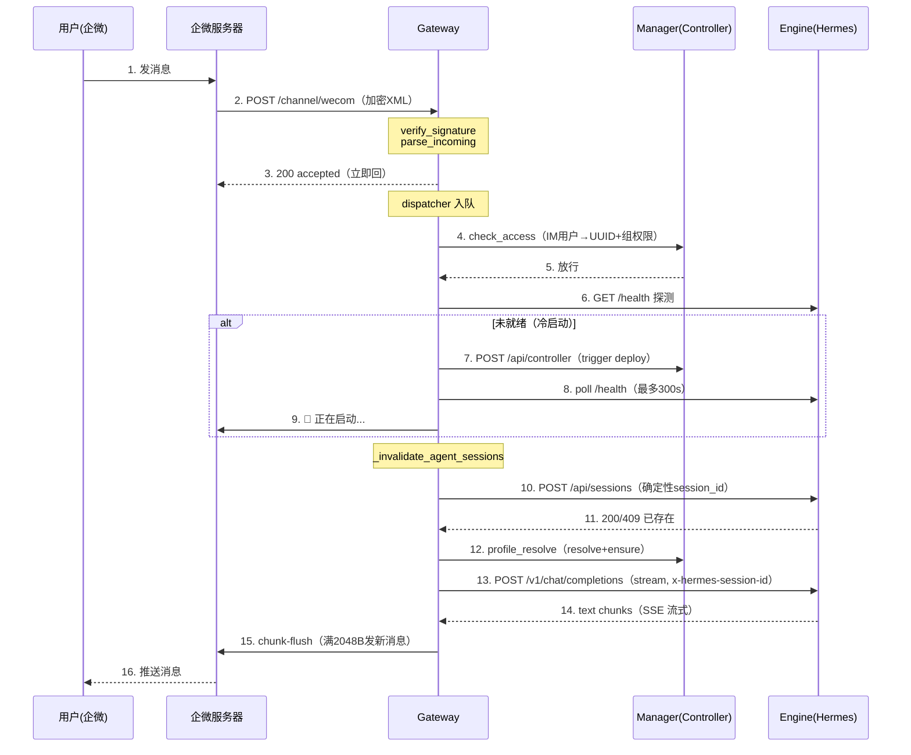
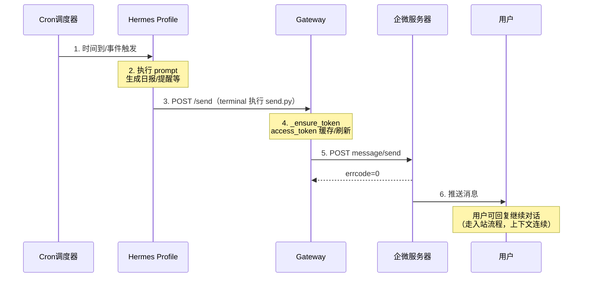

# wecom(callback) 流程设计

> develop gateway 企微 HTTP 回调模式（callback）。入站（用户→Hermes）+ 出站（Hermes→用户）双流程设计。
> 语音详见 `wecom(callback)支持语音方案设计.md`，卡片详见 `wecom-card设计.md`。

---

## 一、入站流程（用户→企微→Gateway→Hermes→回复）

### 1.1 流程概览



> 步骤 6–8 仅在引擎未就绪时发生（冷启动）；热启动跳过 7–9。

### 1.2 步骤详解

#### 步骤 1-3：webhook 接入与立即回执

企微 POST 加密 XML 到 `POST /api/gateway/channel/wecom/{agent_id}/callback?msg_signature&timestamp&nonce`。

`router.channel_webhook`：
1. `get_channel_config(agent_id, "wecom")` 从 DB 加载渠道配置（corp_id/secret/agent_id/token/encoding_aes_key）。
2. `adapter.verify_signature`：SHA1(token,timestamp,nonce,encrypt) 校验。
3. `adapter.handle_verification`：企微 URL 验证（GET echostr）。
4. `adapter.parse_incoming`：AES-256-CBC 解密 → 解析 XML → `msg_type=text` 产出 MessageEvent；`voice` 经 ASR 转文字复用文本链路（见 ASR 方案文档）；`image`/`video` 产出附件 event（dispatcher 下载企微媒体 → 写引擎工作区 → 转 `[Attached files: path]` 送引擎）；`event`（卡片按钮点击等）单独处理；其余丢弃。

> **⚠️ 企微回调消息类型约束（官方文档，避免重复踩坑）**
> 企微自建应用「接收消息」回调**只下发**：`text` / `image` / `voice` / `video` / `location` / `link`。
> **`file`（文件消息）不在支持下发列表**——用户在企微里发文件，企微**不会**把 `MsgType=file` 回调推给应用后台。
> 因此 `parse_incoming` 虽保留了 `file` 分支（防企微后续支持 / 复用给其他 IM 通道），但企微实际永远走不到该分支。
> 用户要在企微侧传文件给智能体，需走其它途径（如引导到 web 门户上传，或发图片代替）。
5. `dispatcher.dispatch(event)` 入队 → **立即回 `200 {"status":"accepted"}`**（企微 5s 超时要求，处理全异步）。

回调 URL 配置（企微后台 → 自建应用 → 接收消息）：

| 字段 | 值 |
|------|-----|
| URL | `http://公网IP:8080/api/gateway/channel/wecom/<agent_id>/callback` |
| Token / EncodingAESKey | 与 DB `agent_instance_channels` 配置一致 |

#### 步骤 4-5：权限闸门（启动引擎前）

`dispatcher._check_im_access` → `profile_resolver.check_access`：
- **IM 用户映射**：`im_user_bindings` 表把企微 `FromUserName` → 内部 UUID。未绑定 → 回 "⚠️ 您的企微账号尚未绑定，请联系管理员开通" 终止。
- **访问权限**：组隔离——平台管理员跨组；否则必须是 `agent.group_id` 组成员。无权 → 回 "🚫 您暂无权限使用该智能体，请联系管理员添加用户组" 终止。
- **channel 存在性**：`agent_instance_channels` 存在且 enabled。无 → 回 "🛠️ 该智能体暂不可用，请联系管理员" 终止。

**闸门先行**：未通过不启动引擎（防冷启动 DoS）、不转发（防越权）。负缓存 10s 防刷。

#### 步骤 6-9：引擎就绪 + 冷启动占位

`lifecycle.ensure_engine_ready(agent_id, max_wait=300)`：
1. `check_engine_health`：GET `{engine_url}/health`（3s 超时）。就绪 → 热启动，跳过 7-9。
2. 未就绪 → `trigger_deploy`：POST `manager/api/controller/agents/{id}/deploy`（短超时触发，不等完成）。
3. 轮询 `/health` 最多 300s，就绪返回 `(ready=True, was_already_running=False)`。

冷启动时（`was_already_running=False`）：
- `_invalidate_agent_sessions(agent_id)`：清该 agent 全部 session 缓存（下条消息重建，session_id 不变）。
- `adapter.send_processing`：发 "🤖 智能体启动中，请稍候... ⏳"。

#### 步骤 10-11：确定性 session

`dispatcher._get_or_create_session`：
```
session_key = f"{agent_id}:wecom:{chat_id}"
session_id  = sha256(session_key)[:24]   # 确定性
```
- 缓存命中（30min TTL）→ 直接用 session_id。
- 否则 `POST {engine_url}/api/sessions`（body 含 `id`（确定性 session_id）、`name`、`origin` 元数据，header 带 `authorization: Bearer api_server_key`）。200/201 或 409（已存在）→ 缓存。
- API 失败 → 仍用确定性 ID 兜底。

**同一 (agent, 渠道, 用户) 永远同一 session_id**，跨 Gateway/引擎重启稳定 → 上下文不丢。

#### 步骤 12：Profile 解析

`dispatcher._resolve_profile` → `profile_resolver.resolve`：
- scope 派生：channel 配 `INDEPENDENT` → USER 级独立 profile（默认）；仅显式配 `SHARED` 才走 USER_GROUP 共享。
- `profile_name = {agent去连字符后前8位}-{scope_hash(6位)}-{user去连字符后前8位}`。
- `profile_resolver.resolve` 设 `was_cold`（cached_port 无 or force_ensure = 冷启动）。
- 调 Controller `/api/controller/profiles/ensure` 在 Pod 上创建 profile（返回 internal_port）。
- profile 冷启动且 engine 热启动时 → 发 "🕐 正在准备会话环境，首次约需 15 秒，请稍候再对话..."。
- 失败 → 降级 V1（不传 `x-hermes-profile`）。

#### 步骤 13-16：流式转发 + chunk-flush 回复

企微 `supports_streaming=True`（chunk-flush，因企微不能编辑消息）：

`dispatcher._process_one_streaming`：
1. ~~启动 5s 超时定时器补发"思考中..."~~（已去掉，企微撤回留痕迹）。
2. `POST {engine_url}/v1/chat/completions`（`stream=true`，header: `x-hermes-session-id` + `x-hermes-profile` + `authorization`）。
2. 首 chunk 到 → 缓冲回复起始位置（`send_initial_response`，企微不能编辑消息故只缓冲不发）。
4. SSE 流式收 chunks，累积 `full_text`。
5. **chunk-flush**：累积满 2048 字节（UTF-8，不切断多字节）→ `adapter._send_one` 发一条新 markdown 消息。
6. 流结束 → `replace_with_response` flush 剩余 tail。
7. 流式中断 → 追加 "⚠️ 回复生成中断，以上为部分内容"。回复失败 → "⚠️ 回复失败，请稍后重试"。

`wecom.py._send_one`：
```python
POST https://qyapi.weixin.qq.com/cgi-bin/message/send?access_token={token}
{"touser": chat_id, "msgtype": "markdown", "agentid": int(agent_id), "markdown": {"content": chunk}}
```
access_token 缓存 7200s，过期自动 `gettoken` 刷新。

---

## 二、出站流程（Cron/事件 → Hermes → Gateway → 企微 → 用户）

> Hermes 主动推消息到企微用户（Cron 定时任务/外部事件触发）。与入站互补：入站是用户发起的请求-响应，出站是 Hermes 发起的主动推送。设计完成，**待实现**。

### 2.1 时序图



### 2.2 步骤详解

1. **Cron/事件触发**：Cron 定时任务到达执行时间，Hermes 调度器执行 prompt。
2. **执行 prompt**：Hermes 处理 prompt，生成日报/提醒/通知等内容。
3. **Hermes 调 Gateway send API**：通过 `terminal` 工具执行固定脚本 `send.py`，LLM 只传参数（`--touser/--msgtype/--content`），脚本内部 `urllib` POST 调 Gateway send 端点。不依赖系统 curl（engine pod 是 `python:3.11-slim`，用 python3 标准库发请求）；不用 `execute_code`（沙箱可能限制网络访问）。调用方式与脚本放置选型见 2.3。
4. **Gateway 获取 access_token**：从 DB 加载渠道配置（agent_id → corp_id/secret/agent_id），`_ensure_token` 获取/刷新 access_token（跟入站共用缓存）。
5. **POST message/send**：Gateway 调企微 `message/send` 下发消息，返回企微响应给 Hermes。
6. **用户收到消息**：用户在企微收到推送，可回复继续对话（走入站流程，session_id 一致，上下文连续）。

### 2.3 Hermes 侧调用方式选型

**外部依赖断点审视**（141 实测，2026-07）：

| 依赖 | 状态 | 说明 |
|---|---|---|
| gateway service 网络 | ✅ 可达 | engine pod → `http://gateway.unionagents:8010` 实测 200 |
| terminal + python3/urllib | ✅ 可用 | slim 镜像自带标准库，terminal 执行 python3 可出站（实测） |
| Cron 调度 | ✅ 可用 | hermes in-process cron scheduler |
| api_server_key | ✅ 已有 | engine pod env `API_SERVER_KEY=change-me`（= gateway api_server_key），send.py 直接复用，无需新增 |

**调用方式：固定 `send.py` 脚本（LLM 只传参数）**

不让 LLM 自行生成 `python3+urllib` 代码——否则每次生成可能漏 header / 错 URL / 错 body，且 api_server_key 需写进 prompt（暴露给 LLM）。固定脚本消除断点，跟 test-drive-report 的 `run.py` 同模式（`run.py` 固定，LLM 只传 `--sales-phone` 等参数）。

**im-channel-push skill 放置与分发选型**：

| 选项 | 机制 | 优缺点 |
|---|---|---|
| **A. platform preset（选定）** | manager `app/data/preset_skills/im-channel-push/` + `platform_presets.json` 清单 | 所有智能体模版创建时自动预填，走 preset fan-out 管线（MinIO → external_dirs 共享）；要改 manager 代码 + 重新构建 manager 镜像 |
| B. agent-definition install | console-admin 上传 zip 到指定 definition | 只该 definition 有，不改代码；但不通用，每个智能体要手动装 |
| C. profile scripts / hermes plugins | per-profile 或插件机制 | 不通用 / 开发复杂 |

**选定 A（preset）**——所有企微智能体创建模版时自动预填 im-channel-push，无需逐个 install。preset 与用户上传 skill（test-drive-report 等）走同一 fan-out 管线：创建模版时 `save_preset_zips` 打包存 MinIO → `replay_persona_and_skills` fan-out 到 `/opt/data/skills/{did}/im-channel-push/` → hermes 经 external_dirs 加载。

LLM 调用（`find` 定位脚本，`{{profile_skills_dir}}` 不被 hermes 替换，故用 find）：

```
python3 $(find /opt/data/skills -path "*im-channel-push/scripts/send.py" -type f | head -1) --touser LiuWei --msgtype markdown --content "..."
```

send.py 内部：`urllib` POST `http://gateway.unionagents:8010/api/gateway/channel/{channel_type}/{agent_id}/send`（`channel_type` 默认 wecom，可传 `--channel-type dingtalk/feishu` 支持其他通道），`Authorization: Bearer $API_SERVER_KEY`（从 env 读，engine pod 已注入 `AGENT_ID` + `API_SERVER_KEY`，不暴露 LLM）。send.py 还含 `.env` 文件 fallback：hermes terminal 工具不一定继承 pod env，env 读不到时从 profile `.env` 文件读 `AGENT_ID`/`API_SERVER_KEY`。

> **skill 与 terminal 的关系**：skill 在 hermes 里不是独立工具（无独立 tool calling 机制）。hermes 把 `SKILL.md` 注入系统提示，让 LLM 知道这个能力存在 + 参数约定；实际执行仍是 LLM 调 `terminal` 工具跑 `send.py`。

> **preset 只对新模版自动预填**：现有已创建的智能体（如销售助手）不会自动获得 im-channel-push，需在管理台手动 install 一次（上传 im-channel-push zip），或重建模版。

> **避开 hermes 内置 `send_message`**：hermes 有内置 `send_message` 工具（`tools/send_message_tool.py`，故意不注册为 agent 可调用）。本技能原名 `send-message`（横线）与内置 `send_message`（下划线）名字相似，LLM 混淆后会被 cron `[IMPORTANT: do NOT use send_message]` 误禁。改名 `im-channel-push` 避开混淆。

### 2.4 触发场景

| 场景 | 触发方 | 示例 |
|---|---|---|
| Cron 定时任务 | Hermes 调度器 | 每日销售日报、定时客户跟进提醒 |
| 外部事件 | 外部系统 → Hermes | 客户试驾完成通知、订单状态变更 |
| Profile 主动推送 | Hermes Profile | 销售助手主动提醒跟进客户 |

### 2.5 send API 设计（待实现）

Gateway 端点接收 Hermes 主动发消息请求：

```
POST /api/gateway/channel/wecom/{agent_id}/send
Header: Authorization: Bearer {api_server_key}
Body: {
  "touser": "企微user_id",
  "msgtype": "markdown",       # markdown / text / template_card
  "content": "消息内容",        # markdown/text 的内容，或 template_card 的 JSON
  "chat_id": "可选，群聊ID"     # 单聊用 touser，群聊用 chat_id
}
```

Gateway 处理：
1. 从 DB 加载渠道配置（`get_channel_config(agent_id, "wecom")`）。
2. `_ensure_token` 获取/刷新 access_token。
3. 按 `msgtype` 调企微 API（`message/send` 或 `send_card_message`）。
4. 企微返回 `errcode=0` → 返回 `{ok:true}`；`errcode≠0` → 记日志 + 返回 `{ok:false}`（text/markdown 不返回企微 raw 响应；template_card 返回 `{ok, raw}`）。

### 2.6 token 管理

跟入站共用 `WeComAdapter._ensure_token`：
- access_token 缓存 7200s，过期前 60s 主动刷新。
- 多 agent 各自缓存（per-agent token，互不干扰）。
- token 失效（40001/42001）→ 清 token 缓存，下次请求自动刷新（当前请求返回失败，不重试）。

### 2.7 消息类型

跟入站共用 `send_message` / `send_card_message`：

| msgtype | 用途 | 说明 |
|---|---|---|
| `markdown` | 日报/提醒正文 | 超长自动分段（2048 字节 `_split_by_bytes` 分段） |
| `text` | 简短通知 | 纯文本 |
| `template_card` | 结构化卡片 | text_notice 列表卡等，详见 `wecom-card设计.md` |

### 2.8 错误处理

| 错误 | 处理 |
|---|---|
| access_token 失效（40001/42001） | 清 token 缓存，下次请求自动刷新（当前请求返回失败，不重试） |
| 企微 API 错误（errcode≠0） | 记日志 + 返回 `{ok:false}` 给 Hermes |
| 网络超时 | 出站路径无重试（重试机制仅用于入站引擎转发，见三章可靠性表） |
| 用户未关注/禁用（60011 等） | 记日志，不重试（不可恢复） |
| 渠道配置缺失 | 返回 404 给 Hermes |

### 2.9 实现状态

- ✅ **Gateway send API 端点**（`POST /api/gateway/channel/{channel_type}/{agent_id}/send`）：已实现（router.py），Bearer 鉴权 + 复用 adapter send_message/send_card_message。支持 wecom/dingtalk/feishu 等通道。124 已部署 `gateway:send-outbound` 镜像验证通过（LiuWei 收到消息 ok=true）。
- ✅ **im-channel-push preset skill + send.py**：做成 platform preset（manager `app/data/preset_skills/im-channel-push/` + `platform_presets.json`），所有智能体模版创建时自动预填，fan-out 到 `/opt/data/skills/{did}/im-channel-push/`。send.py 支持 `--channel-type`（默认 wecom）多通道。LLM 通过 terminal 执行 `send.py --touser/--msgtype/--content`，脚本内部 urllib POST gateway send（鉴权用 env `API_SERVER_KEY`，engine pod 已注入）。
- ✅ **SKILL.md 优化**：`{{profile_skills_dir}}` 改用 `find` 定位（hermes 不替换占位符），api_calls 从 20 降到 2；`\n` 字面量转实际换行（避免企微显示 "nn"）（仅 text/markdown 转，template_card 不转以避免破坏卡片 JSON）；改名 `im-channel-push` 避开 hermes 内置 `send_message` 混淆。
- ✅ **hermes Cron → prompt → send.py 端到端联调**：124 验证通过——用户发"X分钟后提醒我"→ LLM 建 cron → 到点触发 → LLM 调 send.py → gateway send → 企微 → 用户收到。
- ⚠️ **现有智能体需手动补装**：preset 只对新模版自动预填，已创建的智能体（销售助手等）需在管理台手动 install 一次 im-channel-push zip，或重建模版。
- ⚠️ **SOUL 需含推送职责**：当前 hermes SOUL 优先级高于 SKILL.md，LLM 需 SOUL 明确允许推送才会稳定调 im-channel-push（预置 skill 不受 SOUL 限制的理想方案待 hermes 改进）。
- **出站消息跟入站 session 上下文连续**：用户收到推送后回复，走入站流程，session_id 一致（确定性派生），上下文连续。

---

## 三、可靠性机制（入站/出站公共）

| 机制 | 说明 |
|------|------|
| MsgId 去重 | `(agent_id, platform_message_id)` 120s TTL，重复投递只处理一次 |
| per-agent 串行 | 每 agent 一个队列 + worker，消息串行，避免并发冲突 |
| 立即回执 | webhook 入队后立即 200，处理异步（满足企微 5s） |
| 权限闸门先行 | 启动引擎前校验，拒绝即终止，防冷启动 DoS |
| 引擎就绪等待 | ensure_engine_ready 最多 300s 轮询 |
| 引擎转发重试 | 连接级错误指数退避 3 次（1s/2s/4s） |
| session 确定性 | sha256 派生，跨重启稳定，上下文不丢 |
| Pod 重启 session 失效 | 冷启动清缓存重建（session_id 不变，引擎历史仍在） |
| 超长分段 | UTF-8 字节 2048 切分，不切断多字节字符 |
| access_token 缓存 | 7200s 缓存 + 过期前 60s 刷新 + 失效重试 |
| 失败兜底 | 启动失败 → "🛠️ 智能体启动异常，请联系管理员"；回复失败 → "⚠️ 回复失败，请稍后重试"（见 `messages.py`） |
