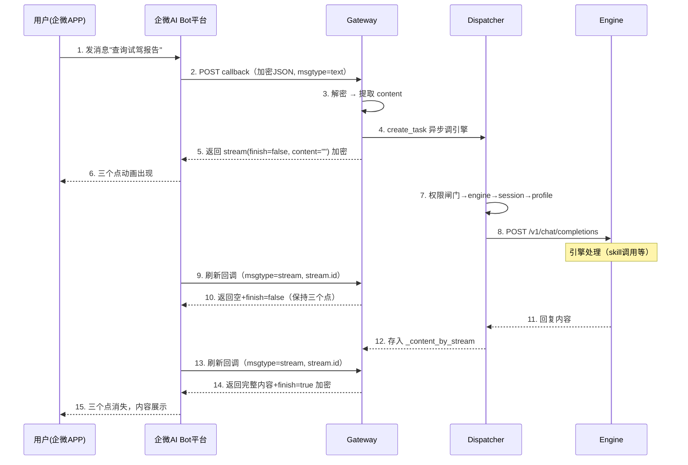

# WeCom Bot（AI Bot URL 回调）流程设计

> 本文设计企微 AI Bot URL 回调通道（`wecom_bot_callback`）的完整方案。
> 与已实现的 `wecom_bot`（AI Bot 长连接 WS 透传）互补，本通道走 dispatcher 完整生命周期，支持企微原生流式 stream。

## 一、背景

### 1.1 为什么需要 URL 回调模式

企微 AI Bot 有两种连接方式：

| | 长连接（已实现 `wecom_bot`） | URL 回调（本次新增 `wecom_bot_callback`） |
|---|---|---|
| **连接方式** | Profile 通过 WS 连企微 openws | 企微 POST 回调到 gateway URL |
| **gateway 角色** | 1:1 WS 透传桥（不解包） | 完整消息处理（解密→dispatcher→加密回复） |
| **session/profile** | Profile 自带（WS 内维持） | gateway 管理（确定性 session_id） |
| **流式** | ❌ 无 stream | ✅ `msgtype: stream`（pull 覆盖式 + 三个点动画） |
| **卡片/多媒体** | ❌ 透传不处理 | ✅ template_card + stream_with_template_card + msg_item 图片 |
| **skills/tools** | ❌ Profile 内闭环 | ✅ 走 dispatcher，引擎完整能力（skills/tools/记忆） |
| **适用场景** | 简单问答、企微自带 ASR | 需要流式体验、卡片交互、skill 调用的业务场景 |

URL 回调模式让 gateway 重新掌控消息处理全生命周期，同时获得企微原生流式能力——这是长连接模式和自建应用回调模式都不具备的。

### 1.2 与 wecom（自建应用回调）的关系

两者都是 URL 回调，但是企微的**两个不同产品、两套不同的 API 协议**：

| | wecom（自建应用 Callback） | wecom_bot_callback（AI Bot URL 回调） |
|---|---|---|
| **产品** | 企微自建应用 | 企微智能机器人（AI Bot） |
| **创建入口** | 管理后台 → 应用管理 → 自建应用 | 管理后台 → 智能体 → 创建 AI Bot |
| **回调协议** | 加密 XML | 加密 JSON `{"encrypt": "..."}` |
| **回复方式** | 主动发送：调 `message/send` API | 被动回复：在回调响应体里直接返回 |
| **stream 支持** | ❌ 没有 stream msgtype | ✅ `msgtype: stream` 原生支持 |
| **消息更新** | 不能编辑已发消息 | stream 覆盖式更新同一条消息 |
| **卡片** | template_card（message/send 主动发送） | template_card（被动回复）+ stream_with_template_card |
| **图片** | media_id（media/upload → image msgtype） | base64（stream.msg_item 内） |
| **加解密** | AES-256-CBC + SHA1 签名（相同） | AES-256-CBC + SHA1 签名（相同） |

**AI Bot 是企微为 AI 场景设计的新协议，自带流式；自建应用是传统的消息通道，没有流式设计。**

### 1.3 设计约束

1. **不破坏 wecom（自建应用回调）的现有能力** — 新增 `wecom_bot_callback.py`，不改 `wecom.py`
2. **复用 wecom 的加解密代码** — AES-256-CBC + SHA1 签名 + PKCS7 填充，直接复用 `wecom.py` 的 `_sha1_signature`/`_decrypt_message`/`_encrypt_message`/`_pkcs7_decode`
3. **复用 wecom 的卡片能力** — `card_utils.py` 的 JSON 提取、template_card 结构体，卡片格式一致
4. **走 dispatcher 完整生命周期** — 权限闸门 → engine ready → session → profile → 引擎转发 → 流式回复

## 二、整体架构

```
┌═══ 外网 ════════════════════════════════════════════════════════════┐
║                                                                       ║
║   用户(企微APP)                         企微 AI Bot 平台              ║
║      │                                      │                         ║
║      │ 1.发消息                              │                         ║
║      ▼                                      ▼                         ║
║   企微客户端 ──→ 企微服务端 ──→ POST 回调(加密JSON) ──→ Gateway       ║
║                                                                       ║
╚═══════════════════════════════════════════════════════════════════════╝
                                                    │
                                                    ▼
┌═══ 内网（K8s）═══════════════════════════════════════════════════════┐
║                                                                       ║
║   Gateway (:8010)                                                     ║
║   ┌─────────────────────────────────────────────────────────────┐     ║
║   │  wecom_bot_callback 适配器                                   │     ║
║   │  1. 解密 JSON body（AES-256-CBC）                            │     ║
║   │  2. 判断 msgtype：text=用户消息 / stream=刷新回调 / event=事件│     ║
║   │  3. text → 走 dispatcher 完整生命周期                       │     ║
║   │     立即返回 stream(finish=false, content="") 触发三个点     │     ║
║   │     后台异步调引擎，拿到回复后存入 stream 缓冲              │     ║
║   │  4. stream → 刷新回调：从缓冲取内容，有则返回+finish=true    │     ║
║   │     无则返回空+finish=false（保持三个点）                    │     ║
║   │  5. 所有响应 AES 加密后返回                                  │     ║
║   └───────────────────────────┬─────────────────────────────────┘     ║
║                               │                                       ║
║   ┌───────────────────────────▼─────────────────────────────────┐     ║
║   │  ChannelDispatcher                                          │     ║
║   │  权限闸门 → engine ready → session → profile → 引擎转发     │     ║
║   └───────────────────────────┬─────────────────────────────────┘     ║
║                               │                                       ║
║   ┌───────────────────────────▼─────────────────────────────────┐     ║
║   │  Engine Pod (Hermes :8642)                                  │     ║
║   │  POST /v1/chat/completions → 回复                            │     ║
║   └─────────────────────────────────────────────────────────────┘     ║
╚═══════════════════════════════════════════════════════════════════════╝
```

## 三、消息处理流程

### 3.1 用户消息推送回调（msgtype=text）

```
企微 POST callback（加密JSON {"encrypt":"..."}）
  │
  ▼
1. 签名校验：SHA1(token, timestamp, nonce, encrypt) == msg_signature?
  │  失败 → 403
  ▼
2. AES 解密：解密 encrypt 字段 → 明文 JSON
  │
  ▼
3. 解析 msgtype：
  ├─ text → 用户消息，提取 text.content + from.userid
  ├─ stream → 流式刷新回调（见 3.2）
  └─ event → 事件回调（进入会话/卡片点击，见 3.3）
  │
  ▼
4. msgtype=text 处理：
  ├─ 生成唯一 stream_id
  ├─ 后台 asyncio.create_task 异步调引擎：
  │   └─ dispatcher 完整生命周期（权限→engine→session→profile→转发）
  │   └─ 引擎回复存入 _content_by_stream[stream_id]
  └─ 立即返回 stream 响应：
      {"msgtype":"stream","stream":{"id":stream_id,"finish":false,"content":""}}
      AES 加密 → 返回 {"encrypt":"...","msgsignature":"...","timestamp":...,"nonce":...}
  │
  ▼
企微收到 finish=false + content="" → 客户端显示三个点动画
企微开始周期性发刷新回调（msgtype=stream）拉取最新内容
```

### 3.2 流式刷新回调（msgtype=stream）

```
企微 POST callback（加密JSON，解密后 msgtype=stream，含 stream.id）
  │
  ▼
1. 签名校验 + AES 解密（同上）
  │
  ▼
2. 提取 stream.id
  │
  ▼
3. 查 _content_by_stream[stream.id]：
  ├─ 有内容 → 引擎已回复
  │   └─ 返回 {"msgtype":"stream","stream":{"id":stream_id,"finish":true,"content":"完整回复"}}
  │       AES 加密 → 三个点消失，内容展示
  │
  ├─ 无内容 + stream.id == 当前活跃 stream → 引擎还在处理
  │   └─ 返回 {"msgtype":"stream","stream":{"id":stream_id,"finish":false,"content":""}}
  │       AES 加密 → 三个点保持
  │
  └─ 无内容 + stream.id != 当前活跃 stream → 旧 stream 残留
      └─ 返回 {"msgtype":"stream","stream":{"id":stream_id,"finish":true,"content":""}}
          AES 加密 → 结束旧 stream，释放企微刷新资源
```

### 3.3 事件回调（msgtype=event）

| 事件 | eventtype | 处理方式 |
|------|-----------|---------|
| 进入会话 | `enter_chat` | 可回复欢迎语（text 或 template_card） |
| 卡片按钮点击 | `template_card_event` | 提取 event_key + task_id，走卡片交互逻辑（复用 wecom 的 button_interaction 处理） |
| 用户反馈 | `feedback` | 记录用户反馈（点赞/点踩） |

### 3.4 时序图



## 四、加解密设计

### 4.1 复用 wecom 的加解密代码

AI Bot URL 回调与自建应用回调的加解密机制完全相同：
- AES-256-CBC，PKCS7 填充
- 密钥 = Base64Decode(EncodingAESKey + "=")
- IV = 密钥前 16 字节
- 签名 = SHA1(sort(token, timestamp, nonce, encrypt))

直接复用 `wecom.py` 的以下函数：
- `_sha1_signature(token, timestamp, nonce, encrypt)` — 签名计算
- `_pkcs7_decode(data)` — PKCS7 去填充
- `_decrypt_message(encoding_aes_key, msg_encrypt)` — AES 解密
- `_encrypt_message(encoding_aes_key, receive_id, plaintext)` — AES 加密

**注意**：AI Bot 的 receive_id 传空字符串 `""`（企业内部智能机器人场景）。

### 4.2 回调格式差异

| | wecom（自建应用） | wecom_bot_callback（AI Bot） |
|---|---|---|
| **POST body** | 加密 XML `<xml><Encrypt>...</Encrypt></xml>` | 加密 JSON `{"encrypt": "..."}` |
| **GET 验证** | `echostr` 解密返回明文 | `echostr` 解密返回明文（相同） |
| **被动回复** | 加密 XML `<xml><Encrypt>...</Encrypt><MsgSignature>...</MsgSignature>...</xml>` | 加密 JSON `{"encrypt": "...", "msgsignature": "...", "timestamp": ..., "nonce": "..."}` |
| **解密后格式** | XML（`<xml><MsgType>text</MsgType><Content>...</Content>...</xml>`） | JSON（`{"msgtype":"text","text":{"content":"..."},"from":{"userid":"..."}}`） |

### 4.3 配置项

| 配置项 | 说明 | 来源 |
|--------|------|------|
| `callback_url` | 企微后台填写的回调地址 | gateway 自动生成 |
| `token` | 签名验证令牌 | 企微后台配置 |
| `encoding_aes_key` | AES 加解密密钥（43位） | 企微后台配置 |

> `token` 和 `encoding_aes_key` 与 wecom（自建应用）的字段名和格式完全一致，可复用 manager 的渠道配置数据结构。`bot_id`/`secret` 是长连接模式的 WS 鉴权参数，URL 回调模式不需要。

## 五、能力复用设计

### 5.1 卡片能力

| 能力 | wecom（自建应用） | wecom_bot_callback（AI Bot） | 复用方式 |
|------|---|---|---|
| template_card | ✅ `message/send` 主动发送 | ✅ 被动回复 template_card | 卡片结构体格式一致，复用 `card_utils.py` |
| 按钮交互 | ✅ button_interaction + update_template_card | ✅ template_card_event 事件回调 | 事件格式不同，需适配 |
| 卡片更新 | ✅ `message/send` + update_template_card | ✅ stream_with_template_card | 组合回复，新增支持 |
| markdown | ✅ markdown msgtype | ✅ stream.content 支持 markdown 语法 | 直接放入 content 字段 |

**卡片复用方案**：
- `card_utils.py` 的 `extract_card_json`、`_parse_card` 等函数直接复用
- template_card 结构体格式一致，引擎回复 `{"msgtype": "template_card", "template_card": {...}}` 时，gateway 将其放入 stream 响应或 `stream_with_template_card` 响应
- 按钮点击事件：AI Bot 回调格式为 `{"msgtype": "event", "event": {"eventtype": "template_card_event", "template_card_event": {"event_key": "...", "task_id": "..."}}}`，适配器解析后转为 `MessageEvent(card_click=...)`，复用 dispatcher 的 `_process_card_click`

### 5.2 图片/多媒体能力

| 能力 | wecom（自建应用） | wecom_bot_callback（AI Bot） | 复用方式 |
|------|---|---|---|
| 出站图片 | `media/upload` → media_id → image msgtype | `stream.msg_item` 内 base64 + md5 | **不能直接复用**，需 media_id → base64 转换 |
| 出站文件 | file msgtype | 文档未提及 | 需实测确认 |
| 入站图片 | 未实现 | 文档未提及 | 需实测确认 |
| 入站语音 | 企微 ASR / media_get + faster-whisper | 文档未提及 | 需实测确认 |

**图片复用方案**：
- wecom 的 `_media_upload` 返回 media_id，wecom_bot_callback 需要 base64
- 转换方式：`base64.b64encode(file_bytes).decode()` + `hashlib.md5(file_bytes).hexdigest()`
- 放入 `stream.msg_item: [{"msgtype": "image", "image": {"base64": "...", "md5": "..."}}]`
- 仅在 `finish=true` 的最后一帧中设置（企微限制）

### 5.3 出站回复格式对照

引擎回复（OpenAI 格式）→ gateway 适配器转换为企微格式：

| 引擎回复内容 | wecom 出站 | wecom_bot_callback 出站 |
|---|---|---|
| 纯文本 | `message/send` text | `stream.content`（支持 markdown） |
| markdown | `message/send` markdown | `stream.content`（markdown 语法） |
| template_card JSON | `message/send` template_card | `stream_with_template_card`（finish=true 时） |
| 图片 | `media/upload` + image msgtype | `stream.msg_item` base64 |

### 5.4 流式分段策略

wecom_bot_callback 的流式不需要像 wecom 那样 chunk-flush 发多条消息——企微原生 stream 支持覆盖式更新同一条消息。

| 策略 | 说明 | 体验 |
|------|------|------|
| **一次性返回**（早期 PoC） | 刷新回调要么返回空（引擎还没好），要么返回完整内容+finish=true | 三个点 → 完整内容突然出现 |
| **逐字覆盖式**（当前实现，port 自 feat/wecom-robot） | 复用 dispatcher 既有 `_process_one_streaming` 流式循环，把 `send_initial_response`/`send_streaming_update`/`replace_with_response` 的语义从"推送企微"改为"写流式状态存储"；企微刷新回调从存储读**累积全文**（非增量）覆盖式返回 | 三个点 → 内容逐步增长 → 完成 |

当前实现采用逐字覆盖式——dispatcher 零改动，仅靠 adapter 覆写三个流式方法白得逐字效果。流式硬超时 300s（`_STREAM_HARD_TIMEOUT`，< 企微 6min 窗口）防止 agent 工具死循环卡死 per-agent 队列。

## 六、与 dispatcher 的集成

### 6.1 适配器注册

```python
@register("wecom_bot_callback")
class WeComBotCallbackAdapter(BaseChannelAdapter):
    channel_type = "wecom_bot_callback"

    def __init__(self, config: dict):
        super().__init__(config)
        self.token = config.get("token", "")
        self.encoding_aes_key = config.get("encoding_aes_key", "")
```

### 6.2 MessageEvent 转换

AI Bot 回调解密后的 JSON 转为 `MessageEvent`：

| AI Bot 字段 | MessageEvent 字段 | 说明 |
|---|---|---|
| `msgid` | `platform_message_id` | 去重用 |
| `from.userid` | `chat_id` | 用户标识（session_id 派生用） |
| `msgtype: text` + `text.content` | `event_type = "text"` + `text` | 文本消息 |
| `msgtype: stream` + `stream.id` | `event_type = "stream_refresh"` + `stream_id` | 流式刷新回调 |
| `msgtype: event` + `event.eventtype` | `event_type = "event"` + `event_data` | 事件回调 |

### 6.3 流式状态管理

stream 缓冲按 stream_id 隔离，避免并发消息互相覆盖：

```python
# 模块级变量
_content_by_stream: dict[str, str] = {}  # {stream_id: 引擎回复内容}
_current_stream_id: str = ""  # 当前活跃的 stream_id
_streaming: bool = False  # 是否有正在进行的流式会话
```

- 用户消息推送回调：生成新 stream_id，`_streaming=True`，后台异步调引擎
- 刷新回调：按 stream_id 查 `_content_by_stream`，有内容则返回+finish=true
- 旧 stream 残留：stream.id 不匹配当前活跃 stream → 直接 finish=true 清理

### 6.4 不走 dispatcher 的回调

流式刷新回调（`msgtype: stream`）不走 dispatcher——它只是企微来拉取内容的，不需要权限校验/session/engine。适配器在 `parse_incoming` 阶段识别出 stream 刷新回调后直接处理返回，不进入 dispatcher 队列。

只有 `msgtype: text`（用户消息）和 `msgtype: event`（事件）走 dispatcher。

## 七、约束与风险

### 7.1 不破坏 wecom 现有能力

- 新增 `channel/wecom_bot_callback.py`，不改 `channel/wecom.py`
- 加解密函数从 `wecom.py` 导入复用，不复制
- `card_utils.py` 共享，不修改
- dispatcher 不改——`wecom_bot_callback` 注册为新的 channel_type，dispatcher 按类型路由

### 7.2 已知限制

| 限制 | 说明 | 解决方案 |
|------|------|---------|
| 刷新回调频率未知 | 企微发刷新回调的频率未文档化 | 实测约 1 秒一次，可接受 |
| 5s 超时 | 每次回调响应需在 5s 内返回 | 异步调引擎不阻塞回调响应 |
| 图片仅 finish 帧支持 | `stream.msg_item` 仅在 `finish=true` 时设置 | 最后一帧附带图片 |
| finish=false 死循环 | 如果永远不返回 finish=true，企微会限流 | 确保引擎超时后返回 finish=true + 错误提示 |
| 并发消息 | 同一用户快速发多条消息时 stream_id 冲突 | 按 stream_id 隔离内容，旧 stream 直接 finish=true 清理 |

### 7.3 待实测确认

| 项目 | 说明 |
|------|------|
| 图文消息（news/textcard） | AI Bot URL 回调文档未提及，需实测 |
| 附件/音视频 | AI Bot URL 回调文档未提及，需实测 |
| 刷新回调精确频率 | 需实测确认是否为逐字效果 |
| `<think>` 标签展示 | 文档提到 stream.content 支持 `<think>` 思考过程展示 |

## 八、Gateway 路由与正式实现（复用 wecom callback）

> **实现状态（2026-07-28）**：已采纳 `feat/wecom-robot` 分支的 gateway 实现作为正式基线，port 进 develop 并将 `wecom_robot` 改名为 `wecom_bot_callback`（与前端/manager 命名一致）。`main.py` 的 `/aibot_test/callback` 临时测试端点已删除。实际落地能力超出本文档早期设计：
> - **流式**：逐字覆盖式（复用 dispatcher `_process_one_streaming`，零改动 dispatcher）+ 硬超时 300s
> - **状态存储**：Redis 共享 + 内存降级（`redis_client.get_redis`，多副本 HA；`UA_REDIS_URL` 未配则降级内存）
> - **思考过程**：`on_reasoning` 累积 reasoning → `<think>` 折叠块前置（cap 1500 字）
> - **工具进度**：`on_tool_progress` 累积工具摘要 → 合进 `<think>` 🔧
> - **卡片**：agent 回复里的 `template_card` 优先用 `response_url` standalone POST（`stream_with_template_card` 渲染不稳，作 fallback）
> - **附件入站**：image/file/video 加密 URL 下载 + AES 解密；voice 自带转写；群聊 @ 剥离
> - **图片出站**：`_resolve_images` → base64 `msg_item`（finish 帧）；**文件出站**：`resolve_file_share_url` 调 manager `/files/share-link`（manager 端未实现时优雅降级，文件链接不展示）
>
> 以下章节为设计说明，与实现对照以 `channel/wecom_bot_callback.py` 为准。

### 8.1 路由注册：复用通用 callback 路由（无需新路由）

gateway 的 callback 路由是 channel_type 驱动的通用路由（`channel/router.py:25-82`）：

- `GET  /{channel_type}/{agent_id}/callback` → `adapter.verify_url(request)`
- `POST /{channel_type}/{agent_id}/callback` → `verify_signature` → `handle_verification` → `parse_incoming` → `dispatch` → 返回 `{"status":"accepted"}`

注册 `wecom_bot_callback` adapter（`@register("wecom_bot_callback")`）后，企微回调 `POST /api/gateway/channel/wecom_bot_callback/{agent_id}/callback` 自动走该通用路由，**无需新增路由**。manager 创建渠道时自动生成的 `callback_url`（`channel_service._generate_callback_url`）即指向此路径。

### 8.2 通用 router 的响应钩子扩展（必需）

通用 router 对 POST callback 固定返回 `{"status":"accepted"}`（`router.py:65`），但 AI Bot URL 回调要求**同步返回加密 stream JSON**（`{"encrypt":"...","msgsignature":"...","timestamp":...,"nonce":...}`）。两者不兼容——这是正式实现首先要解决的结构性问题。

router 已有 `handle_verification` 钩子（`router.py:49-51`）可让 adapter 短路返回自定义响应，但语义是"平台握手"。为保持语义清晰，**新增一个可选钩子 `handle_callback`**，让需要同步返回自定义响应体的通道接管整个回调：

```python
# channel/base.py 新增（可选，默认 None）
async def handle_callback(self, request: Request, events: list["MessageEvent"], dispatch):
    """完整回调处理钩子。返回非 None 则 router 直接返回该响应，
    跳过默认 dispatch。用于 wecom_bot_callback 等需同步返回自定义
    响应体（stream 协议）的通道。dispatch 为 ChannelDispatcher.dispatch，
    adapter 自行决定何时入队后台处理。"""
    return None

# channel/router.py channel_webhook：parse 后先填 metadata，再调 handle_callback
for event in events:
    event.agent_id = agent_id
    event.channel_type = channel_type
sync_resp = await adapter.handle_callback(request, events, dispatcher.dispatch)
if sync_resp is not None:
    return sync_resp
# 其余通道走原有 dispatch → {"status":"accepted"}
```

> 三参签名 `(request, events, dispatch)`：router 已 parse 完 events 并填好 metadata，adapter 不用重复 parse；`dispatch` 显式传入，adapter 在返回同步响应前自行入队后台处理。

`wecom_bot_callback` 实现 `handle_callback` 包揽整个 stream 协议（解密→识别 msgtype→text/stream/event 分派→加密 stream 响应）：text 消息先 `await dispatch(event)` 入队后台跑引擎，再同步返回 `stream(finish=false, content="")` 首帧；stream 刷新回调从存储读累积全文返回。

### 8.3 与 wecom(callback) 的复用边界

| 层 | wecom(callback) | wecom_bot_callback | 复用？ |
|---|---|---|---|
| 加解密 | `_sha1_signature` / `_pkcs7_decode` / `_decrypt_message` / `_encrypt_message`（`wecom.py:115-142`） | 相同算法（AES-256-CBC + SHA1 + PKCS7），仅 receive_id 传空串 | ✅ **直接 import 复用**，不复制 |
| 路由 | 通用 `/{type}/{agent_id}/callback` | 同 | ✅ 复用，无需新路由 |
| GET 验证 | `verify_url`：解密 echostr 返回明文 | 相同 | ✅ 复用同一钩子 |
| dispatcher 生命周期 | text 走 权限→engine→session→profile→转发 | text 同 | ✅ 复用 |
| 卡片工具 | `card_utils.py` template_card | 结构体一致 | ✅ 复用 |
| 消息体解析 | 加密 XML → XML 解析 | 加密 JSON `{"encrypt":"..."}` → JSON 解析 | ❌ 新写（JSON，非 XML） |
| 出站回复 | 主动 `message/send`（push） | 被动加密 stream 响应（pull，同步返回） | ❌ 新写 |
| 流式 | chunk-flush 发多条独立消息（push） | stream 覆盖式 + 缓冲层 + 刷新回调拉取（pull） | ❌ 新写（wecom 无此机制） |

**结论**：加解密、路由、GET 验证、dispatcher 生命周期、卡片工具均可复用 wecom(callback)；**JSON 解析、加密 stream 响应、pull 流式缓冲**这三块是 AI Bot 协议特有的，需新写。能复用的就是 crypto + 路由框架 + dispatcher + card_utils，正好是 wecom(callback) 里最成熟的部分。

### 8.4 正式实现文件落点

| 文件 | 改动 |
|---|---|
| `channel/wecom_bot_callback.py`（新建） | `WeComBotCallbackAdapter`：`verify_url` / `handle_callback` / `send_message`（缓冲写入）/ 流式状态管理。从 `wecom.py` import 加解密函数；从 `main.py` `/aibot_test/callback` 迁移 stream 协议逻辑；config 从 DB 读 `token`/`encoding_aes_key`（替换写死的 `_AIBOT_TOKEN`/`_AIBOT_AES_KEY`） |
| `channel/base.py` | 新增可选 `handle_callback` 钩子（默认 None） |
| `channel/router.py` | `channel_webhook` 增加 `handle_callback` 短路分支（约 3 行） |
| `channel/registry.py` | 无需改（`@register("wecom_bot_callback")` 自动注册） |
| `dispatcher.py` | 无需改（text 事件走既有 `_process_one`；stream 刷新回调在 `handle_callback` 内闭环，不进 dispatcher） |
| `main.py` | 删除 `/aibot_test/callback` 临时测试端点及 `_AIBOT_TOKEN`/`_AIBOT_AES_KEY`/`_aes_*`/`_aibot_*` 等测试代码 |

### 8.5 stream_id 在 dispatcher 链路的传递

text 回调在 `handle_callback` 里生成 stream_id 并立即返回 `stream(finish=false, content="")`，同时把 stream_id 挂到 MessageEvent（如 `event.raw_message["stream_id"]`），`asyncio.create_task(dispatcher.dispatch(event))` 异步走完整生命周期。dispatcher `_process_one` 末尾调 `adapter.send_message(chat_id, reply)`——wecom_bot_callback 的 `send_message` **不 push，而是把 reply 写入 `_content_by_stream[stream_id]`**（stream_id 从 event 取，参照 dispatcher 已有的 `adapter.ua_agent_id = event.agent_id` per-event 属性设置模式，`dispatcher.py:156`）。后续 stream 刷新回调按 stream_id 取内容返回。

```
text 回调 → handle_callback:
  生成 stream_id → asyncio.create_task(dispatcher.dispatch(event[stream_id]))
  → 立即返回加密 stream(finish=false, content="")      # 三个点动画
dispatcher(异步): 权限→engine→session→profile→引擎回复
  → adapter.send_message(chat_id, reply) → _content_by_stream[stream_id] = reply
stream 刷新回调 → handle_callback:
  查 _content_by_stream[stream_id]
  → 有: 返回加密 stream(finish=true, content=reply)     # 内容展示
  → 无: 返回加密 stream(finish=false, content="")       # 保持三个点
```
