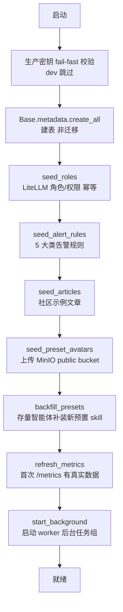
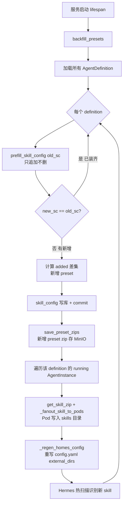

# Manager 方案设计

> UnionAgent-Develop `manager` 服务方案设计。manager 是平台中枢：用户/组/智能体定义/实例/资源池/技能生命周期管理 + K8s 引擎编排 + 后台调度。
> 原 `controller` 服务已并入 manager（`worker` 模块），对外路径 `/api/controller/*` 不变。

---

## 一、整体架构

### 1.1 模块划分（`services/manager/app/`）

| 模块 | 职责 | 关键文件 |
|---|---|---|
| **api/** | FastAPI 路由层（HTTP 端点）。22 个子模块，按功能域拆分：auth / users / roles / user_groups / im_bindings / business_bindings / litellm / agent_skills / agent_definitions / agent_instances / resource_pools / dashboard / engine_configs / sms_configs / email_configs / observability / community / hub_proxy | `app/api/*.py` |
| **services/** | 业务逻辑层。`definition_service`（模版 CRUD + 预置 skill 注入）、`instance_service`（实例 + 升级 skill fan-out）、`business_binding_service`、`user_info_renderer`、`preset_skills`（预置 skill 元数据/打包）、`alert_service`、`metrics_service`、`engine_rollout_service`、`litellm_client`、`minio_public` 等 | `app/services/*.py` |
| **models/** | SQLAlchemy ORM 集中在 `__init__.py`。含 `AgentDefinition` / `AgentInstance` / `AgentProfile` / `AgentDeployment` / `User` / `BusinessUserBinding` / `ImUserBinding` / `SkillCredential` / `OperationLog` / `ResourceMetricSample` 等 | `app/models/__init__.py` |
| **worker/** | K8s 引擎生命周期 + 后台任务 + skill fan-out + 配置同步。`k8s_manager`（exec 进 Pod）、`config_skills`（skill 安装/同步/backfill）、`background`（后台循环）、`scheduler`（空闲回收）、`lifecycle`/`lifecycle_service`（部署/挂起/销毁）、`profiles`（profile 创建 + USER.md 同步）、`minio_archiver`（MinIO skill zip store）、`metric_sampler`、`recycle_scheduler`、`user_md_sync` | `app/worker/*.py` |
| **core/** | 认证/加密/seed。`auth.py`（JWT）、`seed.py`（seed_roles + seed_alert_rules）、`seed_articles.py`、`seed_preset_avatars.py`、`group_scope`（组隔离）、`crypto`、`secrets` | `app/core/*.py` |
| **middleware/** | `rate_limit.py`（登录限流：/auth/login 单 IP 双闸，每分钟 10 次 + 每小时 50 次失败拉黑 1h，进程内 dict + asyncio.Lock） | `app/middleware/rate_limit.py` |
| **data/** | 静态资产。`platform_presets.json`（预置 skill 清单）、`preset_skills/<name>/`（各 skill 的 SKILL.md + 脚本）、`preset_avatars/`（卡通头像源文件） | `app/data/` |

`main.py` 内嵌两个 http middleware：`rate_limit_middleware`（仅 `/auth/login`）与 `access_log_middleware`（记 method/path/status/duration/request_id/user_id 到 Loki，不写 DB）。

### 1.2 lifespan 启动流程

严格顺序，每步 try/except 自吞不阻断启动（`main.py:51-112`）：



### 1.3 worker 后台任务（`worker/background.py`）

manager lifespan 持有的后台任务组，故障隔离（每个循环单轮异常自吞继续）。`start_background()` 启动 `recycle_scheduler` + `metric_sampler` 两个独立调度器 + 8 个内联循环：

| 循环 | 周期 | 作用 |
|---|---|---|
| `_suspend_loop` | 5 min | RUNNING 空闲超 `idle_suspend_minutes` → 存档 + 休眠 |
| `_cleanup_loop` | 1 h | SUSPENDED 超 `idle_destroy_hours` → 清 K8s 资源 |
| `_update_active_loop` | 60 s | 更新 last_active_at + profile 一致性巡检 |
| `_finalizer_reconcile_loop` | ~10s | Terminating Pod 销毁前备份 finalizer 放行 |
| `_daily_backup_loop` | 1 h | 到点对 RUNNING 引擎全量备份 |
| `_daily_cleanup_loop` | 1 h | 清理超 `daily_backup_retain_days` 的备份 |
| `_metrics_refresh_loop` | 60 s | Prometheus 自定义 gauge + Dify 健康探活 |
| `_alert_check_loop` | 120 s | 5 类告警规则触发 + 发通知，去重走 alert_events 表 |

`worker/router.py` 是纯聚合层：把 5 个子 router（chat_api / config_skills / engine_pods / lifecycle / profiles）include 进 `/api/controller` 前缀。

---

## 二、关键模块设计

### 2.1 V3 三层数据模型

平台资源按「定义 / 资源 / 实例」三层组织，UserGroup 是最小租户隔离单元：

| 层 | 实体 | 说明 |
|---|---|---|
| 定义层 | `AgentDefinition` / `AgentVersion` | 智能体模板：人设/System Prompt/模型/技能/版本。不含运行实例 |
| 资源层 | `ResourcePool` | K8s 资源池。平台共享池（group_id NULL）+ 组私有池 |
| 实例层 | `AgentInstance` / `AgentDeployment` / `AgentProfile` | 基于定义+版本部署的运行体，渠道挂在实例下；profile 按用户/组隔离 |

### 2.2 认证与组隔离

- **认证**：JWT（`core/auth.py`）。`require_platform_admin` 装饰器保护用户 CRUD 等敏感端点。
- **组隔离**（`core/group_scope.py`）：
  - `get_current_group_ids`：平台管理员返 None（旁路），组用户返所属组列表
  - `assert_group_writable`：写操作校验 target_group_id ∈ 可操作组
  - `visible_filter`：资源池可见性（共享池 NULL + 所属组私有池）
- **IM/业务绑定 scope**（`api/im_bindings.py:_check_user_scope`）：平台管理员旁路；组用户只能管自己或同组成员的绑定，否则 403。

### 2.3 worker K8s 编排

- `k8s_manager`：exec 进 Pod 执行命令/写文件（profile seed、skill fan-out、USER.md 同步都经它）
- `lifecycle` / `lifecycle_service`：部署（create Pod）、挂起（scale 0 + 存档）、销毁（清 K8s）
- `profiles`：profile 创建 + `_seed_persona`（SOUL.md/USER.md/skills 后台 seed，不阻塞 ensure）

---

## 三、send-message 预置 skill（配合 gateway 出站逻辑）

### 3.1 背景：gateway 出站 send API

入站（用户→企微→gateway→engine→回复）之外，还有**出站**场景：Hermes 主动向企微用户推送消息（Cron 定时日报/提醒/外部事件通知）。为此 gateway 提供 send 端点：

```
POST /api/gateway/channel/{channel_type}/{agent_id}/send
Header: Authorization: Bearer {API_SERVER_KEY}
Body: { touser, chat_id?, msgtype: markdown|text|template_card, content }
```

handler `services/gateway/app/channel/router.py:102-159` `channel_send`：鉴权 → 加载 channel config → 取 `WeComAdapter` → 按 msgtype 分派 `send_message` / `send_card_message` → `_ensure_token`（gettoken 缓存）→ 调企微 `message/send`。markdown 超长由 gateway `_split_by_bytes` 自动按 2048 字节分段（不切断多字节字符）。

### 3.2 send-message 预置 skill

让 Hermes 引擎能主动调 gateway send API。文件 `app/data/preset_skills/send-message/`：

- **SKILL.md**：触发意图"把XX发给销售/推送XX/提醒XX/通知XX/发送日报"。LLM 用 `terminal` 工具执行脚本，**不触发入站对话回复**。
- **scripts/send.py**：用标准库 `urllib.request`（pod 最小依赖，不依赖 curl/第三方包）POST gateway send 端点。env 注入 `AGENT_ID` / `API_SERVER_KEY` / `GATEWAY_URL`（默认 `http://gateway.unionagents:8010`），LLM 不需提供。退出码：0 成功 / 1 env 缺失 / 2 gateway 非 ok / 3 网络错误。

### 3.3 端到端链路

```mermaid
flowchart LR
    H[Hermes Cron/主动事件] --> L[LLM 识别推送/提醒/通知意图]
    L --> T[terminal 工具执行 send.py<br/>env: AGENT_ID/API_SERVER_KEY/GATEWAY_URL]
    T --> G[gateway POST /channel/wecom/&#123;agent_id&#125;/send<br/>Bearer API_SERVER_KEY]
    G --> A[WeComAdapter.send_message/send_card_message]
    A --> TK[_ensure_token gettoken]
    TK --> W[企微 message/send]
    W --> U[用户收到推送]
```



> 设计要点：send.py 用 `urllib` 而非 `curl`（engine pod 是 python:3.11-slim 未装 curl）；markdown 分段在 gateway 做（send.py 不分段），保证所有出站路径一致。

---

## 四、预置 skill 加载与 backfill（升级后存量智能体加载新预置 skill）

### 4.1 预置 skill 定义与映射

- **清单** `app/data/platform_presets.json`：`presets` 数组，每项含 `name`/`description`/`icon`/`version`/`enabled_default`/`removable`。当前 6 个：plan / searxng-search / concept-diagrams / fastmcp / one-three-one-rule / **send-message**。
- **asset 本体** `app/data/preset_skills/<name>/SKILL.md`（+ 可选 scripts/）。
- **服务层** `app/services/preset_skills.py`：
  - `_load_presets_meta()`：读清单，失败返空不阻断
  - `_preset_records()`：构建 skill_config 记录，固定 `id="preset-{name}"`、`source="preset"`、`builtin=True`
  - `prefill_skill_config(skill_config)`：把预置 skill 注入 skill_config，**返回新 dict 不就地改**；幂等（`existing_names` 去重，已存在同名跳过，**只追加不删**）
  - `build_preset_zip(skill_name)`：打包 `preset_skills/<name>/` 成 zip（保留顶层目录），与用户上传 zip 同构
  - `save_preset_zips(definition_id)`：逐个 preset zip 存 MinIO（按 definition_id 隔离）

### 4.2 创建模版时预填（首次安装）

`definition_service.create_definition`：仅当 `skill_config` 为空（`sc_empty`）时调 `prefill_skill_config` 预填 + `save_preset_zips` 存 MinIO。显式传 skill_config 的迁移/测试不预填。

### 4.3 skill 安装 fan-out（运行时）

`config_skills._fanout_skill_to_pods`（`config_skills.py:167-216`）：
1. `_load_agent_configs` 取 definition_id
2. `_iter_agent_target_pods` 取目标 pod
3. 每 pod：`_ensure_shared_skill_dir`（建组 + 目录）→ `rm -rf {dest}` + `mkdir -p` → `_zip_to_tar_strip_top`（zip→tar.gz 剥顶层目录）→ `exec_untar_to_in_pod`
4. `_regen_homes_config` 重写各 home 的 config.yaml（external_dirs + disabled）
5. 删 `.skills_prompt_snapshot.json` 让 gateway 下次重建

skill 文件写在 Pod `/opt/data/skills/{definition_id}/{skill_name}/`，同 definition 的所有 profile 经 config.yaml `external_dirs` 共享读（external_dirs 共享目录模型，无需 per-profile 复制）。Hermes 热扫描 skills 目录，**写文件即生效，不重启**。

**部署后重放** `replay_persona_and_skills`：destroy→redeploy 删 PVC 后，以 MinIO skill zip store 为权威，`list_skill_zips` 取回逐个 fan-out。

### 4.4 backfill_presets（升级后给存量智能体补装新预置 skill）

`config_skills.backfill_presets(db)`（`config_skills.py:630-675`），被 `main.py:92-97` lifespan 每次启动调用：



**幂等/只追加不删 保证**：
- `prefill_skill_config` 用 `existing_names` 集合去重，已存在同名跳过，绝不覆盖/删除用户 skill
- `new_sc == old_sc` 短路跳过——已 backfill 过的启动无副作用
- `added` 差集只含新增 preset，不碰旧 skill
- `save_preset_zips` 覆盖写（幂等）；`_fanout_skill_to_pods` 内 `rm -rf` + 重写（幂等）
- 整个 backfill best-effort，失败不阻断启动

**注意**：backfill 只 fan-out 到 **running** instance。SUSPENDED/DESTROYED 的 instance 下次 deploy 走 `replay_persona_and_skills`（以 MinIO 为权威）自动补齐——因 backfill 已把 zip 存进 MinIO。

> 升级加 send-message 的完整链路：新增 send-message 到 `platform_presets.json` + `preset_skills/send-message/` → 服务重启 → backfill_presets 遍历所有 definition → prefill 发现无 send-message → added=["send-message"] → 写库 + 存 MinIO + fan-out 到 running pod → Hermes 热扫描识别（下次会话可用）。非 running instance 下次 deploy 自动补齐。

---

## 五、业务用户绑定特性

### 5.1 背景

用户管理需把「智能体平台用户 + IM 用户 + 业务系统用户」三方身份关联。现有 IM 绑定（`im_user_bindings`，1:N）只关联 UA user ↔ IM user。新增业务用户绑定（`business_user_bindings`，1:1）补充业务系统身份（业务用户名/业务手机号/业务邮箱），独立于 UA 平台 User 表的 email/phone。

业务绑定信息写入 profile 的 `memories/USER.md`——**写入时机保持现状不变**（profile 创建 seed + `update_user` fan-out + 业务绑定变更 fan-out，都走 `sync_user_md_for_user`），只在 `render_user_md_entries` 增加业务绑定数据渲染。IM 绑定维持现状不写 USER.md。

### 5.2 数据模型

`BusinessUserBinding`（`models/__init__.py:247-266`），仿 `ImUserBinding`：

| 字段 | 说明 |
|---|---|
| `id` | UUID PK |
| `user_id` | FK `users.id`，`ondelete=CASCADE`（删 UA user 自动删绑定），indexed |
| `business_username` | 业务用户名（必填） |
| `business_phone` | 业务手机号（可选） |
| `business_email` | 业务邮箱（可选） |
| `created_at` | 创建时间 |

`UniqueConstraint("user_id", name="uq_business_binding_per_user")` — **1:1**（一个 UA user 一个业务身份）。

### 5.3 API（1:1）

`/api/manager/users/{user_id}/business-bindings`（`api/business_bindings.py`），复用 `_check_user_scope`（同 IM 绑定 scope）：

| 方法 | 行为 |
|---|---|
| GET | 查当前业务绑定（无则返空） |
| PUT | upsert（有则更新无则创建）+ `log_operation` 审计 + `sync_user_md_for_user` fan-out |
| DELETE | 删 + 审计 + `sync_user_md_for_user` fan-out |

### 5.4 USER.md 写入衔接

```mermaid
flowchart LR
    A[业务绑定 PUT/DELETE] --> SC[_check_user_scope]
    SC --> OP[upsert/delete_binding]
    OP --> AU[log_operation 审计]
    AU --> F[sync_user_md_for_user<br/>fan-out 该用户所有活跃 profile]
    F --> Q[查 BusinessUserBinding by user_id]
    Q --> R[render_user_md_entries<br/>user + business_binding]
    R --> M[merge_user_md<br/>剔除旧 系统托管条目 保留引擎追加]
    M --> W[写 /opt/data/profiles/&#123;profile_name&#125;/memories/USER.md]
```



- `render_user_md_entries(user, business_binding=None)`（`user_info_renderer.py:36-77`）：遍历 User 表非敏感列 + roles/groups + **business_binding 的 business_username/phone/email**，每条 `[系统]` 前缀。`business_binding=None` 跳过。
- `sync_user_md`（`user_md_sync.py:33-102`）：`_load_user` → **查 `BusinessUserBinding`** → `render_user_md_entries(user, business_binding)` → 读现有 USER.md → `merge_user_md` → exec 写文件。
- 三个写入入口都经 `sync_user_md`，自动带业务绑定：profile 创建 seed、`update_user` fan-out、业务绑定 API fan-out。
- 全部 best-effort（fan-out 失败仅 warning，不影响绑定变更成功）。

### 5.5 字段策略

- **UA 平台用户信息**（User 表，保留）：username / real_name / email（标签"邮箱"，已非必填）/ phone（标签"手机号"）。是平台账号信息，认证用。
- **业务用户绑定**（新增表）：business_username / business_phone / business_email。独立于 UA 平台 email/phone。

### 5.6 前端

admin 编辑用户对话框，IM 渠道绑定下方新增「业务用户绑定」区：表单填业务用户名/业务手机号/业务邮箱 + 保存（PUT）/解绑（DELETE）。仅编辑态加载回填（`loadBusinessBinding` onMounted）。

---

## 六、渠道管理：新增 wecom_bot_callback（AI Bot URL 回调）

### 6.1 背景

企微 AI Bot 有两种连接方式，长连接（`wecom_bot`）已实现，本次新增 URL 回调模式（`wecom_bot_callback`）。该通道走 gateway dispatcher 完整生命周期，支持企微原生流式 stream（三个点动画 + 覆盖式更新），技术验证已通过。

### 6.2 通道命名

| 通道名 | 说明 | 现状 |
|--------|------|------|
| `wecom` | 企微自建应用 HTTP 回调 | 已实现 |
| `wecom_bot` | 企微 AI Bot WS 长连接（透传） | 已实现 |
| `wecom_bot_callback` | 企微 AI Bot URL 回调（流式 stream） | **本次新增** |

命名理由：`wecom_bot_callback` 明确表达"AI Bot + URL 回调"两个维度，与 `wecom_bot`（长连接）区分，前缀 `wecom_bot` 表明是同一产品（AI Bot）的不同连接方式。

### 6.3 ChannelType 枚举扩展

```python
class ChannelType(str, enum.Enum):
    WECOM = "wecom"
    WECOM_BOT = "wecom_bot"
    WECOM_BOT_CALLBACK = "wecom_bot_callback"   # 新增
    FEISHU = "feishu"
    DINGTALK = "dingtalk"
```

### 6.4 渠道配置数据结构

`wecom_bot_callback` 的配置复用 `wecom`（自建应用回调）的数据结构，字段基本一致：

| 配置项 | 类型 | 必填 | 说明 | wecom 是否有 |
|--------|------|------|------|-------------|
| `token` | string | ✅ | 签名验证令牌（企微后台配置） | ✅ 相同 |
| `encoding_aes_key` | string | ✅ | AES 加解密密钥（43位） | ✅ 相同 |
| `corp_id` | string | ❌ | 企业 CorpID（企业内部 Bot 不需要） | ✅ wecom 需要 |
| `agent_id` | string | ❌ | 自建应用 AgentID（AI Bot 不需要） | ✅ wecom 需要 |

> **注意**：`bot_id` 和 `secret` 是 AI Bot **长连接模式**（`wecom_bot`）的 WS 鉴权参数（`aibot_subscribe`），URL 回调模式不需要。URL 回调的鉴权仅依赖 `token`（SHA1 签名验证）+ `encoding_aes_key`（AES 解密）。

**config JSON 示例**：

```json
{
  "token": "RlhRkmh5NMIa7p",
  "encoding_aes_key": "7al2UGmrruqi4FwJngjsBNaOxap8iRbcIJfbu9kpIVn"
}
```

与 wecom 的 config 对比：

```json
// wecom（自建应用）
{
  "token": "xxx",
  "encoding_aes_key": "xxx",
  "corp_id": "xxx",
  "secret": "xxx",        // corp_secret
  "agent_id": "1000002"
}

// wecom_bot_callback（AI Bot URL 回调）
{
  "token": "xxx",
  "encoding_aes_key": "xxx"
}
```

### 6.5 数据模型复用

#### AgentInstanceChannel（渠道绑定）

`wecom_bot_callback` 完全复用 `AgentInstanceChannel` 表，无需新增表或字段：

- `channel_type = "wecom_bot_callback"`（新增枚举值）
- `config`（JSON）存上述配置项
- `callback_url`（自动生成：`https://{gateway域名}/api/gateway/channel/wecom_bot_callback/{agent_id}/callback`）
- `scope_type` / `scope_target_id` / `profile_type` / `enabled` 语义不变

#### IM 用户绑定（im_user_bindings）

完全复用，无需改动：

- `channel_type = "wecom_bot_callback"`
- `im_user_id` = AI Bot 回调中的 `from.userid`（如 "LiuWei"）
- `im_user_name` = 用户名（可选）
- 绑定到 UA 平台用户 UUID

#### 用户组管理

完全复用，无需改动。`wecom_bot_callback` 的渠道绑定同样挂在 `AgentInstance` 下，受 `UserGroup` 租户隔离。

### 6.6 Schema 扩展

`AgentInstanceChannelCreate` 与 `ImBindingCreate` 的 `channel_type` 正则扩展，加入 `wecom_bot_callback`：

```python
# 当前
channel_type: str = Field(..., pattern="^(wecom|feishu|dingtalk)$")

# 扩展后
channel_type: str = Field(..., pattern="^(wecom|wecom_bot_callback|feishu|dingtalk)$")
```

> 注：`wecom_bot`（长连接）目前不走 `AgentInstanceChannel`（它是 WS 透传，不经过 dispatcher，也无 IM 用户绑定），本次未加入枚举；待长连接模式纳入统一管理时再补。

### 6.7 Manager API 无需改动

渠道 CRUD API（`agent_instances.py` 的 `create_instance_channel` / `update_instance_channel` / `delete_instance_channel`）是通用的，按 `channel_type` 存取，不需要为新通道新增 API。

前端渠道配置页需要新增 `wecom_bot_callback` 选项，配置表单字段：Token、EncodingAESKey。URL 回调鉴权仅依赖此两项（Token 做 SHA1 签名验证、EncodingAESKey 做 AES 加解密）；`bot_id`/`secret` 是长连接模式的 WS 鉴权参数，URL 回调模式不需要。前端同时提供「连接方式」选择（URL 回调 / 长连接），长连接模式本次置灰「暂未开放」。

### 6.8 与 Gateway 的协作

1. **Manager 创建渠道**：admin 在前端创建 `wecom_bot_callback` 渠道，填入 Token/EncodingAESKey，存入 `AgentInstanceChannel.config`
2. **Gateway 读取配置**：gateway 从 DB 加载渠道配置（60s 缓存），实例化 `WeComBotCallbackAdapter`
3. **企微回调到达**：企微 POST 到 `https://{gateway}/api/gateway/channel/wecom_bot_callback/{agent_id}/callback`
4. **Gateway 处理**：适配器解密 → 识别 msgtype → text 走 dispatcher / stream 直接处理 → AES 加密返回
5. **回调 URL 验证**：企微后台保存 URL 时发 GET 验证，适配器解密 echostr 返回明文

---

## 附：关键文件速查

| 主题 | 文件:行 |
|---|---|
| lifespan 启动 | `services/manager/app/main.py:51-112` |
| 8 个后台循环 | `services/manager/app/worker/background.py:32-171` |
| worker router 聚合 | `services/manager/app/worker/router.py:1-86` |
| backfill_presets | `services/manager/app/worker/config_skills.py:630-675` |
| 预置 skill 服务 | `services/manager/app/services/preset_skills.py:30-146` |
| 预置 skill 清单 | `services/manager/app/data/platform_presets.json:3-58` |
| create_definition 预填 | `services/manager/app/services/definition_service.py:114-161` |
| skill fan-out | `services/manager/app/worker/config_skills.py:167-216` |
| send-message skill | `app/data/preset_skills/send-message/SKILL.md` + `scripts/send.py` |
| gateway send 端点 | `services/gateway/app/channel/router.py:102-159` |
| WeCom adapter 下发 | `services/gateway/app/channel/wecom.py:439-521` |
| 业务绑定 API/service | `app/api/business_bindings.py` / `app/services/business_binding_service.py` |
| 业务绑定 model | `app/models/__init__.py:247-266` |
| user_info_renderer | `app/services/user_info_renderer.py:36-102` |
| user_md_sync | `app/worker/user_md_sync.py:33-141` |
| MinIO skill zip store | `app/worker/minio_archiver.py:409-447` |
